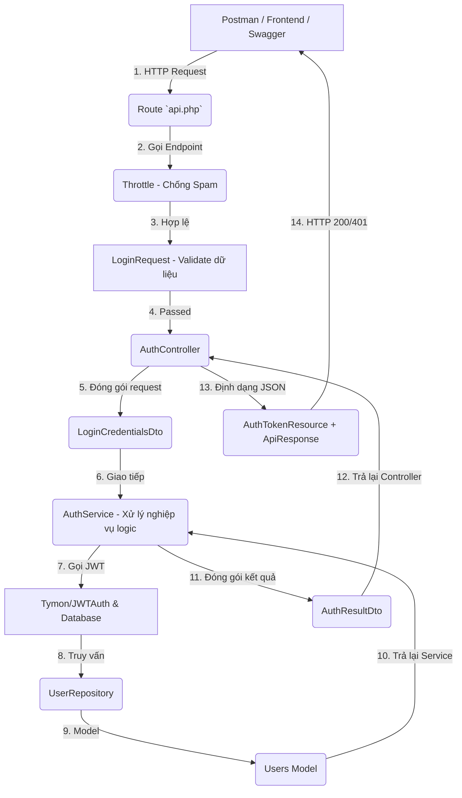

# Hướng Dẫn Chi Tiết Kiến Trúc Authentication (Enterprise Level)

Chào bạn, dưới đây là bản tài liệu giải thích toàn bộ luồng hoạt động, cấu trúc thư mục và ý nghĩa từng dòng code quan trọng của hệ thống Authentication vừa được refactored. Việc áp dụng đúng chuẩn Enterprise giúp hệ thống của bạn có thể mở rộng (scale), dễ dàng bảo trì và vô cùng bảo mật để chống lại các cuộc tấn công.

## 1. Mô Hình Luồng Dữ Liệu (Layered Architecture)

Khi một user gửi request (ví dụ: đăng nhập), dữ liệu sẽ đi qua các tầng sau một cách STRICTLY ONE-WAY (một chiều khép kín):



---

## 2. Ý Nghĩa Của Từng File Và Dòng Code Quan Trọng

### A. Tầng Routing (Định tuyến) - [routes/api.php](file:///d:/PROJECT/Meyland/PropifyBackend/routes/api.php)
*Nhiệm vụ: Phân luồng các API URLs cho đúng Controller, giới hạn số lần gọi.*

```php
Route::prefix('v1/auth')->as('auth.')->group(function () {
    // throttle:5,1 -> Giới hạn địa chỉ IP chỉ được gọi 5 requests mỗi 1 phút phòng hờ kẻ gian cắm Auto Brute Force mật khẩu
    Route::post('/login', [AuthController::class, 'login'])->middleware('throttle:5,1')->name('login');
    // ...
});
```

### B. Tầng Request Validation (Xác thực đầu vào) - [app/Http/Requests/Auth/LoginRequest.php](file:///d:/PROJECT/Meyland/PropifyBackend/app/Http/Requests/Auth/LoginRequest.php)
*Nhiệm vụ: Là vệ sĩ gác cổng, chặn các Request sai móp hàm (thiếu parameter) trước khi ngốn RAM chạm vào Controller.*

```php
// Hàm rules() khai báo các luật: bắt buộc (required), tối đa (max), chuẩn email...
public function rules(): array {
    return [
        'email' => 'required|email|max:100',
        'password' => 'required|string',
    ];
}
// Nếu vi phạm luật này (VD user k gửi mật khẩu), Laravel tự động ném ra lỗi HTTP 422 Unprocessable Entity kèm messages bạn đã viết ở dưới. Hàm ở Controller sẽ KHÔNG bao giờ bị gọi, tránh sập web vì dữ liệu NULL.
```

### C. Tầng Controller (Bộ Não Đi Phối Viên) - [app/Http/Controllers/Api/V1/Auth/AuthController.php](file:///d:/PROJECT/Meyland/PropifyBackend/app/Http/Controllers/Api/V1/Auth/AuthController.php)
*Nhiệm vụ: Chỉ nhận Request hợp lệ, chuyển DTO sang tầng Service và phân giải Response JSON. KHÔNG chứa bất cứ câu SQL hay IF/ELSE nghiệp vụ nào.*

```php
/** Phân tích từng dòng của hàm login */
public function login(LoginRequest $request): JsonResponse
{
    // DÒNG 1: Chuyển đổi dữ liệu Array đã qua gác cổng thành 1 Object DTO (Data Transfer Object)
    // Tại sao không dùng mảng $request->all()? Vì mảng thường hay viết nhầm key, lỗi chính tả lúc truy xuất. DTO ép kiểu ($dto->email) giúp Code IDE gợi ý, an toàn tuyệt đối ở compile-time.
    $dto = LoginCredentialsDto::fromRequest($request);

    // DÒNG 2: Chuyển quyền xử lý cho Service layer. AuthController không tự check password, không gọi JWTAuth::attempt().
    // Kết quả trả về từ hàm login() BẮT BUỘC theo bản thiết kế phải là 1 object AuthResultDto.
    $result = $this->authService->login($dto);

    // DÒNG 3: Sử dụng ApiResponse Helper để bọc lại toàn bộ JSON theo đúng chuẩn format cho Frontend {status: true, message: "...", data: {...}}
    // Cặn kẽ: Bọc biến $result vào AuthTokenResource để làm gì? Để giấu Mật Khẩu, format lại ngày giờ tạo, giấu ID phụ, chỉ lộ ra access_token và info user cần thiết.
    return ApiResponse::success(
        data: new AuthTokenResource($result),
        message: 'Đăng nhập thành công'
    );
}
```

### D. Tầng Service (Nghiệp Vụ Cốt Lõi) - [app/Services/Impl/AuthServiceImpl.php](file:///d:/PROJECT/Meyland/PropifyBackend/app/Services/Impl/AuthServiceImpl.php)
*Nhiệm vụ: Nơi duy nhất xử lý nghiệp vụ kinh doanh, mã hóa password, cấp Token, ném (throw) lỗi khi thất bại.*

```php
/** Phân tích hàm login của AuthServiceImpl */
public function login(LoginCredentialsDto $dto): AuthResultDto
{
    // 1. JWTAuth nhận array ['email', 'password'] để giải mã hash và so khớp.
    if (!$token = $this->guard()->attempt(['email' => $dto->email, 'password' => $dto->password])) {
        // 2. Cực Kỳ Quan Trọng: Nếu sai mật khẩu, ta QUĂNG (throw) lỗi Business Exception chứ không ném Array hoặc string lỗi như code cũ.
        // Cú throw này sẽ cắt ngang chạy code. Framework sẽ bắt được Exception này thay vì sập lỗi 500 do Null.
        throw new AuthenticationFailedException();
    }

    // 3. Nếu Login trót lọt, load thông tin User từ JWT guard.
    /** @var \App\Models\Users $user */
    $user = $this->guard()->user();

    // 4. Trả về đối tượng AuthResultDto đảm bảo đúng cấu trúc Controller đang chờ. (Chưa AccessToken + Info)
    return AuthResultDto::fromUserAndToken($user, $token, $this->guard()->factory()->getTTL());
}
```

#### Nâng Cấp Kỹ Thuật (Transaction Register)
Mọi hàm tạo dữ liệu lớn phải bọc SQL Transaction (Dòng code `DB::transaction(...)`)

```php
/** Phân tích Transaction trong Hàm Đăng ký (Register) */
public function register(RegisterUserDto $dto): AuthResultDto
{
    // Lợi ích Transaction: Nếu quá trình tạo User thành công (Insert DB OK) ở dòng đầu, nhưng vì rớt mạng JWT tạo Token lỗi ở dòng 2 -> Transaction sẽ CATCH (Bắt lỗi) và ROLLBACK (Hủy Insert) xóa User gốc -> Database không bao giờ bị dính rác ("Tài khoản ma không có quyền").
    return DB::transaction(function () use ($dto) {
        
        // Tạo Repo, chỉ ghi các cột cần thiết (Giữ Cột Status, Role lại do tự code tay ở dưới để chống Hack gán quyền bằng công cụ tấn công).
        $user = $this->userRepository->create([
            'full_name' => $dto->fullName,
            'email'     => $dto->email,
            'phone'     => $dto->phone,
            'password'  => Hash::make($dto->password), // Hash mật khẩu luôn lập tức
            'role'      => UserRole::User->value, // Cứng cấp Role USER (Không bị hacker gửi gán ROLE ADMIN)
            'status'    => UserStatus::Active->value, // Trạng thái Active
        ]);

        $token = $this->guard()->login($user);
        return AuthResultDto::fromUserAndToken($user, $token, $this->guard()->factory()->getTTL());
    });
}
```

### E. Tầng Bắt Lỗi Global Auto (Exception Handler) - [app/Exceptions/ApiExceptionHandler.php](file:///d:/PROJECT/Meyland/PropifyBackend/app/Exceptions/ApiExceptionHandler.php)
*Nhiệm vụ: Tại sao không thấy chữ `try { } catch() { }` nào ở Controller?*

Đó là vì trong file cấu hình lỗi global [ApiExceptionHandler.php](file:///d:/PROJECT/Meyland/PropifyBackend/app/Exceptions/ApiExceptionHandler.php), mình đã viết sẵn một **"Máy Quét Lỗi Tự Động"**.
- Khi Service chạy dòng này: `throw new AuthenticationFailedException();`
- File quăng lỗi này liên kết với `ErrorCode::AuthLoginFailed` mang HTTP code = [401](file:///d:/PROJECT/Meyland/PropifyBackend/tests/Feature/Auth/AuthControllerTest.php#103-109) và thông báo = `Email hoặc mật khẩu không đúng`.
- [ApiExceptionHandler](file:///d:/PROJECT/Meyland/PropifyBackend/app/Exceptions/ApiExceptionHandler.php#19-93) sẽ bắt ngay trên đường bay để đóng gói thành 1 cục JSON Format lỗi (Status: False) rất đẹp cho FE render báo đỏ mà Code Controller không cần tự check [if(!dữ_liệu_gì_đó) {trả lỗi}](file:///d:/PROJECT/Meyland/PropifyBackend/app/Models/Users.php#46-53).

---

## 3. Tổng Kết Các Ưu Điểm Đạt Được (Chuẩn Enterprise)
- **SOLID (Single Responsibility)**: Tách riêng mỗi lớp 1 nhiệm vụ. Đầu vào cho móp chặn -> Điều phối cho Controller -> Tính toán cho Service. Nếu phát sinh Lỗi, bạn biết trỏ ngay vào tầng nào.
- **TypeScript - Vị Vị Thế Của PHP 8 (Data Transfer Class)**: Áp dụng mạnh OOP và Data Class ép buộc kiểu dữ liệu. Hạn chế hoàn toàn tư duy xài mảng `$data['email']`, thay bằng `$dto->email`. Gọi tự gõ auto-complete cực mạnh.
- **Testable (Code dễ kiểm định)**: Việc tiêm phụ thuộc [UserRepository](file:///d:/PROJECT/Meyland/PropifyBackend/app/Repositories/UserRepository.php#7-24) vào [AuthService](file:///d:/PROJECT/Meyland/PropifyBackend/app/Services/AuthService.php#11-40) (Thay vì chèn cứng User::create) giúp Laravel Mock test giả chạy 29 lệnh assert Test không cần chèn rác DB gốc.
- **Bảo mật An Toàn**: Chống băm brute-force qua Rate Limiting, đóng kín quyền và status tránh Hacker lợi dụng sơ hở HTTP Post.
