# Giải Thích Chi Tiết Các Design Pattern Đã Áp Dụng Trong Dự Án Propify

Báo cáo này làm rõ chi tiết các Design Pattern thực tế đã được triển khai trong dự án Propify (Website đăng tin bất động sản), giải thích lý do áp dụng, bài toán giải quyết, sơ đồ cấu trúc của từng Pattern và mô tả vai trò các thành phần (class/interface) cụ thể trong mã nguồn.

---

## Mục Lục

1. [Tổng quan kiến trúc](#1-tổng-quan-kiến-trúc)
2. [Chức năng Đăng ký tài khoản](#2-chức-năng-đăng-ký-tài-khoản)
3. [Chức năng Đăng nhập](#3-chức-năng-đăng-nhập)
4. [Chức năng Quên mật khẩu](#4-chức-năng-quên-mật-khẩu)
5. [Chức năng Xác thực tin đăng](#5-chức-năng-xác-thực-tin-đăng)
6. [Chức năng Tin đăng yêu thích](#6-chức-năng-tin-đăng-yêu-thích)
7. [Chức năng Nâng cấp gói tin](#7-chức-năng-nâng-cấp-gói-tin)
8. [Thuật toán sắp xếp hiển thị](#8-thuật-toán-sắp-xếp-hiển-thị)
9. [Chức năng Chat](#9-chức-năng-chat)
10. [Lịch sử giao dịch](#10-lịch-sử-giao-dịch)
11. [Bảng tổng hợp hệ thống Design Pattern](#11-bảng-tổng-hợp-hệ thống-design-pattern)

---

## 1. Tổng quan kiến trúc

Dự án Propify áp dụng kiến trúc **Clean Architecture** phân tầng độc lập kết hợp với **Laravel 12** nhằm đảm bảo tính bảo trì và mở rộng lâu dài:

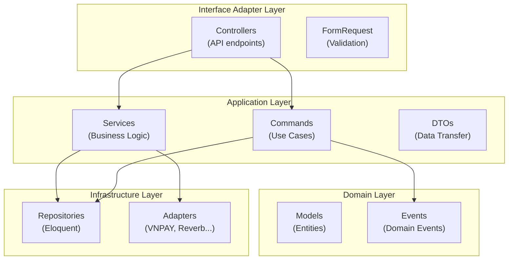

---

## 2. Chức năng Đăng ký tài khoản

### 2.1. Tại sao áp dụng & Giải quyết bài toán gì?
Luồng đăng ký thành viên có nhiều thao tác phức tạp liên tiếp: Validate dữ liệu → Lưu thông tin người dùng ở trạng thái chờ kích hoạt → Tạo mã kích hoạt OTP gửi qua email → Phát sự kiện chào mừng thành viên.
- **Vấn đề giải quyết**: Tránh hiện tượng Controller phình to (Fat Controller) do ôm đồm quá nhiều nghiệp vụ. Tách rời hoàn toàn logic xác thực dữ liệu và logic lưu dữ liệu để dễ viết Unit Test độc lập. Cô lập các dịch vụ phụ (gửi email, OTP) khỏi tiến trình chính.

---

### 2.2. Command Pattern — Đóng gói luồng nghiệp vụ đăng ký

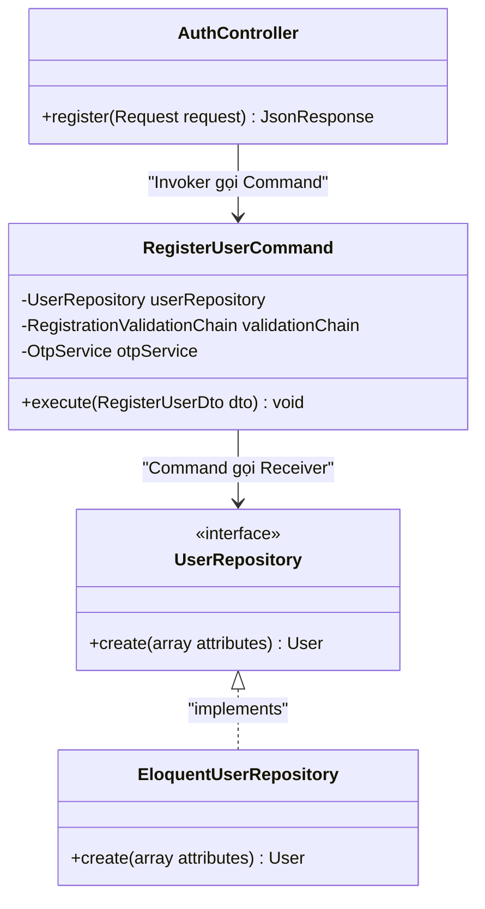

#### Giải thích các khối trong sơ đồ:
- **`AuthController`**: Tiếp nhận HTTP Request đăng ký từ người dùng, chuyển đổi dữ liệu thô thành `RegisterUserDto` và gọi Command để thực thi.
- **`RegisterUserCommand`**: Đóng gói toàn bộ tiến trình nghiệp vụ đăng ký thành viên. Lớp này điều phối luồng validate dữ liệu, lưu DB và gọi dịch vụ OTP.
- **`UserRepository` / `EloquentUserRepository`**: Thực hiện nhiệm vụ ghi dữ liệu người dùng mới vào CSDL (Receiver).

| Thành phần GoF | Vai trò | Lớp cụ thể trong sơ đồ |
|---|---|---|
| **Invoker** | Khởi chạy yêu cầu đăng ký | `AuthController` |
| **ConcreteCommand** | Đóng gói nghiệp vụ xử lý chính | `RegisterUserCommand` |
| **Receiver** | Trực tiếp tác động cơ sở dữ liệu | `EloquentUserRepository` |

---

### 2.3. Chain of Responsibility — Xác thực dữ liệu đầu vào tuần tự

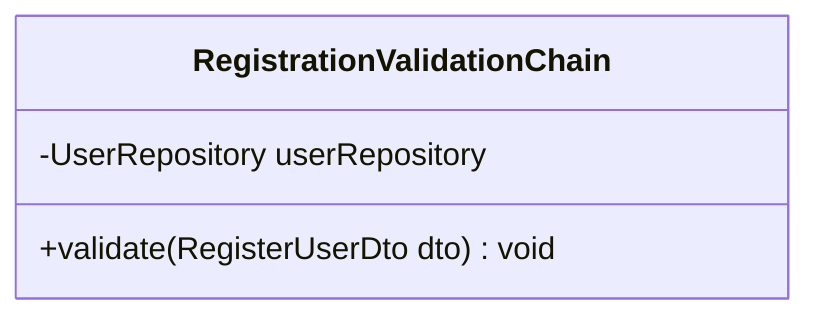

#### Giải thích các khối trong sơ đồ:
- **`RegistrationValidationChain`**: Thiết lập luồng kiểm tra dữ liệu đăng ký tuần tự (kiểm tra định dạng Email → Kiểm tra độ mạnh Mật khẩu → Kiểm tra tính duy nhất của Email). Bất kỳ bước nào không hợp lệ sẽ dừng luồng xử lý bằng một Exception cụ thể.

| Thành phần GoF | Vai trò | Lớp cụ thể trong sơ đồ |
|---|---|---|
| **Handler Chain** | Xác thực dữ liệu đăng ký theo các quy tắc tuần tự | `RegistrationValidationChain` |

---

### 2.4. Adapter & Observer Pattern — Quản lý OTP & Phát sự kiện chào mừng

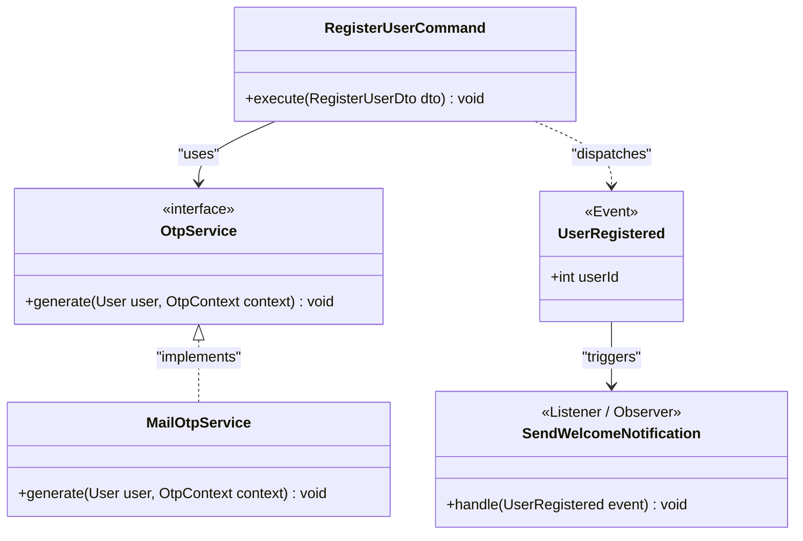

#### Giải thích các khối trong sơ đồ:
- **`RegisterUserCommand`**: Kích hoạt việc tạo OTP và phát đi sự kiện đăng ký.
- **`OtpService` / `MailOtpService`**: Interface đóng vai trò **Target** và lớp triển khai đóng vai trò **Adapter** để đồng nhất hóa phương thức gửi OTP qua email, tránh liên kết trực tiếp mã nguồn lõi với thư viện SMTP hoặc SDK thư điện tử bên ngoài.
- **`UserRegistered`**: Đối tượng sự kiện mang thông tin người dùng vừa đăng ký thành công (Subject).
- **`SendWelcomeNotification`**: Lớp xử lý sự kiện lắng nghe sự kiện đăng ký mới để tự động gửi email chào mừng (Observer).

| Thành phần GoF | Vai trò | Lớp cụ thể trong sơ đồ |
|---|---|---|
| **Target (Adapter)** | Giao diện chuẩn hóa dịch vụ gửi OTP | `OtpService` |
| **Adapter** | Lớp triển khai gửi OTP qua email | `MailOtpService` |
| **Subject (Event)** | Phát đi tín hiệu đăng ký thành công | `UserRegistered` |
| **Observer** | Lắng nghe sự kiện để gửi email chào mừng | `SendWelcomeNotification` |

---

## 3. Chức năng Đăng nhập

### 3.1. Tại sao áp dụng & Giải quyết bài toán gì?
Hệ thống hỗ trợ nhiều phương thức xác thực đầu vào khác nhau (đăng nhập bằng Email/Mật khẩu truyền thống và đăng nhập liên kết qua tài khoản Google OAuth).
- **Vấn đề giải quyết**: Tránh sử dụng các câu lệnh rẽ nhánh `if-else` phức tạp trong Controller khi chuyển đổi phương thức đăng nhập, vi phạm nguyên tắc Open/Closed (OCP). Hấp thụ sự thay đổi cấu trúc dữ liệu từ Google SDK bên thứ ba về hệ thống mà không phá vỡ logic nghiệp vụ.

---

### 3.2. Strategy Pattern — Chuyển đổi chiến lược đăng nhập động

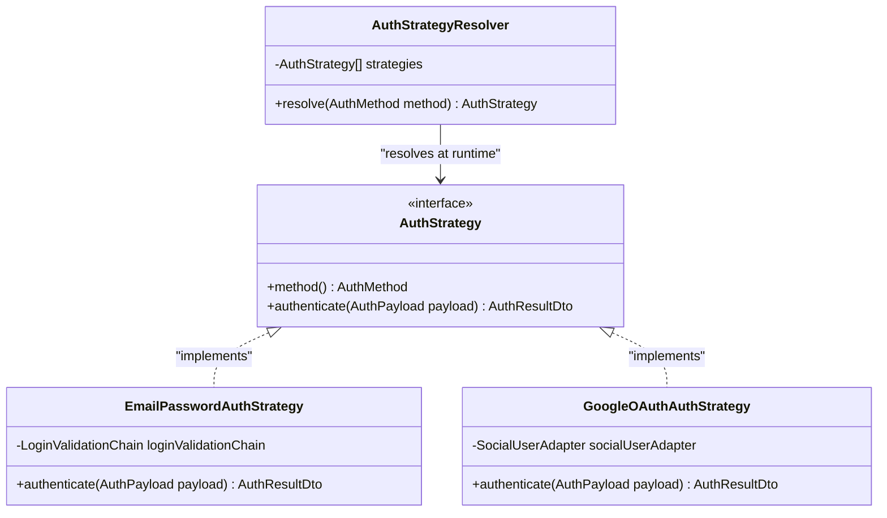

#### Giải thích các khối trong sơ đồ:
- **`AuthStrategy`**: Interface định nghĩa cấu trúc chuẩn cho mọi chiến lược đăng nhập.
- **`EmailPasswordAuthStrategy`**: Chiến lược xử lý đăng nhập truyền thống, kiểm tra cặp email và hash mật khẩu.
- **`GoogleOAuthAuthStrategy`**: Chiến lược xử lý đăng nhập thông qua Google OAuth.
- **`AuthStrategyResolver`**: Lớp đóng vai trò **Context**, lưu trữ danh sách Strategy và trả về Strategy tương ứng động tại runtime dựa vào loại phương thức đăng nhập được gửi từ Client.

| Thành phần GoF | Vai trò | Lớp cụ thể trong sơ đồ |
|---|---|---|
| **Strategy Interface** | Quy ước giao tiếp chung cho việc đăng nhập | `AuthStrategy` |
| **ConcreteStrategy A** | Chiến lược đăng nhập truyền thống | `EmailPasswordAuthStrategy` |
| **ConcreteStrategy B** | Chiến lược đăng nhập qua Google | `GoogleOAuthAuthStrategy` |
| **Context** | Lựa chọn chiến lược đăng nhập động | `AuthStrategyResolver` |

---

### 3.3. Factory Method Pattern — Khởi tạo Strategy tương ứng

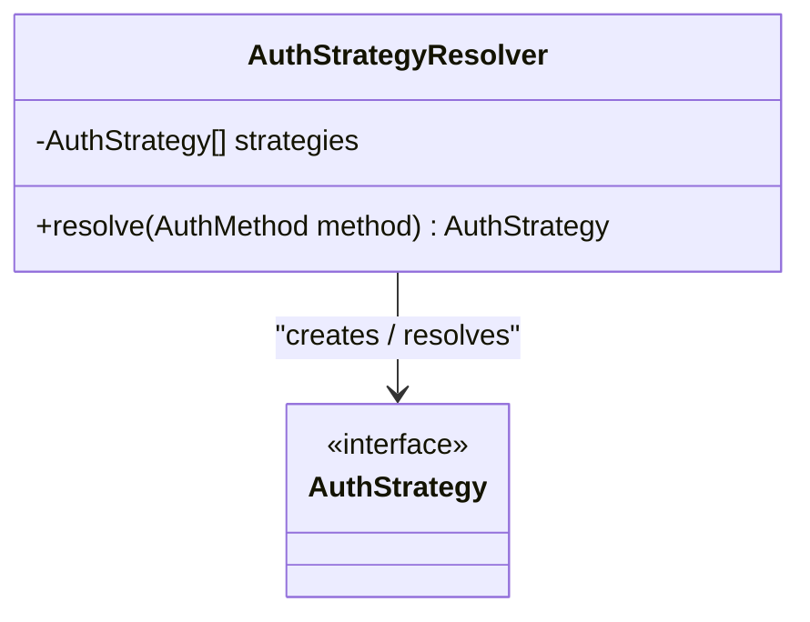

#### Giải thích các khối trong sơ đồ:
- **`AuthStrategyResolver`**: Đóng vai trò lớp Factory, đóng gói toàn bộ logic tìm kiếm và khởi tạo Strategy tương ứng, bảo vệ Client khỏi việc phụ thuộc cứng vào các lớp chiến lược cụ thể.

| Thành phần GoF | Vai trò | Lớp cụ thể trong sơ đồ |
|---|---|---|
| **Creator/Factory** | Phân giải và khởi tạo đối tượng chiến lược xác thực | `AuthStrategyResolver` |

---

### 3.4. Adapter Pattern — Thích ứng cấu trúc dữ liệu người dùng Google

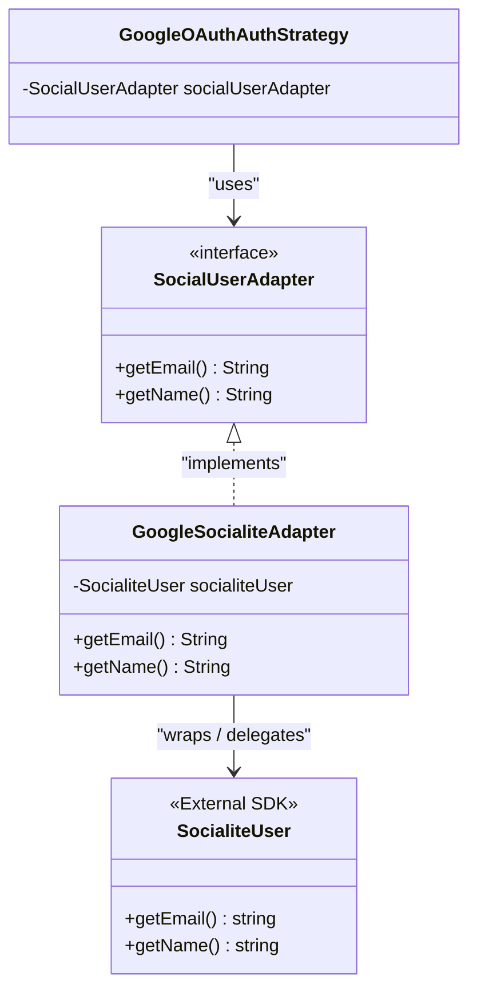

#### Giải thích các khối trong sơ đồ:
- **`SocialUserAdapter`**: Target Interface được Domain của hệ thống định nghĩa.
- **`GoogleSocialiteAdapter`**: Lớp đóng vai trò Adapter chuyển đổi giao diện dữ liệu từ SDK bên thứ ba thành chuẩn của hệ thống.
- **`SocialiteUser`**: Đối tượng dữ liệu người dùng của thư viện Laravel Socialite SDK ngoài (Adaptee).

| Thành phần GoF | Vai trò | Lớp cụ thể trong sơ đồ |
|---|---|---|
| **Target Interface** | Cấu trúc dữ liệu người dùng tiêu chuẩn hệ thống | `SocialUserAdapter` |
| **Adapter** | Chuyển đổi dữ liệu từ SDK ngoài về dạng tiêu chuẩn | `GoogleSocialiteAdapter` |
| **Adaptee** | Đối tượng người dùng trả về từ Google SDK | `SocialiteUser` |

---

### 3.5. Chain of Responsibility & Observer Pattern — Kiểm tra đăng nhập bảo mật & Ghi nhật ký đăng nhập

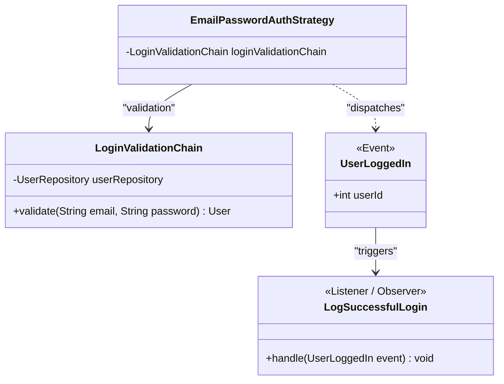

#### Giải thích các khối trong sơ đồ:
- **`LoginValidationChain`**: Tiến hành chuỗi kiểm tra tuần tự tài khoản người dùng: Check Email tồn tại → Check trạng thái Active → Check đúng Hash mật khẩu.
- **`UserLoggedIn`**: Đối tượng Event mang dữ liệu sự kiện đăng nhập thành công.
- **`LogSuccessfulLogin`**: Observer ghi nhận nhật ký hệ thống hoạt động hoặc gửi cảnh báo đăng nhập thiết bị lạ.

| Thành phần GoF | Vai trò | Lớp cụ thể trong sơ đồ |
|---|---|---|
| **Handler Chain** | Xác thực tuần tự thông tin đăng nhập | `LoginValidationChain` |
| **Subject (Event)** | Phát tín hiệu đăng nhập thành công | `UserLoggedIn` |
| **Observer** | Ghi nhận hoạt động truy cập nền | `LogSuccessfulLogin` |

---

## 4. Chức năng Quên mật khẩu

### 4.1. Tại sao áp dụng & Giải quyết bài toán gì?
Yêu cầu quên mật khẩu trải qua các giai đoạn: Kiểm tra tài khoản có tồn tại không (nếu không thì dừng lại) → Khởi tạo và ghi nhận mã OTP vào CSDL/Redis → Tải ảnh/mẫu HTML email và truyền đi thông báo → Ghi log bảo mật.
- **Vấn đề giải quyết**: Tách biệt hoàn toàn các nhiệm vụ gửi mail, lưu DB, kiểm tra người dùng. Chuỗi kiểm định độc lập cho phép dễ dàng cài đặt bổ sung lớp kiểm soát tần suất yêu cầu OTP (Rate Limiting) để tránh spam, tối ưu hóa tài nguyên.

---

### 4.2. Chain of Responsibility — Pipeline xử lý tuần tự quên mật khẩu

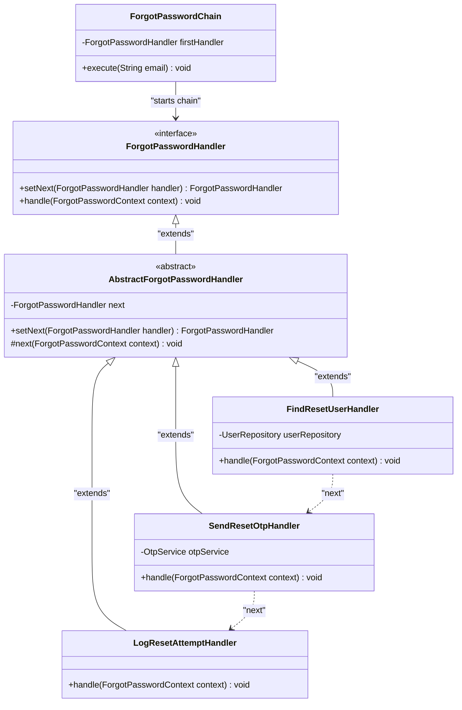

#### Giải thích các khối trong sơ đồ:
- **`ForgotPasswordHandler`**: Định nghĩa hợp đồng chung cho các mắt xích xử lý phục hồi tài khoản.
- **`AbstractForgotPasswordHandler`**: Lớp cơ sở trừu tượng quản lý con trỏ `next` để kết nối chuỗi.
- **`FindResetUserHandler`**: Handler tìm kiếm xem địa chỉ email của người dùng có tồn tại trong hệ thống hay không.
- **`SendResetOtpHandler`**: Handler khởi tạo mã OTP ngẫu nhiên và gửi đi email xác minh.
- **`LogResetAttemptHandler`**: Handler ghi nhận logs về nỗ lực phục hồi mật khẩu.
- **`ForgotPasswordChain`**: Khởi chạy tiến trình, giữ mắt xích đầu tiên.

| Thành phần GoF | Vai trò | Lớp cụ thể trong sơ đồ |
|---|---|---|
| **Handler Interface** | Hợp đồng chung cho các mắt xích | `ForgotPasswordHandler` |
| **AbstractHandler** | Quản lý chuyển tiếp chuỗi xử lý | `AbstractForgotPasswordHandler` |
| **ConcreteHandler 1** | Xác thực người dùng tồn tại | `FindResetUserHandler` |
| **ConcreteHandler 2** | Sinh và gửi mã OTP | `SendResetOtpHandler` |
| **ConcreteHandler 3** | Ghi nhật ký nỗ lực khôi phục | `LogResetAttemptHandler` |
| **Client** | Điều phối khởi chạy chuỗi | `ForgotPasswordChain` |

---

### 4.3. Command Pattern — Đóng gói thao tác Reset mật khẩu

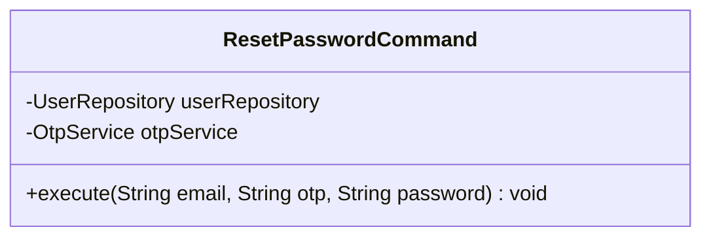

#### Giải thích các khối trong sơ đồ:
- **`ResetPasswordCommand`**: Command Object đóng gói nghiệp vụ cập nhật mật khẩu mới, kiểm tra tính hợp lệ của mã OTP và cập nhật bản ghi mật khẩu đã được hash trong cơ sở dữ liệu.

| Thành phần GoF | Vai trò | Lớp cụ thể trong sơ đồ |
|---|---|---|
| **ConcreteCommand** | Thực hiện hành động đặt lại mật khẩu | `ResetPasswordCommand` |

---

### 4.4. Adapter & Observer Pattern — Thích ứng OtpService & Phát sự kiện đổi mật khẩu

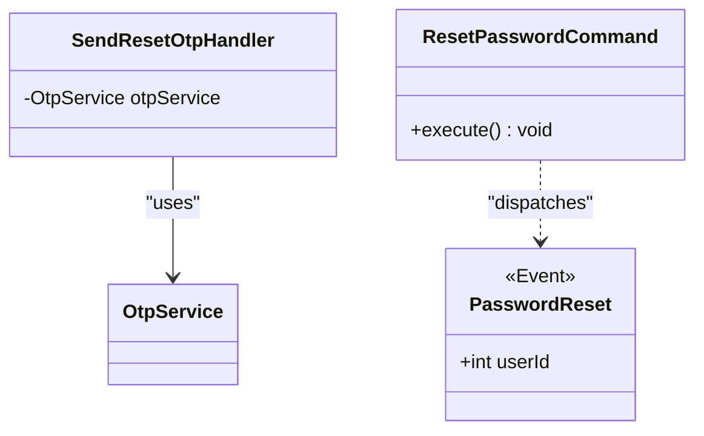

#### Giải thích các khối trong sơ đồ:
- **`OtpService`**: Interface Adapter chuẩn hóa giao tiếp tạo/xác thực mã OTP.
- **`PasswordReset`**: Sự kiện hệ thống phát ra khi đặt lại mật khẩu mới thành công, dùng để kích hoạt các Listener thu hồi token đăng nhập cũ của người dùng trên toàn bộ các thiết bị (Observer).

| Thành phần GoF | Vai trò | Lớp cụ thể trong sơ đồ |
|---|---|---|
| **Target Interface** | Cung cấp giao diện trừu tượng hóa xử lý OTP | `OtpService` |
| **Subject (Event)** | Phát đi tín hiệu thay đổi mật khẩu | `PasswordReset` |

---

## 5. Chức năng Xác thực tin đăng

### 5.1. Tại sao áp dụng & Giải quyết bài toán gì?
Tin đăng bất động sản cần được kiểm định thực tế/pháp lý trước khi công khai. Giai đoạn ban đầu duyệt thủ công bởi Admin, tuy nhiên hệ thống cần khả năng tích hợp các thuật toán kiểm duyệt tin tự động qua AI hoặc API kiểm tra chéo giấy tờ nhà đất trong tương lai.
- **Vấn đề giải quyết**: Ngăn ngừa việc sửa đổi mã nguồn nghiệp vụ chính khi thay đổi hoặc thêm phương thức xác thực tin đăng. Quản lý trạng thái nhất quán của tin đăng, đảm bảo không có tin đăng nào chưa xác thực có thể đăng lên trang công cộng.

---

### 5.2. Strategy Pattern — Chiến lược kiểm duyệt tài liệu pháp lý tin đăng

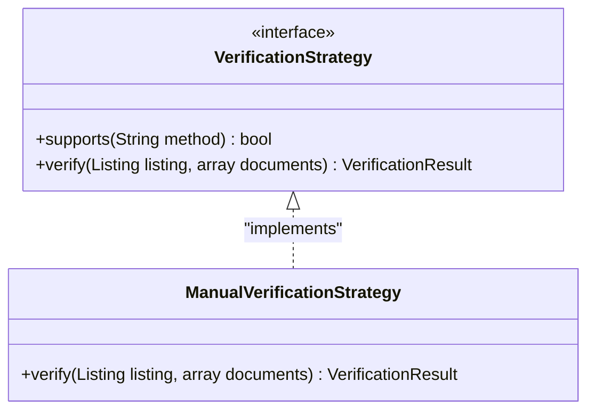

#### Giải thích các khối trong sơ đồ:
- **`VerificationStrategy`**: Định nghĩa interface chung cho các cơ chế kiểm duyệt tin đăng.
- **`ManualVerificationStrategy`**: Chiến lược xác thực tin đăng thủ công bởi nhân viên kiểm duyệt thông qua việc kiểm tra tài liệu pháp lý đính kèm.

| Thành phần GoF | Vai trò | Lớp cụ thể trong sơ đồ |
|---|---|---|
| **Strategy Interface** | Hợp đồng chung cho việc xác thực | `VerificationStrategy` |
| **ConcreteStrategy** | Chiến lược xác thực giấy tờ thủ công | `ManualVerificationStrategy` |

---

### 5.3. Command Pattern — Đóng gói yêu cầu gửi tài liệu xác thực

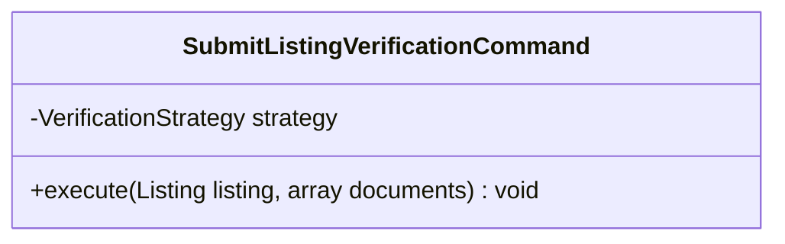

#### Giải thích các khối trong sơ đồ:
- **`SubmitListingVerificationCommand`**: Đóng gói thao tác tạo hồ sơ xác minh tin đăng của người dùng, thực thi áp dụng chiến lược xác minh tương ứng.

| Thành phần GoF | Vai trò | Lớp cụ thể trong sơ đồ |
|---|---|---|
| **ConcreteCommand** | Thực thi nghiệp vụ nộp tài liệu xác thực | `SubmitListingVerificationCommand` |

---

### 5.4. State Pattern — Quản lý vòng đời trạng thái của tin đăng

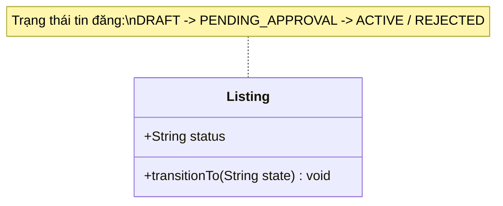

#### Giải thích các khối trong sơ đồ:
- **`Listing`**: Đóng vai trò **Context**, lưu trạng thái hiện tại của tin đăng (`status`). Các hành vi hiển thị, sửa đổi tin đăng sẽ thay đổi linh hoạt và tuân thủ điều kiện chuyển đổi trạng thái (ví dụ: Tin bị khóa `LOCKED` không thể tự chuyển thành `ACTIVE` nếu không duyệt lại).

| Thành phần GoF | Vai trò | Lớp cụ thể trong sơ đồ |
|---|---|---|
| **Context** | Thực thể duy trì trạng thái của tin đăng | `Listing` |

---

## 6. Chức năng Tin đăng yêu thích

### 6.1. Tại sao áp dụng & Giải quyết bài toán gì?
Chức năng tin đăng yêu thích cần tương tác chéo giữa dữ liệu lưu trữ tài khoản của người dùng (User) và dữ liệu các tin bất động sản đang theo dõi (Listing).
- **Vấn đề giải quyết**: Giảm độ liên kết trực tiếp giữa tầng điều khiển (Controller) và các Repository dữ liệu chi tiết của từng thực thể. Cung cấp một giao diện sử dụng thống nhất, đơn giản cho Client.

---

### 6.2. Facade Pattern — Hệ thống con quản lý lưu giữ tin đăng yêu thích

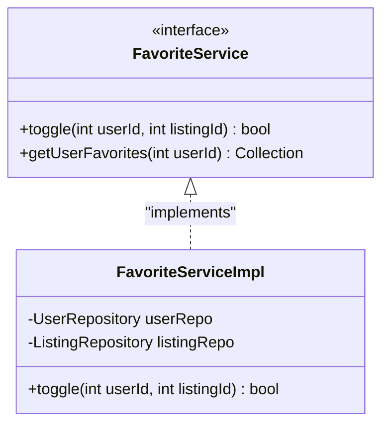

#### Giải thích các khối trong sơ đồ:
- **`FavoriteService` / `FavoriteServiceImpl`**: Đóng vai trò lớp Facade. Nó che giấu sự phức tạp của việc truy vấn liên hợp các bảng CSDL khác nhau, liên kết giữa `User` và `Listing`. Client chỉ cần gọi một interface đơn giản là `toggle()` để bật/tắt yêu thích.

| Thành phần GoF | Vai trò | Lớp cụ thể trong sơ đồ |
|---|---|---|
| **Facade Interface** | Giao diện tương tác nghiệp vụ tin yêu thích | `FavoriteService` |
| **Facade Implementation** | Gom các nghiệp vụ thực thể để thực thi | `FavoriteServiceImpl` |

---

## 7. Chức năng Nâng cấp gói tin

### 7.1. Tại sao áp dụng & Giải quyết bài toán gì?
Đây là module tích hợp nhiều nghiệp vụ nhất: Nhận thanh toán trực tuyến → Kiểm tra điều kiện tin đăng (được phép nâng cấp hay chỉ được gia hạn) → Tính toán số ngày hết hạn (mua mới hay cộng dồn ngày của gói cũ) → Áp dụng hệ số hiển thị ưu tiên theo gói VIP → Phát sự kiện xóa cache tin công cộng.
- **Vấn đề giải quyết**: Đây là ví dụ hoàn hảo giải quyết bài toán nghiệp vụ siêu phức tạp nếu chỉ viết mã nguồn tuyến tính. Viết chung sẽ tạo ra luồng logic rối loạn, dễ lỗi dòng tiền và ngày hạn tin đăng. Pattern hóa từng khía cạnh giúp mã nguồn an toàn tuyệt đối trước các giao dịch tài chính thật.

---

### 7.2. Command Pattern — Đóng gói quy trình tạo thanh toán và áp dụng gói

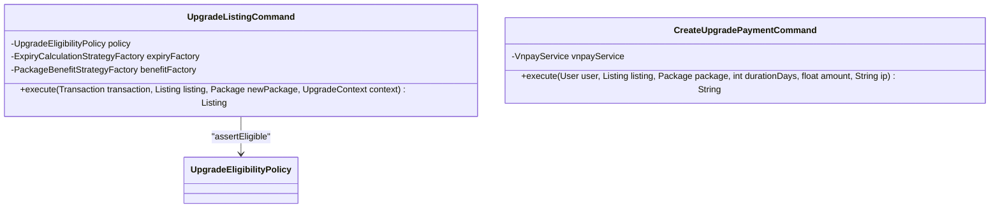

#### Giải thích các khối trong sơ đồ:
- **`CreateUpgradePaymentCommand`**: Khởi tạo bản ghi giao dịch thanh toán dạng chờ xử lý (`PENDING`) và tạo đường link thanh toán qua VNPAY.
- **`UpgradeListingCommand`**: Thực hiện cập nhật nâng cấp gói và phân phối quyền lợi tin đăng sau khi có callback ghi nhận giao dịch thành công.

| Thành phần GoF | Vai trò | Lớp cụ thể trong sơ đồ |
|---|---|---|
| **ConcreteCommand A** | Đóng gói nghiệp vụ sinh link thanh toán | `CreateUpgradePaymentCommand` |
| **ConcreteCommand B** | Đóng gói thực thi nâng cấp khi giao dịch thành công | `UpgradeListingCommand` |

---

### 7.3. Strategy Pattern — Tính toán thời hạn hết hạn & quyền lợi gói tin đăng

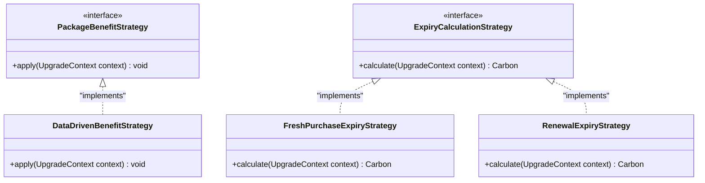

#### Giải thích các khối trong sơ đồ:
- **`ExpiryCalculationStrategy`**: Giao diện tính ngày hết hạn của tin đăng.
- **`FreshPurchaseExpiryStrategy`**: Thuật toán tính ngày hết hạn cho tin đăng mua gói mới hoàn toàn (thời hạn bắt đầu tính từ hôm nay).
- **`RenewalExpiryStrategy`**: Thuật toán cộng dồn ngày hết hạn cho tin đăng đang kích hoạt gói cùng loại.
- **`PackageBenefitStrategy` / `DataDrivenBenefitStrategy`**: Chiến lược áp dụng các quyền lợi hiển thị của gói VIP tương ứng lên tin đăng.

| Thành phần GoF | Vai trò | Lớp cụ thể trong sơ đồ |
|---|---|---|
| **Strategy Interface A** | Trừu tượng hóa cách tính hạn dùng | `ExpiryCalculationStrategy` |
| **ConcreteStrategy A1** | Tính thời hạn mua gói mới | `FreshPurchaseExpiryStrategy` |
| **ConcreteStrategy A2** | Tính thời hạn gia hạn gói | `RenewalExpiryStrategy` |
| **Strategy Interface B** | Trừu tượng hóa cách áp quyền lợi | `PackageBenefitStrategy` |
| **ConcreteStrategy B1** | Áp dụng quyền lợi theo thông số cấu hình | `DataDrivenBenefitStrategy` |

---

### 7.4. Factory Method Pattern — Khởi tạo thuật toán xử lý phù hợp

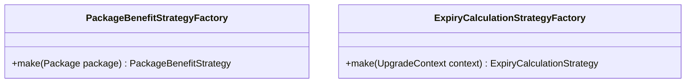

#### Giải thích các khối trong sơ đồ:
- **`PackageBenefitStrategyFactory`**: Lớp Factory khởi tạo chiến lược quyền lợi phù hợp dựa trên thông tin gói tin.
- **`ExpiryCalculationStrategyFactory`**: Lớp Factory phân tích ngữ cảnh (nâng cấp hay gia hạn) để sinh ra Strategy tính ngày hết hạn chuẩn xác.

| Thành phần GoF | Vai trò | Lớp cụ thể trong sơ đồ |
|---|---|---|
| **Creator 1** | Factory sinh Strategy quyền lợi | `PackageBenefitStrategyFactory` |
| **Creator 2** | Factory sinh Strategy tính hạn dùng | `ExpiryCalculationStrategyFactory` |

---

### 7.5. Specification Pattern — Kiểm định quy tắc nâng cấp hợp lệ

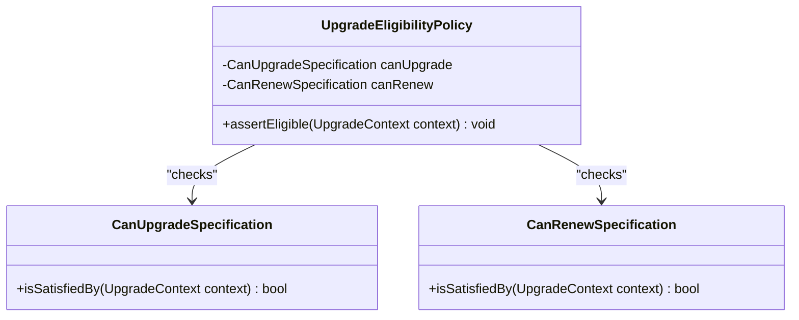

#### Giải thích các khối trong sơ đồ:
- **`CanUpgradeSpecification`**: Quy tắc kiểm định xem tin đăng có thỏa mãn điều kiện nâng cấp gói hay không (ví dụ: Tin đang ACTIVE và gói mới có độ ưu tiên cao hơn gói cũ).
- **`CanRenewSpecification`**: Quy tắc kiểm định xem tin đăng có thỏa mãn điều kiện gia hạn hay không (ví dụ: Tin đăng đang sử dụng gói tin cùng loại).
- **`UpgradeEligibilityPolicy`**: Lớp chính sách gom các luật kiểm định để tiến hành kiểm tra chéo trước khi giao dịch được thông qua.

| Thành phần GoF | Vai trò | Lớp cụ thể trong sơ đồ |
|---|---|---|
| **Specification 1** | Luật kiểm tra điều kiện nâng cấp gói | `CanUpgradeSpecification` |
| **Specification 2** | Luật kiểm tra điều kiện gia hạn gói | `CanRenewSpecification` |
| **Context Policy** | Điều phối kiểm định các quy tắc | `UpgradeEligibilityPolicy` |

---

### 7.6. Adapter & Observer Pattern — Thích ứng VNPAY API & Xử lý sự kiện sau nâng cấp

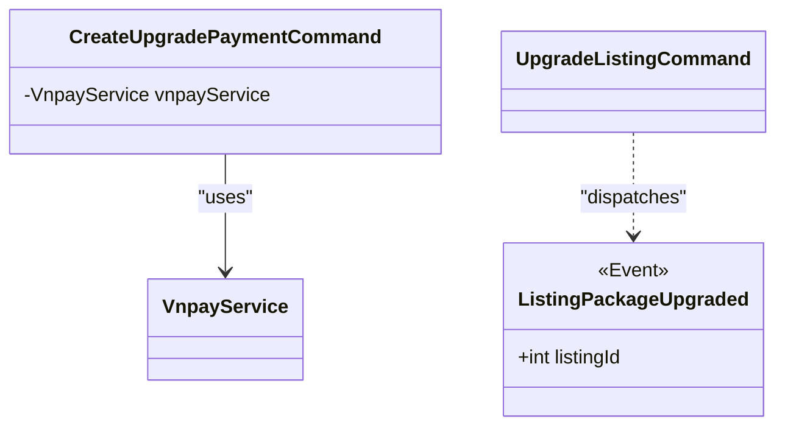

#### Giải thích các khối trong sơ đồ:
- **`VnpayService`**: Đóng vai trò Adapter tương tác với cổng thanh toán VNPAY (Adaptee).
- **`ListingPackageUpgraded`**: Sự kiện phát ra khi nâng cấp tin thành công để thông báo cho hệ thống xóa bộ nhớ đệm (Cache) danh sách tin công cộng nhằm cập nhật thứ tự hiển thị mới tức thì (Observer).

| Thành phần GoF | Vai trò | Lớp cụ thể trong sơ đồ |
|---|---|---|
| **Adapter** | Cầu nối giao tiếp cổng thanh toán VNPAY | `VnpayService` |
| **Subject (Event)** | Phát đi tín hiệu nâng cấp tin thành công | `ListingPackageUpgraded` |

---

## 8. Thuật toán sắp xếp hiển thị

### 8.1. Tại sao áp dụng & Giải quyết bài toán gì?
Thứ tự hiển thị tin đăng trên trang danh sách mặc định được sắp xếp theo công thức tính điểm ưu tiên phức tạp (độ ưu tiên của gói tin x điểm chất lượng tin x hệ số suy giảm thời gian đăng tin). Ngoài ra, người dùng có thể chọn sắp xếp theo giá, diện tích tăng hoặc giảm.
- **Vấn đề giải quyết**: Tránh code cứng (hardcode) các câu lệnh SQL `orderBy` rẽ nhánh phức tạp trong Repository. Cho phép dễ dàng bổ sung các cách sắp xếp hiển thị mới (ví dụ: sắp xếp theo mức độ phù hợp AI, khoảng cách địa lý) mà không chạm vào lõi truy vấn SQL của Repository.

---

### 8.2. Strategy Pattern — Đóng gói thuật toán sắp xếp động trên SQL Query Builder

```mermaid
classDiagram
    class ListingSortingStrategy {
        <<interface>>
        +apply(Builder query) Builder
    }
    class DefaultPackageScoreSortingStrategy {
        +apply(Builder query) Builder
    }
    class PriceLowToHighSortingStrategy {
        +apply(Builder query) Builder
    }
    class EloquentListingRepository {
        +paginatePublic(ListingSortingStrategy strategy) LengthAwarePaginator
    }

    ListingSortingStrategy <|.. DefaultPackageScoreSortingStrategy : "implements"
    ListingSortingStrategy <|.. PriceLowToHighSortingStrategy : "implements"
    EloquentListingRepository --> ListingSortingStrategy : "delegates to"
```

#### Giải thích các khối trong sơ đồ:
- **`ListingSortingStrategy`**: Interface định nghĩa phương thức can thiệp trực tiếp vào Eloquent Query Builder của Laravel để thay đổi cấu trúc truy vấn.
- **`DefaultPackageScoreSortingStrategy`**: Chiến lược sắp xếp mặc định áp dụng công thức suy giảm theo thời gian và nhân điểm hệ số gói VIP.
- **`PriceLowToHighSortingStrategy`**: Chiến lược sắp xếp theo giá bất động sản từ thấp đến cao.
- **`EloquentListingRepository`**: Lớp đóng vai trò **Context**, nhận vào Strategy sắp xếp phù hợp từ client và ủy thác việc can thiệp câu lệnh truy vấn cho Strategy đó thực hiện.

| Thành phần GoF | Vai trò | Lớp cụ thể trong sơ đồ |
|---|---|---|
| **Strategy Interface** | Quy chuẩn phương pháp can thiệp câu lệnh SQL | `ListingSortingStrategy` |
| **ConcreteStrategy 1** | Sắp xếp mặc định ưu tiên gói tin + thời gian đăng | `DefaultPackageScoreSortingStrategy` |
| **ConcreteStrategy 2** | Sắp xếp hiển thị theo giá tăng dần | `PriceLowToHighSortingStrategy` |
| **Context** | Thực hiện truy vấn và gọi chiến lược sắp xếp | `EloquentListingRepository` |

---

### 8.3. Factory Method Pattern — Sinh chiến lược sắp xếp hiển thị

```mermaid
classDiagram
    class ListingSortingStrategyFactory {
        +make(String sortBy)$ ListingSortingStrategy
    }
```

#### Giải thích các khối trong sơ đồ:
- **`ListingSortingStrategyFactory`**: Lớp Factory nhận vào chuỗi tham số `sortBy` từ HTTP Request để phân tích và khởi tạo đối tượng chiến lược sắp xếp (`ListingSortingStrategy`) tương ứng.

| Thành phần GoF | Vai trò | Lớp cụ thể trong sơ đồ |
|---|---|---|
| **Creator/Factory** | Sinh ra chiến lược sắp xếp động từ request | `ListingSortingStrategyFactory` |

---

## 9. Chức năng Chat

### 9.1. Tại sao áp dụng & Giải quyết bài toán gì?
Nghiệp vụ chat bao gồm: Tạo cuộc hội thoại, lưu tin nhắn, phân nhóm chat, quản lý danh sách block, đồng thời đẩy tin nhắn realtime qua giao thức WebSockets.
- **Vấn đề giải quyết**: Giấu độ phức tạp của phân hệ chat phía sau một interface đơn giản để các phần khác dễ dàng tương tác. Đảm bảo tính realtime của tin nhắn mà không làm nghẽn tiến trình ghi nhận vào cơ sở dữ liệu chính của hệ thống.

---

### 9.2. Facade Pattern — Interface duy nhất cho phân hệ Chat phức tạp

```mermaid
classDiagram
    class ChatService {
        <<interface>>
        +sendMessage(SendMessageDto dto) Message
        +getOrCreateConversation(GetOrCreateConversationDto dto) Conversation
    }
    class ChatServiceImpl {
        -ConversationRepository conversationRepo
        -MessageRepository messageRepo
        +sendMessage(SendMessageDto dto) Message
    }

    ChatService <|.. ChatServiceImpl : "implements"
```

#### Giải thích các khối trong sơ đồ:
- **`ChatService` / `ChatServiceImpl`**: Đóng vai trò lớp Facade. Nó che giấu sự phối hợp phức tạp giữa các Repository, các bảng dữ liệu `Conversation`, `Message`, `GroupMember`... Cung cấp giao diện gọi đơn giản để Controller thực thi.

| Thành phần GoF | Vai trò | Lớp cụ thể trong sơ đồ |
|---|---|---|
| **Facade Interface** | Giao diện tương tác nghiệp vụ phân hệ chat | `ChatService` |
| **Facade Implementation** | Gom các repository phân hệ để thực thi | `ChatServiceImpl` |

---

### 9.3. Observer & Adapter Pattern — Đồng bộ truyền phát Realtime qua WebSocket

```mermaid
classDiagram
    class ChatServiceImpl {
        +sendMessage() Message
    }
    class MessageSent {
        <<Event>>
        +Message message
    }
    class LaravelReverb {
        <<External Adapter / Broadcast Service>>
        +broadcast(Event event) void
    }

    ChatServiceImpl ..> MessageSent : "dispatches"
    MessageSent --> LaravelReverb : "broadcasts via"
```

#### Giải thích các khối trong sơ đồ:
- **`MessageSent`**: Đối tượng Event mang nội dung tin nhắn được phát ra ngay khi tin nhắn lưu database thành công (Subject).
- **`LaravelReverb`**: Dịch vụ truyền tải WebSocket chuẩn của Laravel đóng vai trò **Adapter** truyền phát tin nhắn tức thì (realtime) đến thiết bị người nhận (Observer).

| Thành phần GoF | Vai trò | Lớp cụ thể trong sơ đồ |
|---|---|---|
| **Subject (Event)** | Phát đi sự kiện tin nhắn mới được gửi | `MessageSent` |
| **Observer (Adapter)** | Nhận tin và phát tín hiệu truyền tải realtime qua socket | `LaravelReverb` |

---

## 10. Lịch sử giao dịch

### 10.1. Tại sao áp dụng & Giải quyết bài toán gì?
Nhận và xử lý dữ liệu giao dịch tài chính trả về từ VNPAY API. Cần kiểm soát quy trình chuyển đổi trạng thái thanh toán để tránh các lỗi lặp tiền/giao dịch không hợp lệ.
- **Vấn đề giải quyết**: Tách biệt logic xác minh chữ ký bảo mật của cổng thanh toán khỏi tiến trình nghiệp vụ chính của cơ sở dữ liệu. Bảo vệ dữ liệu giao dịch tài chính luôn chính xác và nhất quán.

---

### 10.2. Adapter Pattern — Thích ứng phản hồi cổng thanh toán VNPAY

```mermaid
classDiagram
    class VnpayReturnController {
        -VnpayService vnpayService
    }
    class VnpayService {
        +isValidReturn(Request request) bool
        +transactionIdFromTxnRef(String txnRef) int
    }

    VnpayReturnController --> VnpayService : "uses"
```

#### Giải thích các khối trong sơ đồ:
- **`VnpayService`**: Adapter xử lý giải mã, xác thực chữ ký bảo mật từ VNPAY Response gửi về để kiểm chứng tính toàn vẹn của dữ liệu giao dịch.

| Thành phần GoF | Vai trò | Lớp cụ thể trong sơ đồ |
|---|---|---|
| **Adapter** | Chuyển đổi dữ liệu và xác thực an toàn cổng thanh toán | `VnpayService` |

---

### 10.3. State Pattern — Quản lý chuyển đổi trạng thái thanh toán giao dịch

```mermaid
classDiagram
    class Transaction {
        +String status
        +transitionTo(String state) void
    }
    note for Transaction "State transitions:\nPENDING -> SUCCESS / FAILED / EXPIRED"
```

#### Giải thích các khối trong sơ đồ:
- **`Transaction`**: Đóng vai trò **Context**, lưu giữ trạng thái thanh toán hiện tại (`status`). Quá trình chuyển đổi trạng thái (ví dụ: Giao dịch đã `SUCCESS` không thể chuyển đổi ngược lại thành `FAILED` hoặc `PENDING`) được kiểm soát chặt chẽ để chống gian lận.

| Thành phần GoF | Vai trò | Lớp cụ thể trong sơ đồ |
|---|---|---|
| **Context** | Thực thể duy trì trạng thái của giao dịch | `Transaction` |

---

## 11. Bảng tổng hợp hệ thống Design Pattern

Bảng dưới đây ánh xạ vai trò của các GoF Design Pattern tương ứng với các phân hệ chức năng thực tế trong mã nguồn dự án Propify:

| # | Phân hệ chức năng | Design Pattern | Lớp / Khối chính trong sơ đồ cấu trúc |
|---|---|---|---|
| 1 | **Đăng ký tài khoản** | Command | `RegisterUserCommand` |
| | | Chain of Responsibility | `RegistrationValidationChain` |
| | | Adapter | `MailOtpService` bọc `OtpService` |
| | | Observer | Sự kiện `UserRegistered` phát đến `SendWelcomeNotification` |
| 2 | **Đăng nhập** | Strategy | Chiến lược xác thực `EmailPasswordAuthStrategy`, `GoogleOAuthAuthStrategy` |
| | | Factory Method | `AuthStrategyResolver` phân giải chiến lược |
| | | Adapter | `GoogleSocialiteAdapter` chuyển đổi cấu trúc dữ liệu Google SDK |
| | | Chain of Responsibility | `LoginValidationChain` xác thực bảo mật tuần tự |
| | | Observer | Sự kiện `UserLoggedIn` phát đến `LogSuccessfulLogin` |
| 3 | **Quên mật khẩu** | Chain of Responsibility | Chuỗi liên kết `FindResetUserHandler` → `SendResetOtpHandler` → `LogResetAttemptHandler` |
| | | Command | `ResetPasswordCommand` thực hiện đặt lại mật khẩu |
| | | Observer | Sự kiện `PasswordReset` kích hoạt Listener thu hồi token cũ |
| 4 | **Xác thực tin đăng** | Strategy | Chiến lược xác thực tài liệu `ManualVerificationStrategy` |
| | | Command | `SubmitListingVerificationCommand` |
| | | State | `Listing` duy trì và kiểm soát quy trình chuyển trạng thái |
| 5 | **Tin đăng yêu thích** | Facade | `FavoriteServiceImpl` che giấu sự phối hợp phức tạp giữa các Repository |
| 6 | **Nâng cấp gói tin** | Command | `CreateUpgradePaymentCommand` và `UpgradeListingCommand` |
| | | Strategy | Tính ngày hết hạn (`FreshPurchaseExpiryStrategy`, `RenewalExpiryStrategy`) và áp quyền lợi (`DataDrivenBenefitStrategy`) |
| | | Factory Method | Các factory `ExpiryCalculationStrategyFactory`, `PackageBenefitStrategyFactory` |
| | | Specification | Các Spec kiểm định điều kiện: `CanUpgradeSpecification`, `CanRenewSpecification` |
| | | Adapter | `VnpayService` bọc API thanh toán VNPAY |
| | | Observer | Sự kiện `ListingPackageUpgraded` phát đi xóa bộ nhớ đệm hiển thị |
| 7 | **Thuật toán sắp xếp** | Strategy | `DefaultPackageScoreSortingStrategy`, `PriceLowToHighSortingStrategy` can thiệp SQL Query Builder |
| | | Factory Method | `ListingSortingStrategyFactory` tạo chiến lược sắp xếp |
| 8 | **Chức năng Chat** | Facade | `ChatServiceImpl` gom các logic quản lý Message, Conversation |
| | | Observer | Sự kiện `MessageSent` kích hoạt Adapter đẩy tin nhắn realtime |
| | | Adapter | `LaravelReverb` bọc engine phát tín hiệu WebSocket |
| 9 | **Lịch sử giao dịch** | Adapter | `VnpayService` giải mã, check chữ ký số bảo mật VNPAY Response |
| | | State | `Transaction` quản lý các trạng thái tài chính hợp lệ |
