# Giải Thích Chi Tiết Design Pattern Trong Dự Án Propify

## Mục Lục

1. [Tổng quan kiến trúc](#1-tổng-quan-kiến-trúc)
2. [Đăng ký tài khoản](#2-đăng-ký-tài-khoản) — Command, Chain of Responsibility, Observer
3. [Đăng nhập](#3-đăng-nhập) — Strategy, Chain of Responsibility, Observer, Adapter
4. [Xem thông tin tài khoản](#4-xem-thông-tin-tài-khoản) — Facade, Strategy, Proxy
5. [Chỉnh sửa thông tin cá nhân](#5-chỉnh-sửa-thông-tin-cá-nhân) — Command, Chain of Responsibility, Observer, Memento
6. [Đổi mật khẩu](#6-đổi-mật-khẩu) — Command, Chain of Responsibility, Observer
7. [Quên mật khẩu](#7-quên-mật-khẩu) — Chain of Responsibility, Command, Observer, Adapter
8. [Xác thực tin đăng](#8-xác-thực-tin-đăng) — Strategy, Chain of Responsibility, Observer
9. [Tin đăng yêu thích](#9-tin-đăng-yêu-thích) — Command, Observer, Proxy
10. [Nâng cấp gói tin](#10-nâng-cấp-gói-tin) — Strategy, Factory Method, Command, Observer, Specification
11. [Thêm gói tin](#11-thêm-gói-tin) — Factory Method, Command, Observer
12. [Khóa/Kích hoạt gói tin](#12-khóakích-hoạt-gói-tin) — Command, State, Observer, Proxy
13. [Tính điểm tin đăng & Sắp xếp hiển thị](#13-tính-điểm-tin-đăng--sắp-xếp-hiển-thị) — Strategy (Rules Pattern), Strategy
14. [Bảng tổng hợp Design Pattern](#14-bảng-tổng-hợp-design-pattern)

---

## 1. Tổng quan kiến trúc

Dự án Propify là website đăng tin bất động sản, sử dụng:
- **Backend**: Laravel 12 (PHP) — Clean Architecture (Repository → Service → Controller)
- **Frontend**: Vue 3 + Vite

Kiến trúc tổng thể tuân thủ **SOLID** và **Clean Architecture**:

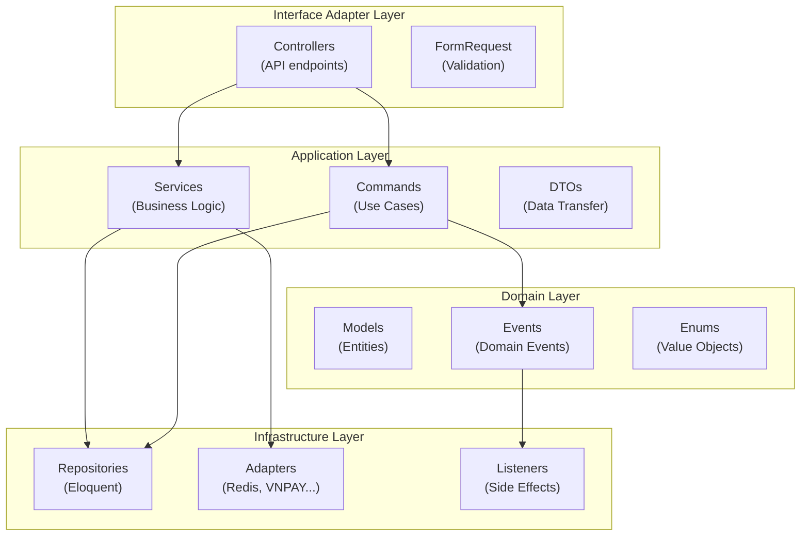
```mermaid
graph TB
    subgraph "Interface Adapter Layer"
        Controller["Controllers<br/>(API endpoints)"]
        Request["FormRequest<br/>(Validation)"]
    end
    subgraph "Application Layer"
        Service["Services<br/>(Business Logic)"]
        Command["Commands<br/>(Use Cases)"]
        DTO["DTOs<br/>(Data Transfer)"]
    end
    subgraph "Domain Layer"
        Model["Models<br/>(Entities)"]
        Event["Events<br/>(Domain Events)"]
        Enum["Enums<br/>(Value Objects)"]
    end
    subgraph "Infrastructure Layer"
        Repo["Repositories<br/>(Eloquent)"]
        Adapter["Adapters<br/>(Redis, VNPAY...)"]
        Listener["Listeners<br/>(Side Effects)"]
    end

    Controller --> Service
    Controller --> Command
    Service --> Repo
    Command --> Repo
    Command --> Event
    Event --> Listener
    Service --> Adapter
```

**Dependency Inversion Principle (DIP)**: Tất cả Service và Repository đều có **interface** riêng, implementation được bind qua `AppServiceProvider`. Module cấp cao (Service) không phụ thuộc vào module cấp thấp (Eloquent, Redis), mà phụ thuộc vào abstraction (Interface).

```
File: app/Providers/AppServiceProvider.php
$this->app->bind(UserRepository::class, EloquentUserRepository::class);
$this->app->bind(AuthService::class, AuthServiceImpl::class);
$this->app->bind(OtpStoragePort::class, RedisOtpStorageAdapter::class);
```

---

## 2. Đăng ký tài khoản

### 2.1. Tại sao dùng các pattern này?

Logic đăng ký có nhiều bước (validate, tạo user, gửi OTP, phát event). Nếu viết tất cả vào `AuthServiceImpl`, file sẽ quá lớn và khó bảo trì. Cần tách thành các class riêng biệt, mỗi class một trách nhiệm.

### 2.2. Command Pattern — Đóng gói thao tác đăng ký

> **Slide bài giảng**: _"Command Pattern đóng gói một request thành một object, cho phép tham số hóa client, hỗ trợ undo/redo/logging."_ — _"Controller rất mỏng, chỉ biết Execute()."_

**Áp dụng**: `RegisterUserCommand` đóng gói toàn bộ logic đăng ký. Controller chỉ gọi `$command->execute($dto)`, không cần biết bên trong validate ra sao, tạo user thế nào, gửi OTP bằng gì.

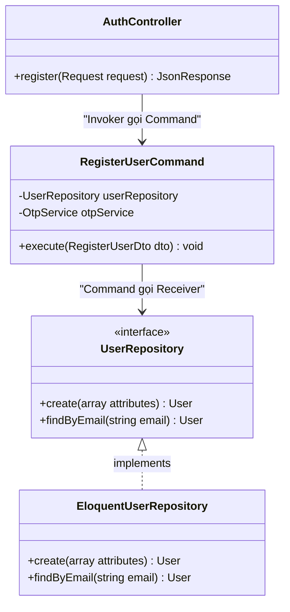
```mermaid
classDiagram
    class AuthController {
        +register(Request request) JsonResponse
    }
    class RegisterUserCommand {
        -UserRepository userRepository
        -OtpService otpService
        +execute(RegisterUserDto dto) void
    }
    class UserRepository {
        <<interface>>
        +create(array attributes) User
        +findByEmail(string email) User
    }
    class EloquentUserRepository {
        +create(array attributes) User
        +findByEmail(string email) User
    }

    AuthController --> RegisterUserCommand : "Invoker gọi Command"
    RegisterUserCommand --> UserRepository : "Command gọi Receiver"
    UserRepository <|.. EloquentUserRepository : implements
```

| Thành phần GoF | Vai trò | File code |
|---|---|---|
| Invoker | Controller gọi Command | `app/Http/Controllers/Api/V1/Auth/AuthController.php` |
| ConcreteCommand | Đóng gói logic đăng ký | `app/Services/Auth/Registration/RegisterUserCommand.php` |
| Receiver | Thực thi lưu DB | `app/Repositories/UserRepository.php` → `Eloquent/EloquentUserRepository.php` |

### 2.3. Chain of Responsibility — Validate tuần tự

> **Slide bài giảng**: _"Tách mỗi bước thành 1 Object riêng biệt (Handler). Các Handler được nối với nhau thành chuỗi. Client chỉ cần gọi Handler đầu tiên."_ — _"Dễ dàng: thêm bước xử lý mới, thay đổi thứ tự, bật/tắt bước."_

**Áp dụng**: `RegistrationValidationChain` kiểm tra tuần tự: email format → password strength → duplicate email. Nếu bất kỳ bước nào fail → throw exception, không chạy tiếp.

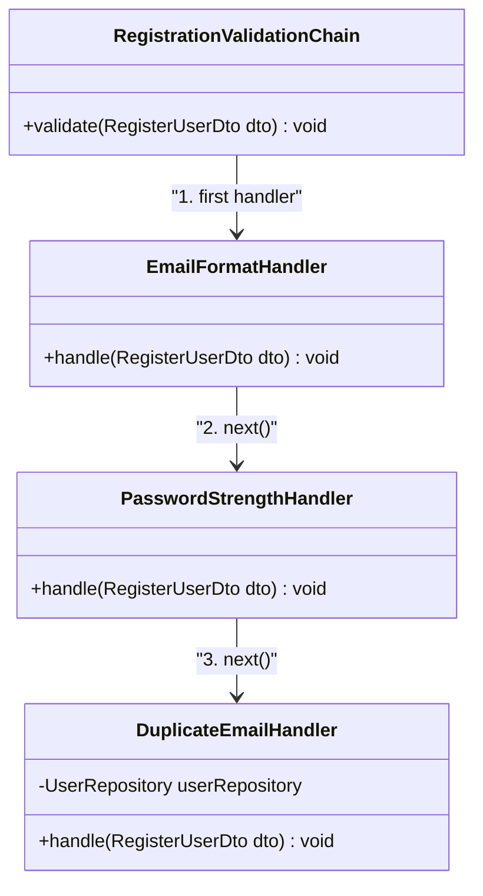
```mermaid
classDiagram
    class RegistrationValidationChain {
        +validate(RegisterUserDto dto) void
    }
    class EmailFormatHandler {
        +handle(RegisterUserDto dto) void
    }
    class PasswordStrengthHandler {
        +handle(RegisterUserDto dto) void
    }
    class DuplicateEmailHandler {
        -UserRepository userRepository
        +handle(RegisterUserDto dto) void
    }

    RegistrationValidationChain --> EmailFormatHandler : "1. first handler"
    EmailFormatHandler --> PasswordStrengthHandler : "2. next()"
    PasswordStrengthHandler --> DuplicateEmailHandler : "3. next()"
```

| Thành phần GoF | Vai trò | File code |
|---|---|---|
| Handler Chain | Điều phối chain | `app/Services/Auth/Registration/RegistrationValidationChain.php` |
| ConcreteHandler 1 | Check email format | `app/Services/Auth/Registration/Handlers/EmailFormatHandler.php` |
| ConcreteHandler 2 | Check password strength | `app/Services/Auth/Registration/Handlers/PasswordStrengthHandler.php` |
| ConcreteHandler 3 | Check duplicate email | `app/Services/Auth/Registration/Handlers/DuplicateEmailHandler.php` |

### 2.4. Observer Pattern — Phát event sau đăng ký

> **Slide bài giảng**: _"OrderService chỉ phát sự kiện — ai quan tâm thì tự xử lý."_ — _"Thêm Observer mới không sửa OrderService."_

**Áp dụng**: Sau khi đăng ký thành công → phát event `UserRegistered` → Listener `SendWelcomeNotification` tự động gửi email chào mừng. Nếu muốn thêm ghi log, gửi SMS → chỉ cần thêm Listener mới, không sửa `RegisterUserCommand`.

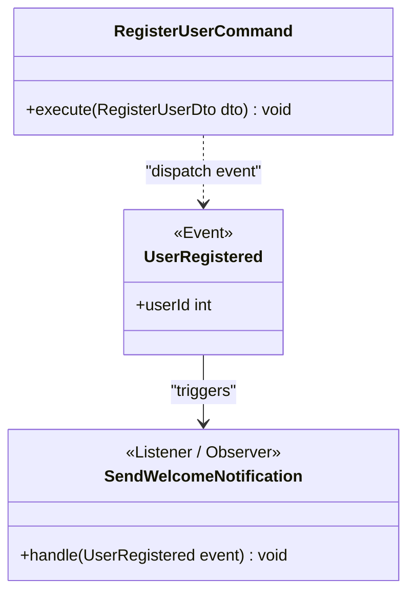
```mermaid
classDiagram
    class RegisterUserCommand {
        +execute(RegisterUserDto dto) void
    }
    class UserRegistered {
        <<Event>>
        +userId int
    }
    class SendWelcomeNotification {
        <<Listener / Observer>>
        +handle(UserRegistered event) void
    }

    RegisterUserCommand ..> UserRegistered : "dispatch event"
    UserRegistered --> SendWelcomeNotification : "triggers"
```

| Thành phần GoF | Vai trò | File code |
|---|---|---|
| Subject/Publisher | Phát event | `RegisterUserCommand` → `event(new UserRegistered(...))` |
| Event | Dữ liệu sự kiện | `app/Events/Auth/UserRegistered.php` |
| Observer/Subscriber | Phản ứng sự kiện | `app/Listeners/Auth/SendWelcomeNotification.php` |

### 2.5. Luồng hoạt động tổng hợp

```
1. User gửi form đăng ký → AuthController.register()
2. AuthServiceImpl → delegate sang RegisterUserCommand.execute()
3. RegisterUserCommand:
   a. RegistrationValidationChain.validate() → CoR kiểm tra email, password, trùng
   b. UserRepository.create() → tạo user (status = Pending)
   c. OtpService.generate() → tạo OTP, gửi email
   d. event(new UserRegistered($user)) → phát event Observer
4. SendWelcomeNotification listener → gửi email chào mừng
```

---

## 3. Đăng nhập

### 3.1. Tại sao dùng các pattern này?

Hệ thống hỗ trợ **nhiều phương thức đăng nhập** (Email/Password, Google OAuth). Mỗi phương thức có luồng xử lý hoàn toàn khác nhau. Nếu dùng `if-else`, code sẽ vi phạm OCP và khó mở rộng.

### 3.2. Strategy Pattern — Chọn phương thức đăng nhập

> **Slide bài giảng**: _"Strategy Pattern định nghĩa một họ các thuật toán, đóng gói từng thuật toán, và cho phép chúng thay đổi độc lập với client."_ — _"Context phụ thuộc abstraction (DIP)."_

**Áp dụng**: Mỗi phương thức đăng nhập là 1 class riêng implement `AuthStrategy`. `AuthStrategyResolver` nhận tất cả strategies qua DI, chọn strategy phù hợp tại runtime bằng method `resolve()`.

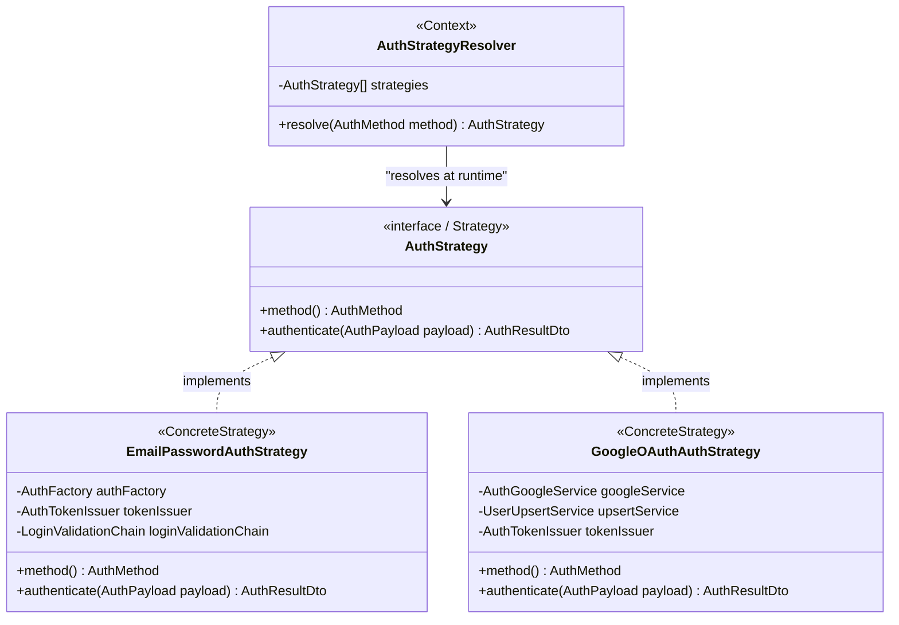
```mermaid
classDiagram
    class AuthStrategy {
        <<interface / Strategy>>
        +method() AuthMethod
        +authenticate(AuthPayload payload) AuthResultDto
    }
    class EmailPasswordAuthStrategy {
        <<ConcreteStrategy>>
        -AuthFactory authFactory
        -AuthTokenIssuer tokenIssuer
        -LoginValidationChain loginValidationChain
        +method() AuthMethod
        +authenticate(AuthPayload payload) AuthResultDto
    }
    class GoogleOAuthAuthStrategy {
        <<ConcreteStrategy>>
        -AuthGoogleService googleService
        -UserUpsertService upsertService
        -AuthTokenIssuer tokenIssuer
        +method() AuthMethod
        +authenticate(AuthPayload payload) AuthResultDto
    }
    class AuthStrategyResolver {
        <<Context>>
        -AuthStrategy[] strategies
        +resolve(AuthMethod method) AuthStrategy
    }

    AuthStrategy <|.. EmailPasswordAuthStrategy : implements
    AuthStrategy <|.. GoogleOAuthAuthStrategy : implements
    AuthStrategyResolver --> AuthStrategy : "resolves at runtime"
```

| Thành phần GoF | Vai trò | File code |
|---|---|---|
| Strategy Interface | Định nghĩa thuật toán | `app/Services/Auth/AuthStrategy.php` |
| ConcreteStrategy A | Đăng nhập Email/Password | `app/Services/Auth/Strategies/EmailPasswordAuthStrategy.php` |
| ConcreteStrategy B | Đăng nhập Google OAuth | `app/Services/Auth/Strategies/GoogleOAuthAuthStrategy.php` |
| Context | Chọn strategy tại runtime | `app/Services/Auth/AuthStrategyResolver.php` |

### 3.3. Chain of Responsibility — Validate đăng nhập tuần tự

> **Slide bài giảng**: _"Handler: Xử lý phần việc của mình → Gọi handler tiếp theo (nếu có)."_

**Áp dụng**: `LoginValidationChain` kiểm tra tuần tự: tìm user theo email → check status Active → check password hash. Nếu bất kỳ bước nào fail → throw exception ngay.

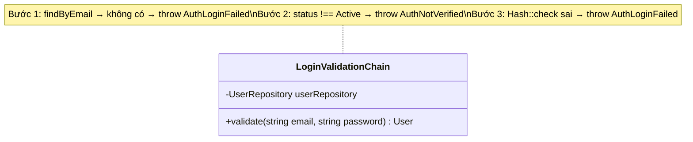
```mermaid
classDiagram
    class LoginValidationChain {
        -UserRepository userRepository
        +validate(string email, string password) User
    }

    note for LoginValidationChain "Bước 1: findByEmail → không có → throw AuthLoginFailed\nBước 2: status !== Active → throw AuthNotVerified\nBước 3: Hash::check sai → throw AuthLoginFailed"
```

| Thành phần GoF | Vai trò | File code |
|---|---|---|
| Handler Chain | Validate tuần tự 3 bước | `app/Services/Auth/Login/LoginValidationChain.php` |

### 3.4. Adapter Pattern — Tích hợp Google OAuth

> **Slide bài giảng**: _"Adapter giúp hệ thống nói chuyện với thế giới mà không đánh mất bản sắc (kiến trúc) của mình."_ — _"Business chỉ biết Interface. Adapter giấu đi sự phức tạp của SDK."_

**Áp dụng**: Google API trả dữ liệu dạng khác (access token, user info format Google). `GoogleOAuthAuthStrategy` đóng vai trò Adapter, chuyển đổi dữ liệu Google thành format hệ thống cần (`AuthResultDto`).

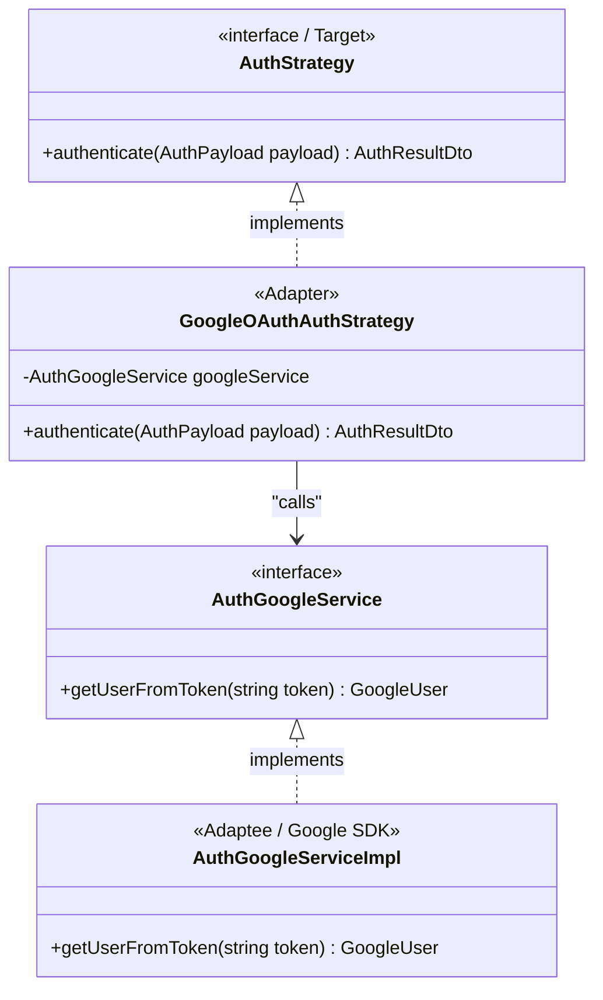
```mermaid
classDiagram
    class AuthStrategy {
        <<interface / Target>>
        +authenticate(AuthPayload payload) AuthResultDto
    }
    class GoogleOAuthAuthStrategy {
        <<Adapter>>
        -AuthGoogleService googleService
        +authenticate(AuthPayload payload) AuthResultDto
    }
    class AuthGoogleService {
        <<interface>>
        +getUserFromToken(string token) GoogleUser
    }
    class AuthGoogleServiceImpl {
        <<Adaptee / Google SDK>>
        +getUserFromToken(string token) GoogleUser
    }

    AuthStrategy <|.. GoogleOAuthAuthStrategy : implements
    GoogleOAuthAuthStrategy --> AuthGoogleService : "calls"
    AuthGoogleService <|.. AuthGoogleServiceImpl : implements
```

| Thành phần GoF | Vai trò | File code |
|---|---|---|
| Target | Interface hệ thống | `app/Services/Auth/AuthStrategy.php` |
| Adapter | Chuyển đổi interface | `app/Services/Auth/Strategies/GoogleOAuthAuthStrategy.php` |
| Adaptee Interface | Port đến Google | `app/Services/Auth/AuthGoogleService.php` |
| Adaptee Implementation | Gọi Google SDK thật | `app/Services/Auth/Impl/AuthGoogleServiceImpl.php` |

### 3.5. Observer Pattern — Phát event đăng nhập

> **Slide bài giảng**: _"Đừng để một class làm mọi thứ. Hãy để nó phát sự kiện, và để thế giới xung quanh tự phản ứng."_

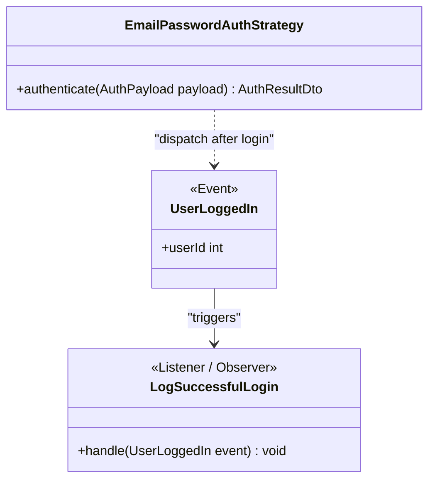
```mermaid
classDiagram
    class EmailPasswordAuthStrategy {
        +authenticate(AuthPayload payload) AuthResultDto
    }
    class UserLoggedIn {
        <<Event>>
        +userId int
    }
    class LogSuccessfulLogin {
        <<Listener / Observer>>
        +handle(UserLoggedIn event) void
    }

    EmailPasswordAuthStrategy ..> UserLoggedIn : "dispatch after login"
    UserLoggedIn --> LogSuccessfulLogin : "triggers"
```

| Thành phần GoF | Vai trò | File code |
|---|---|---|
| Subject | Phát event | `EmailPasswordAuthStrategy` → `event(new UserLoggedIn(...))` |
| Event | Dữ liệu sự kiện | `app/Events/Auth/UserLoggedIn.php` |
| Observer | Ghi log đăng nhập | `app/Listeners/Auth/LogSuccessfulLogin.php` |

---

## 4. Xem thông tin tài khoản

### 4.1. Tại sao dùng các pattern này?

Xem thông tin tài khoản cần gom nhiều nguồn dữ liệu (profile, thống kê tin đăng, gói tin). Cần ẩn/hiện thông tin theo quyền (chủ TK thấy tất cả, người khác không thấy email/phone).

### 4.2. Facade Pattern — Gom logic phức tạp

> **Slide bài giảng**: _"Facade che giấu độ phức tạp. Client chỉ gọi 1 lệnh PlaceOrder(). Facade tự biết gọi Inventory → Payment → Shipping."_ — _"Facade thường nằm ở Application Layer."_

**Áp dụng**: `AccountFacade` gom `UserService`, `ListingService` thành 1 method `getAccountOverview()`. Controller chỉ gọi 1 method thay vì 3-4 service.

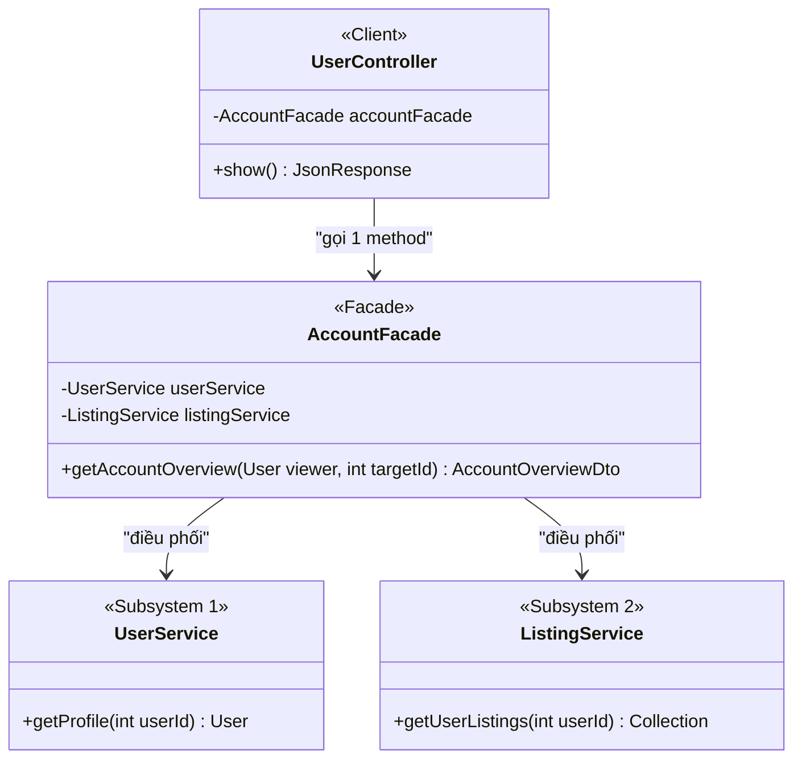
```mermaid
classDiagram
    class AccountFacade {
        <<Facade>>
        -UserService userService
        -ListingService listingService
        +getAccountOverview(User viewer, int targetId) AccountOverviewDto
    }
    class UserService {
        <<Subsystem 1>>
        +getProfile(int userId) User
    }
    class ListingService {
        <<Subsystem 2>>
        +getUserListings(int userId) Collection
    }
    class UserController {
        <<Client>>
        -AccountFacade accountFacade
        +show() JsonResponse
    }

    UserController --> AccountFacade : "gọi 1 method"
    AccountFacade --> UserService : "điều phối"
    AccountFacade --> ListingService : "điều phối"
```

| Thành phần GoF | Vai trò | File code |
|---|---|---|
| Facade | Gom logic | `app/Services/User/AccountFacade.php` |
| Subsystem 1 | Dữ liệu user | `app/Services/User/UserService.php` |
| Subsystem 2 | Dữ liệu tin đăng | `app/Services/Listing/ListingService.php` |

### 4.3. Strategy Pattern — Hiển thị theo quyền (Visibility)

> **Slide bài giảng**: _"Tách hành vi thay đổi ra thành các class riêng. Client không cần biết chi tiết cài đặt. Có thể thay đổi strategy tại runtime."_

**Áp dụng**: User xem profile của mình → `OwnerVisibilityStrategy` hiện tất cả. User khác xem → `PublicVisibilityStrategy` ẩn email/phone.

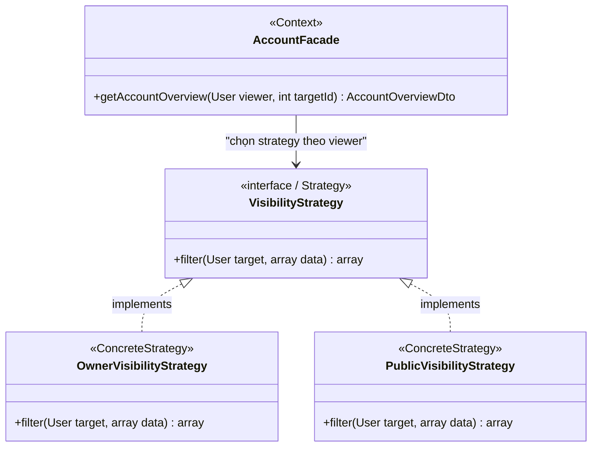
```mermaid
classDiagram
    class VisibilityStrategy {
        <<interface / Strategy>>
        +filter(User target, array data) array
    }
    class OwnerVisibilityStrategy {
        <<ConcreteStrategy>>
        +filter(User target, array data) array
    }
    class PublicVisibilityStrategy {
        <<ConcreteStrategy>>
        +filter(User target, array data) array
    }
    class AccountFacade {
        <<Context>>
        +getAccountOverview(User viewer, int targetId) AccountOverviewDto
    }

    VisibilityStrategy <|.. OwnerVisibilityStrategy : implements
    VisibilityStrategy <|.. PublicVisibilityStrategy : implements
    AccountFacade --> VisibilityStrategy : "chọn strategy theo viewer"
```

| Thành phần GoF | Vai trò | File code |
|---|---|---|
| Strategy Interface | Định nghĩa filter | `app/Services/User/Visibility/VisibilityStrategy.php` |
| ConcreteStrategy A | Hiện tất cả | `app/Services/User/Visibility/OwnerVisibilityStrategy.php` |
| ConcreteStrategy B | Ẩn thông tin nhạy cảm | `app/Services/User/Visibility/PublicVisibilityStrategy.php` |

### 4.4. Proxy Pattern — Kiểm tra quyền truy cập

> **Slide bài giảng**: _"Proxy cung cấp một đối tượng đại diện để kiểm soát truy cập. Client không gọi trực tiếp đối tượng thật → gọi thông qua Proxy."_ — Protection Proxy: _"Chỉ Admin được hủy đơn. Kế toán xem báo cáo."_

**Áp dụng**: Middleware `auth:api` đóng vai trò **Protection Proxy** — kiểm tra user đã đăng nhập chưa trước khi cho phép xem tài khoản.

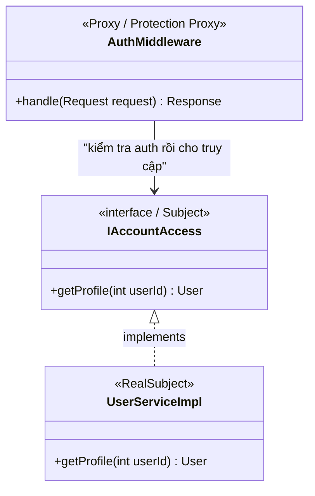
```mermaid
classDiagram
    class IAccountAccess {
        <<interface / Subject>>
        +getProfile(int userId) User
    }
    class UserServiceImpl {
        <<RealSubject>>
        +getProfile(int userId) User
    }
    class AuthMiddleware {
        <<Proxy / Protection Proxy>>
        +handle(Request request) Response
    }

    IAccountAccess <|.. UserServiceImpl : implements
    AuthMiddleware --> IAccountAccess : "kiểm tra auth rồi cho truy cập"
```

| Thành phần GoF | Vai trò | File code |
|---|---|---|
| Protection Proxy | Middleware kiểm tra auth | Laravel Middleware `auth:api` (routes/api.php) |
| RealSubject | Service thật | `app/Services/User/Impl/UserServiceImpl.php` |

---

## 5. Chỉnh sửa thông tin cá nhân

### 5.1. Tại sao dùng các pattern này?

Cập nhật profile cần: validate dữ liệu, lưu thay đổi, ghi audit log (ai thay đổi gì, giá trị cũ/mới), phát event. Mỗi trách nhiệm được tách ra class riêng.

### 5.2. Command Pattern — Đóng gói thao tác update

> **Slide bài giảng**: _"Biến mỗi hành động (Request) thành một Object độc lập."_ — _"Command nằm ở Application Layer (Use Cases)."_

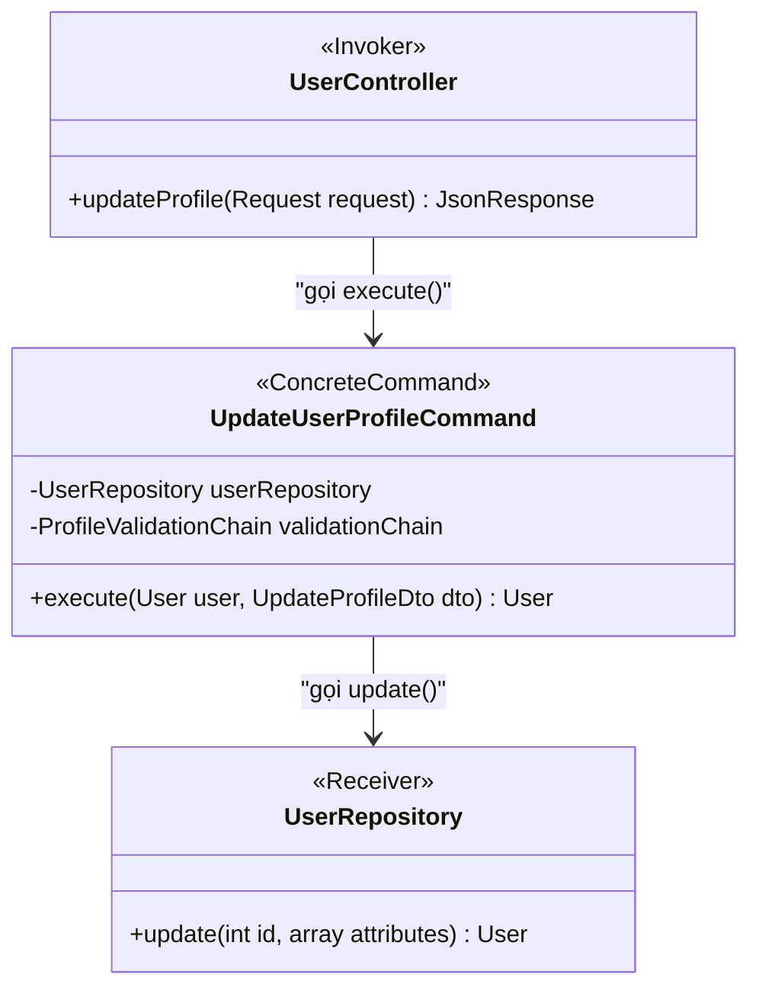
```mermaid
classDiagram
    class UserController {
        <<Invoker>>
        +updateProfile(Request request) JsonResponse
    }
    class UpdateUserProfileCommand {
        <<ConcreteCommand>>
        -UserRepository userRepository
        -ProfileValidationChain validationChain
        +execute(User user, UpdateProfileDto dto) User
    }
    class UserRepository {
        <<Receiver>>
        +update(int id, array attributes) User
    }

    UserController --> UpdateUserProfileCommand : "gọi execute()"
    UpdateUserProfileCommand --> UserRepository : "gọi update()"
```

| Thành phần GoF | Vai trò | File code |
|---|---|---|
| Invoker | Controller | `app/Http/Controllers/Api/V1/User/UserController.php` |
| ConcreteCommand | Đóng gói update profile | `app/Commands/User/UpdateUserProfileCommand.php` |
| Receiver | Lưu DB | `app/Repositories/UserRepository.php` |

### 5.3. Chain of Responsibility — Validate profile

> **Slide bài giảng**: _"Thêm bước xử lý mới không sửa code cũ."_

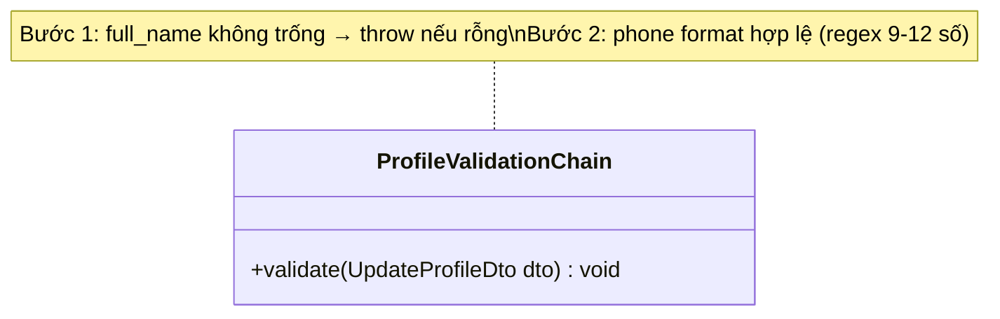
```mermaid
classDiagram
    class ProfileValidationChain {
        +validate(UpdateProfileDto dto) void
    }

    note for ProfileValidationChain "Bước 1: full_name không trống → throw nếu rỗng\nBước 2: phone format hợp lệ (regex 9-12 số)"
```

| Thành phần GoF | Vai trò | File code |
|---|---|---|
| Handler Chain | Validate tuần tự | `app/Services/User/Validation/ProfileValidationChain.php` |

### 5.4. Memento Pattern — Lưu snapshot thay đổi

> **Slide bài giảng**: _"Originator (Order) → Save state → Memento (OrderMemento) → Caretaker quản lý undo/redo stack."_ — _"Save trạng thái hiện tại → Update trạng thái mới."_

**Áp dụng**: `AuditLog.changes` lưu snapshot old/new values mỗi khi user thay đổi profile. Giá trị cũ được snapshot trước khi update — đây chính là Memento.

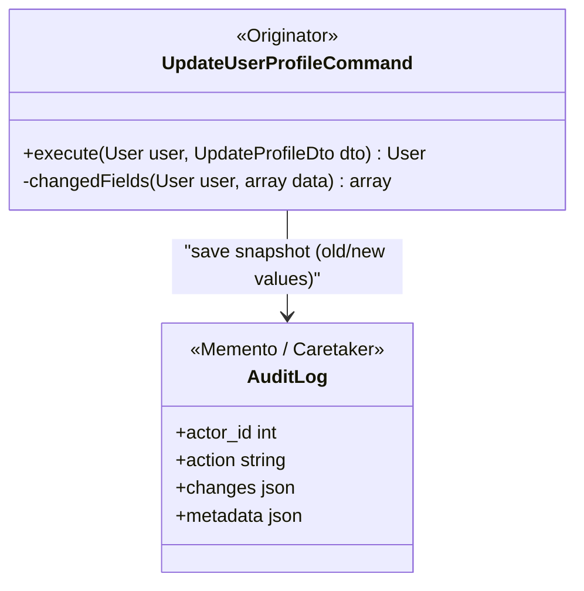
```mermaid
classDiagram
    class UpdateUserProfileCommand {
        <<Originator>>
        +execute(User user, UpdateProfileDto dto) User
        -changedFields(User user, array data) array
    }
    class AuditLog {
        <<Memento / Caretaker>>
        +actor_id int
        +action string
        +changes json
        +metadata json
    }

    UpdateUserProfileCommand --> AuditLog : "save snapshot (old/new values)"
```

**Code thực tế**:
```php
// File: app/Commands/User/UpdateUserProfileCommand.php
$changes = $this->changedFields($user, $data);   // ← Snapshot giá trị cũ
$updated = $this->userRepository->update($user->id, $data);
AuditLog::create([
    'action'  => 'user.profile.updated',
    'changes' => $changes,  // ← Memento: {"full_name": {"old": "Bảo", "new": "Thái Bảo"}}
]);
```

| Thành phần GoF | Vai trò | File code |
|---|---|---|
| Originator | Tạo snapshot | `app/Commands/User/UpdateUserProfileCommand.php` (method `changedFields`) |
| Memento | Lưu snapshot | `app/Models/AuditLog.php` (field `changes`) |

### 5.5. Observer Pattern — Phát event sau update

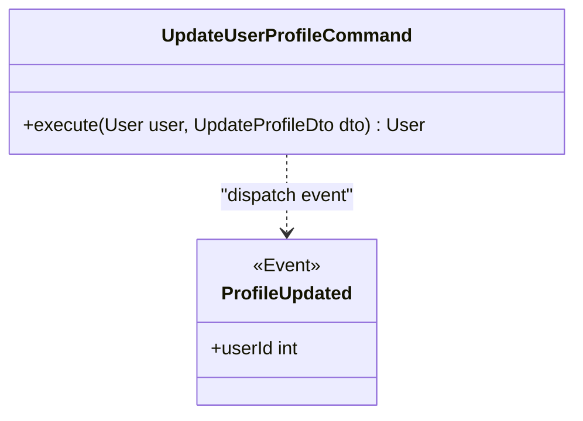
```mermaid
classDiagram
    class UpdateUserProfileCommand {
        +execute(User user, UpdateProfileDto dto) User
    }
    class ProfileUpdated {
        <<Event>>
        +userId int
    }

    UpdateUserProfileCommand ..> ProfileUpdated : "dispatch event"
```

| Thành phần GoF | Vai trò | File code |
|---|---|---|
| Event | Dữ liệu sự kiện | `app/Events/User/ProfileUpdated.php` |

---

## 6. Đổi mật khẩu

### 6.1. Tại sao dùng các pattern này?

Đổi mật khẩu là hành động nhạy cảm. Cần validate nghiêm ngặt và ghi audit log, phát cảnh báo bảo mật.

> **Lưu ý**: Không dùng Memento cho đổi mật khẩu — không được lưu password hash cũ vì lý do bảo mật.

### 6.2. Command Pattern

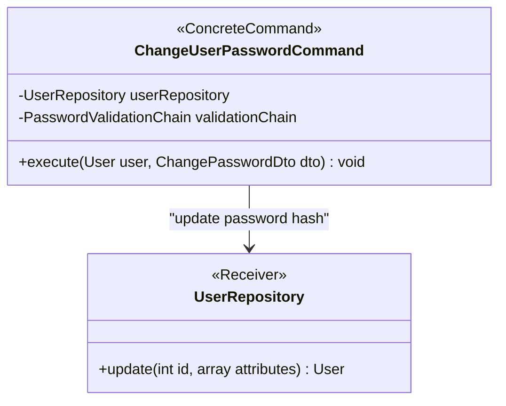
```mermaid
classDiagram
    class ChangeUserPasswordCommand {
        <<ConcreteCommand>>
        -UserRepository userRepository
        -PasswordValidationChain validationChain
        +execute(User user, ChangePasswordDto dto) void
    }
    class UserRepository {
        <<Receiver>>
        +update(int id, array attributes) User
    }

    ChangeUserPasswordCommand --> UserRepository : "update password hash"
```

| Thành phần GoF | Vai trò | File code |
|---|---|---|
| ConcreteCommand | Đóng gói đổi mật khẩu | `app/Commands/User/ChangeUserPasswordCommand.php` |

### 6.3. Chain of Responsibility — Validate mật khẩu

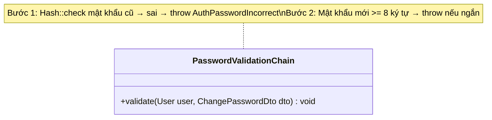
```mermaid
classDiagram
    class PasswordValidationChain {
        +validate(User user, ChangePasswordDto dto) void
    }

    note for PasswordValidationChain "Bước 1: Hash::check mật khẩu cũ → sai → throw AuthPasswordIncorrect\nBước 2: Mật khẩu mới >= 8 ký tự → throw nếu ngắn"
```

| Thành phần GoF | Vai trò | File code |
|---|---|---|
| Handler Chain | Validate mật khẩu cũ + mới | `app/Services/User/Validation/PasswordValidationChain.php` |

### 6.4. Observer Pattern — Cảnh báo bảo mật

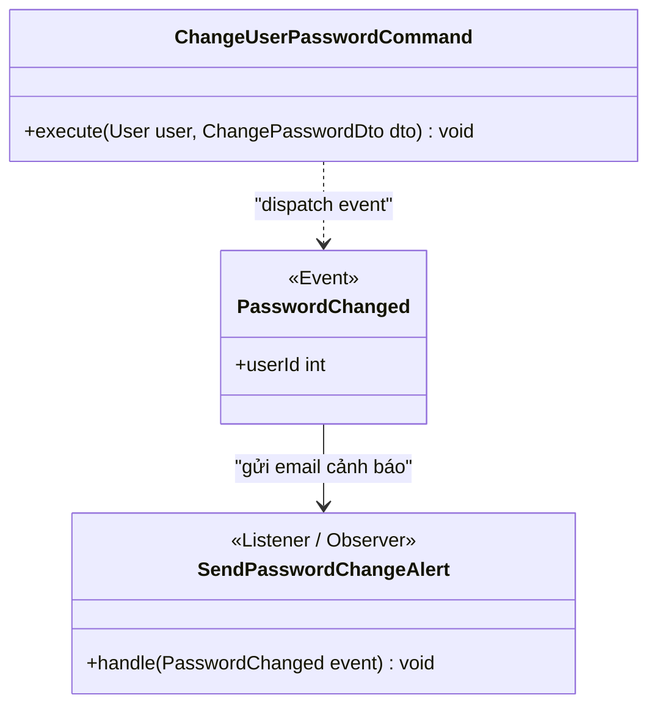
```mermaid
classDiagram
    class ChangeUserPasswordCommand {
        +execute(User user, ChangePasswordDto dto) void
    }
    class PasswordChanged {
        <<Event>>
        +userId int
    }
    class SendPasswordChangeAlert {
        <<Listener / Observer>>
        +handle(PasswordChanged event) void
    }

    ChangeUserPasswordCommand ..> PasswordChanged : "dispatch event"
    PasswordChanged --> SendPasswordChangeAlert : "gửi email cảnh báo"
```

| Thành phần GoF | Vai trò | File code |
|---|---|---|
| Event | Sự kiện đổi mật khẩu | `app/Events/Auth/PasswordChanged.php` |
| Observer | Gửi email cảnh báo | `app/Listeners/Auth/SendPasswordChangeAlert.php` |

---

## 7. Quên mật khẩu

### 7.1. Tại sao dùng các pattern này?

Quên mật khẩu có luồng nhiều bước, mỗi bước có thể dừng lại (user không tồn tại → không gửi OTP). Đây là ví dụ **chuẩn nhất** của Chain of Responsibility trong dự án.

### 7.2. Chain of Responsibility — Pipeline xử lý tuần tự

> **Slide bài giảng**: _"Các Handler được nối với nhau thành chuỗi (Linked List). Handler: Xử lý phần việc của mình → Gọi handler tiếp theo."_ — _"CoR chính là Middleware trong ASP.NET Core!"_

**Áp dụng**: Ba handler nối tiếp: `FindResetUserHandler` → `SendResetOtpHandler` → `LogResetAttemptHandler`. Nếu `FindResetUserHandler` không tìm được user → dừng chain, không gửi OTP.

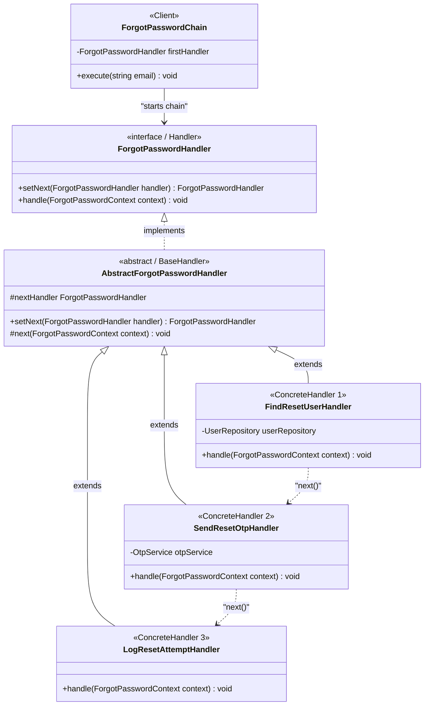
```mermaid
classDiagram
    class ForgotPasswordHandler {
        <<interface / Handler>>
        +setNext(ForgotPasswordHandler handler) ForgotPasswordHandler
        +handle(ForgotPasswordContext context) void
    }
    class AbstractForgotPasswordHandler {
        <<abstract / BaseHandler>>
        #nextHandler ForgotPasswordHandler
        +setNext(ForgotPasswordHandler handler) ForgotPasswordHandler
        #next(ForgotPasswordContext context) void
    }
    class FindResetUserHandler {
        <<ConcreteHandler 1>>
        -UserRepository userRepository
        +handle(ForgotPasswordContext context) void
    }
    class SendResetOtpHandler {
        <<ConcreteHandler 2>>
        -OtpService otpService
        +handle(ForgotPasswordContext context) void
    }
    class LogResetAttemptHandler {
        <<ConcreteHandler 3>>
        +handle(ForgotPasswordContext context) void
    }
    class ForgotPasswordChain {
        <<Client>>
        -ForgotPasswordHandler firstHandler
        +execute(string email) void
    }

    ForgotPasswordHandler <|.. AbstractForgotPasswordHandler : implements
    AbstractForgotPasswordHandler <|-- FindResetUserHandler : extends
    AbstractForgotPasswordHandler <|-- SendResetOtpHandler : extends
    AbstractForgotPasswordHandler <|-- LogResetAttemptHandler : extends
    ForgotPasswordChain --> ForgotPasswordHandler : "starts chain"
    FindResetUserHandler ..> SendResetOtpHandler : "next()"
    SendResetOtpHandler ..> LogResetAttemptHandler : "next()"
```

**Wiring chain trong DI**:
```php
// File: app/Providers/AppServiceProvider.php
$findUser->setNext($sendOtp)->setNext($logAttempt);
return new ForgotPasswordChain($findUser);
```

| Thành phần GoF | Vai trò | File code |
|---|---|---|
| Handler Interface | Base handler | `app/Services/Auth/ForgotPassword/ForgotPasswordHandler.php` |
| AbstractHandler | Template + `next()` | `app/Services/Auth/ForgotPassword/AbstractForgotPasswordHandler.php` |
| ConcreteHandler 1 | Tìm user theo email | `app/Services/Auth/ForgotPassword/Handlers/FindResetUserHandler.php` |
| ConcreteHandler 2 | Gửi OTP | `app/Services/Auth/ForgotPassword/Handlers/SendResetOtpHandler.php` |
| ConcreteHandler 3 | Ghi log | `app/Services/Auth/ForgotPassword/Handlers/LogResetAttemptHandler.php` |
| Chain Client | Khởi tạo chain | `app/Services/Auth/ForgotPassword/ForgotPasswordChain.php` |

### 7.3. Adapter Pattern — OTP Storage

> **Slide bài giảng**: _"Tạo một lớp trung gian (Adapter) để phiên dịch interface."_ — _"Adapter nằm ở Infrastructure Layer. Giúp bảo vệ Domain khỏi thay đổi bên ngoài."_

**Áp dụng**: `OtpStoragePort` là interface domain (Target). `RedisOtpStorageAdapter` chuyển đổi Redis API thành interface domain. Nếu mai đổi sang Database → chỉ tạo `DatabaseOtpStorageAdapter` mới.

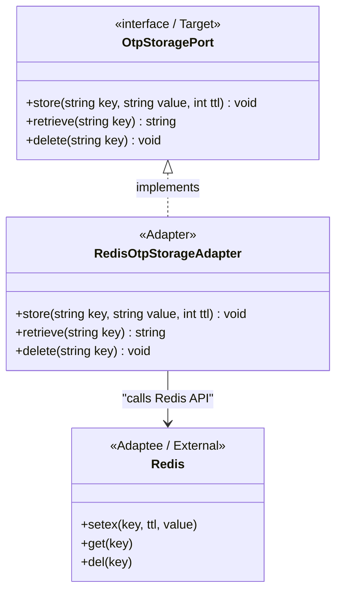
```mermaid
classDiagram
    class OtpStoragePort {
        <<interface / Target>>
        +store(string key, string value, int ttl) void
        +retrieve(string key) string
        +delete(string key) void
    }
    class RedisOtpStorageAdapter {
        <<Adapter>>
        +store(string key, string value, int ttl) void
        +retrieve(string key) string
        +delete(string key) void
    }
    class Redis {
        <<Adaptee / External>>
        +setex(key, ttl, value)
        +get(key)
        +del(key)
    }

    OtpStoragePort <|.. RedisOtpStorageAdapter : implements
    RedisOtpStorageAdapter --> Redis : "calls Redis API"
```

| Thành phần GoF | Vai trò | File code |
|---|---|---|
| Target | Interface domain | `app/Services/Otp/OtpStoragePort.php` |
| Adapter | Chuyển đổi Redis → domain | `app/Services/Otp/Adapters/RedisOtpStorageAdapter.php` |
| Adaptee | Redis (bên thứ ba) | `Illuminate\Support\Facades\Redis` |

### 7.4. Observer Pattern — Phát event reset

```mermaid
classDiagram
    class ResetPasswordCommand {
        +execute(string email, string otp, string password) void
    }
    class PasswordReset {
        <<Event>>
        +userId int
    }

    ResetPasswordCommand ..> PasswordReset : "dispatch event"
```

| Thành phần GoF | Vai trò | File code |
|---|---|---|
| Event | Sự kiện reset password | `app/Events/Auth/PasswordReset.php` |

---

## 8. Xác thực tin đăng

### 8.1. Tại sao dùng các pattern này?

Xác thực tin đăng có thể bằng nhiều phương pháp: admin duyệt thủ công (Manual), hoặc tương lai auto verify. Cần mở rộng mà không sửa code cũ.

### 8.2. Strategy Pattern — Phương thức xác thực

```mermaid
classDiagram
    class VerificationStrategy {
        <<interface / Strategy>>
        +supports(string method) bool
        +verify(Listing listing, array documents) VerificationResult
    }
    class ManualVerificationStrategy {
        <<ConcreteStrategy>>
        +supports(string method) bool
        +verify(Listing listing, array documents) VerificationResult
    }

    VerificationStrategy <|.. ManualVerificationStrategy : implements
```

| Thành phần GoF | Vai trò | File code |
|---|---|---|
| Strategy Interface | Phương thức xác thực | `app/Services/Listing/Verification/VerificationStrategy.php` |
| ConcreteStrategy | Duyệt thủ công | `app/Services/Listing/Verification/ManualVerificationStrategy.php` |

### 8.3. Observer Pattern — Event xác thực

```mermaid
classDiagram
    class ListingVerificationService {
        +requestVerification(User user, int listingId) Listing
    }
    class ListingVerificationRequested {
        <<Event>>
        +listingId int
        +userId int
    }

    ListingVerificationService ..> ListingVerificationRequested : "dispatch event"
```

| Thành phần GoF | Vai trò | File code |
|---|---|---|
| Event | Sự kiện yêu cầu xác thực | `app/Events/Listing/ListingVerificationRequested.php` |

---

## 9. Tin đăng yêu thích

### 9.1. Tại sao dùng các pattern này?

Ban đầu `FavoriteController` là **FAT controller** — logic nghiệp vụ nằm trực tiếp trong controller. Sau refactor, tách ra Service + Repository theo Clean Architecture.

### 9.2. Proxy Pattern — Kiểm tra đăng nhập

> **Slide bài giảng**: Protection Proxy — _"Chỉ Admin được hủy đơn."_ — _"Client không gọi trực tiếp RealSubject → gọi thông qua Proxy."_

**Áp dụng**: Middleware `auth:api` là Protection Proxy — chỉ user đã đăng nhập mới toggle yêu thích.

```mermaid
classDiagram
    class FavoriteService {
        <<interface / Subject>>
        +toggle(int userId, int listingId) bool
        +getUserFavorites(int userId) Collection
        +getUserFavoriteIds(int userId) Collection
    }
    class FavoriteServiceImpl {
        <<RealSubject>>
        -FavoriteRepository repository
        +toggle(int userId, int listingId) bool
        +getUserFavorites(int userId) Collection
    }
    class AuthMiddleware {
        <<Proxy / Protection Proxy>>
        +handle(Request request) Response
    }

    FavoriteService <|.. FavoriteServiceImpl : implements
    AuthMiddleware --> FavoriteService : "check auth → cho truy cập"
```

| Thành phần GoF | Vai trò | File code |
|---|---|---|
| Subject | Interface chung | `app/Services/Listing/Favorite/FavoriteService.php` |
| RealSubject | Service thật | `app/Services/Listing/Favorite/Impl/FavoriteServiceImpl.php` |
| Proxy | Middleware kiểm tra auth | Laravel Middleware `auth:api` |

### 9.3. Observer Pattern — Event yêu thích

```mermaid
classDiagram
    class FavoriteServiceImpl {
        +toggle(int userId, int listingId) bool
    }
    class FavoriteToggled {
        <<Event>>
        +userId int
        +listingId int
        +isFavorited bool
    }

    FavoriteServiceImpl ..> FavoriteToggled : "dispatch event"
```

| Thành phần GoF | Vai trò | File code |
|---|---|---|
| Event | Sự kiện toggle yêu thích | `app/Events/Listing/FavoriteToggled.php` |

---

## 10. Nâng cấp gói tin

### 10.1. Tại sao dùng các pattern này?

Nâng cấp gói tin là **chức năng phức tạp nhất**. Mỗi gói có cách tính giá, thời hạn, quyền lợi khác nhau. Cần kiểm tra nhiều điều kiện nâng cấp.

### 10.2. Strategy Pattern — Tính toán linh hoạt

> **Slide bài giảng**: _"Kết hợp nhiều Strategy: CheckoutService inject cả IShippingStrategy và IDiscountStrategy."_

**Áp dụng**: 3 strategy riêng biệt cho 3 khía cạnh:

```mermaid
classDiagram
    class ExpiryCalculationStrategy {
        <<interface / Strategy>>
        +calculate(Listing listing, Package package) Carbon
    }
    class RenewExpiryStrategy {
        <<ConcreteStrategy>>
        +calculate(Listing listing, Package package) Carbon
    }
    class UpgradeExpiryStrategy {
        <<ConcreteStrategy>>
        +calculate(Listing listing, Package package) Carbon
    }

    ExpiryCalculationStrategy <|.. RenewExpiryStrategy : "gia hạn = cộng thêm ngày"
    ExpiryCalculationStrategy <|.. UpgradeExpiryStrategy : "nâng cấp = reset từ hôm nay"
```

```mermaid
classDiagram
    class PackageBenefitStrategy {
        <<interface / Strategy>>
        +apply(Listing listing, Package package) void
    }
    class DataDrivenBenefitStrategy {
        <<ConcreteStrategy>>
        +apply(Listing listing, Package package) void
    }

    PackageBenefitStrategy <|.. DataDrivenBenefitStrategy : implements
```

| Thành phần GoF | Vai trò | File code |
|---|---|---|
| Strategy (Expiry) | Tính thời hạn | `app/Services/Listing/Upgrade/ExpiryCalculationStrategyFactory.php` |
| Strategy (Benefit) | Áp dụng quyền lợi | `app/Services/Listing/Upgrade/PackageBenefitStrategyFactory.php` |

### 10.3. Factory Method — Tạo strategy theo context

> **Slide bài giảng**: _"Business code không new object — Factory chịu trách nhiệm tạo."_ — _"Factory quyết định tạo cái gì. Strategy quyết định làm gì."_

```mermaid
classDiagram
    class ExpiryCalculationStrategyFactory {
        <<Factory / Creator>>
        +create(string type) ExpiryCalculationStrategy
    }
    class ExpiryCalculationStrategy {
        <<Product / Strategy>>
        +calculate(Listing listing, Package package) Carbon
    }
    class RenewExpiryStrategy {
        <<ConcreteProduct>>
    }
    class UpgradeExpiryStrategy {
        <<ConcreteProduct>>
    }

    ExpiryCalculationStrategyFactory --> ExpiryCalculationStrategy : "creates"
    ExpiryCalculationStrategy <|.. RenewExpiryStrategy : implements
    ExpiryCalculationStrategy <|.. UpgradeExpiryStrategy : implements
```

| Thành phần GoF | Vai trò | File code |
|---|---|---|
| Creator/Factory | Tạo strategy | `app/Services/Listing/Upgrade/ExpiryCalculationStrategyFactory.php` |
| Product | Strategy interface | ExpiryCalculationStrategy (trong factory) |

### 10.4. Specification Pattern — Kiểm tra điều kiện nâng cấp

```mermaid
classDiagram
    class UpgradeEligibilityPolicy {
        <<Specification>>
        +canRenew(Listing listing, Package package) bool
        +canUpgrade(Listing listing, Package newPackage) bool
    }

    note for UpgradeEligibilityPolicy "canRenew: cùng gói + listing Active + chưa hết hạn\ncanUpgrade: gói mới priority cao hơn + listing Active"
```

| Thành phần GoF | Vai trò | File code |
|---|---|---|
| Specification | Kiểm tra điều kiện | `app/Services/Listing/Upgrade/UpgradeEligibilityPolicy.php` |

### 10.5. Command Pattern — Đóng gói thao tác nâng cấp

```mermaid
classDiagram
    class UpgradeListingCommand {
        <<ConcreteCommand>>
        -UpgradeEligibilityPolicy policy
        -ExpiryCalculationStrategyFactory expiryFactory
        -PackageBenefitStrategyFactory benefitFactory
        +execute(UpgradeContext context) Listing
    }

    UpgradeListingCommand --> UpgradeEligibilityPolicy : "check eligibility"
    UpgradeListingCommand --> ExpiryCalculationStrategyFactory : "calculate expiry"
```

### 10.6. Observer Pattern — Event nâng cấp

```mermaid
classDiagram
    class ListingPackageUpgraded {
        <<Event>>
        +listingId int
    }
    class ClearPublicListingCache {
        <<Listener / Observer>>
        +handle(ListingPackageUpgraded event) void
    }
    class LogListingPackageUpgrade {
        <<Listener / Observer>>
        +handle(ListingPackageUpgraded event) void
    }

    ListingPackageUpgraded --> ClearPublicListingCache : "xóa cache listing"
    ListingPackageUpgraded --> LogListingPackageUpgrade : "ghi log nâng cấp"
```

| Thành phần GoF | Vai trò | File code |
|---|---|---|
| Event | Sự kiện nâng cấp | `app/Events/Listing/ListingPackageUpgraded.php` |
| Observer 1 | Xóa cache | `app/Listeners/Listing/ClearPublicListingCache.php` |
| Observer 2 | Ghi log | `app/Listeners/Listing/LogListingPackageUpgrade.php` |

---

## 11. Thêm gói tin

### 11.1. Factory Method — Tạo Package từ DTO

> **Slide bài giảng**: _"Cung cấp một interface để tạo object nhưng ủy quyền việc quyết định class cụ thể cho một đối tượng khác."_ — _"Ẩn logic khởi tạo phức tạp."_

```mermaid
classDiagram
    class PackageFactory {
        <<Factory / Creator>>
        +create(CreatePackageDto dto) Package
    }
    class Package {
        <<Product>>
        +name string
        +slug string
        +price decimal
        +priority int
    }

    PackageFactory --> Package : "creates"
```

| Thành phần GoF | Vai trò | File code |
|---|---|---|
| Factory | Tạo Package + sync pricing | `app/Services/Packages/PackageFactory.php` |
| Product | Entity gói tin | `app/Models/Package.php` |

### 11.2. Command Pattern — Đóng gói tạo gói

```mermaid
classDiagram
    class CreatePackageCommand {
        <<ConcreteCommand>>
        -PackageFactory factory
        -PackageRepository repository
        +execute(CreatePackageDto dto) Package
    }

    CreatePackageCommand --> PackageFactory : "tạo Package"
    CreatePackageCommand --> PackageRepository : "validate + save"
```

### 11.3. Observer Pattern — Event tạo gói

```mermaid
classDiagram
    class PackageCreated {
        <<Event>>
        +packageId int
    }

    CreatePackageCommand ..> PackageCreated : "dispatch event"
```

| Thành phần GoF | Vai trò | File code |
|---|---|---|
| Event | Sự kiện tạo gói mới | `app/Events/Package/PackageCreated.php` |

---

## 12. Khóa/Kích hoạt gói tin

### 12.1. Tại sao dùng các pattern này?

Gói tin có trạng thái (Active/Locked). Cần kiểm tra transition hợp lệ, ghi audit, và thông báo cho user đang dùng gói bị khóa.

### 12.2. Command Pattern — 2 Command cho 2 hành động

> **Slide bài giảng**: _"Mỗi action là 1 class."_ — _"Thêm class Command mới mà không sửa code cũ (OCP)."_

```mermaid
classDiagram
    class ActivatePackageCommand {
        <<ConcreteCommand>>
        -PackageRepository repository
        +execute(int packageId, int adminId) Package
    }
    class LockPackageCommand {
        <<ConcreteCommand>>
        -PackageRepository repository
        +execute(int packageId, int adminId, string reason) Package
    }
    class PackageServiceImpl {
        <<Invoker>>
        +activate(int id) Package
        +lock(int id, string reason) Package
    }

    PackageServiceImpl --> ActivatePackageCommand : "delegate"
    PackageServiceImpl --> LockPackageCommand : "delegate"
```

| Thành phần GoF | Vai trò | File code |
|---|---|---|
| ConcreteCommand (Activate) | Kích hoạt gói | `app/Services/Packages/Commands/ActivatePackageCommand.php` |
| ConcreteCommand (Lock) | Khóa gói | `app/Services/Packages/Commands/LockPackageCommand.php` |

### 12.3. State Pattern — Trạng thái gói tin

> **Slide bài giảng**: _"Cho phép một đối tượng thay đổi hành vi khi trạng thái nội tại thay đổi."_ — _"Thay vì if-else, mỗi trạng thái sẽ là một class riêng."_ — _"Shipped.Cancel() → throw Exception Cannot cancel shipped order."_

**Áp dụng**: Gói đang Active → cho phép Lock. Gói đang Locked → cho phép Activate. Gói đang Locked → không cho Lock lần nữa (tương tự slide: `ShippedState.Cancel() → throw Exception`).

```mermaid
classDiagram
    class Package {
        <<Context>>
        +is_active bool
    }

    note for Package "Active State:\n- Lock → is_active = false ✅\n- Activate → throw 'đã active' ❌\n\nLocked State:\n- Activate → is_active = true ✅\n- Lock → throw 'đã bị khóa' ❌"
```

> **Lưu ý**: Ở mức hiện tại chỉ có 2 trạng thái (Active/Locked) nên dùng `is_active` boolean. Nếu mở rộng thêm (Draft, Active, Locked, Archived, Expired) thì chuyển sang `PackageStatus` enum và State Machine hoàn chỉnh giống slide.

| Thành phần GoF | Vai trò | File code |
|---|---|---|
| Context | Giữ trạng thái | `app/Models/Package.php` (field `is_active`) |
| State transition logic | Trong Command | `ActivatePackageCommand` / `LockPackageCommand` |

### 12.4. Proxy Pattern — Chỉ Admin được thao tác

> **Slide bài giảng**: Protection Proxy — _"Proxy kiểm soát truy cập. Chỉ Admin được hủy đơn."_

```mermaid
classDiagram
    class PackageController {
        <<Client>>
        +destroy(int id) JsonResponse
        +activate(int id) JsonResponse
    }
    class AdminMiddleware {
        <<Proxy / Protection Proxy>>
        +handle(Request request) Response
    }
    class PackageServiceImpl {
        <<RealSubject>>
        +lock(int id) Package
        +activate(int id) Package
    }

    AdminMiddleware --> PackageController : "check role = Admin"
    PackageController --> PackageServiceImpl : "delegate"
```

### 12.5. Observer Pattern — Thông báo khóa gói

```mermaid
classDiagram
    class PackageStatusChanged {
        <<Event>>
        +packageId int
        +oldStatus string
        +newStatus string
    }
    class NotifyPackageStatusChange {
        <<Listener / Observer>>
        +handle(PackageStatusChanged event) void
    }

    PackageStatusChanged --> NotifyPackageStatusChange : "thông báo user đang dùng gói"
```

| Thành phần GoF | Vai trò | File code |
|---|---|---|
| Event | Sự kiện thay đổi trạng thái | `app/Events/Package/PackageStatusChanged.php` |
| Observer | Thông báo user bị ảnh hưởng | `app/Listeners/Package/NotifyPackageStatusChange.php` |

---

## 13. Tính điểm tin đăng & Sắp xếp hiển thị

### 13.1. Tại sao dùng các pattern này?

- **Tính điểm tin đăng (Content Scoring)**: Logic chấm điểm tin hiện tại nằm trực tiếp trong một hàm private `calculateContentScore` tại [ListingServiceImpl.php](file:///d:/PROJECT/Meyland/PropifyBackend/app/Services/Listing/impl/ListingServiceImpl.php). Nó sử dụng nhiều câu điều kiện `if` nối tiếp để tính điểm cộng dồn dựa trên độ dài tiêu đề, mô tả, ảnh, video, thông tin giá và diện tích. Khi cần thêm luật chấm điểm mới (vd: tích hợp chấm điểm AI, có tour 3D...), ta phải sửa trực tiếp Service chính, vi phạm nguyên lý **Open-Closed Principle (OCP)**. Việc áp dụng **Strategy (dưới dạng Rules Pattern)** giúp tách mỗi luật thành một class riêng, dễ dàng quản lý và mở rộng.
- **Sắp xếp hiển thị (Listing Sorting)**: Hiện tại, câu truy vấn SQL lấy danh sách tin đăng ở [EloquentListingRepository.php](file:///d:/PROJECT/Meyland/PropifyBackend/app/Repositories/Eloquent/EloquentListingRepository.php) đang viết cứng (hardcoded) công thức sắp xếp ưu tiên gói tin và hệ số suy giảm thời gian (Time Decay). Khi Client muốn sắp xếp theo tiêu chí khác (Tin mới nhất, Giá rẻ nhất, Xem nhiều nhất, Khoảng cách gần nhất...), câu truy vấn sẽ phải lồng ghép rất nhiều nhánh điều kiện logic phức tạp. Áp dụng **Strategy Pattern** giúp đóng gói mỗi thuật toán sắp xếp thành một class Strategy, giúp controller/repository áp dụng động hành vi sắp xếp vào SQL Query Builder mà không bị phụ thuộc cứng.

---

### 13.2. Strategy Pattern (Rules Pattern) — Tính điểm tin đăng

> **Slide bài giảng**: *"Strategy Pattern định nghĩa một họ thuật toán, đóng gói từng thuật toán và làm cho chúng có thể thay thế lẫn nhau. Strategy cho phép thuật toán biến đổi độc lập với client sử dụng nó."*

**Áp dụng**:
- Interface `ListingScoringRule` đóng vai trò **Strategy**.
- Các lớp quy tắc chấm điểm (vd: `TitleLengthRule`, `MediaPresenceRule`, `VerificationRule`...) đóng vai trò **Concrete Strategy**.
- Lớp `ListingScoreCalculator` đóng vai trò **Context**, lưu giữ danh sách các rules và duyệt qua để tính toán điểm số tổng hợp cho tin đăng.

#### Sơ đồ thành phần:

```mermaid
classDiagram
    class ListingScoreCalculator {
        -rules: array~ListingScoringRule~
        +calculate(dto: CreateListingDto): int
    }
    
    class ListingScoringRule {
        <<interface>>
        +calculate(dto: CreateListingDto): int
    }
    
    class TitleScoringRule {
        +calculate(dto: CreateListingDto): int
    }
    
    class MediaScoringRule {
        +calculate(dto: CreateListingDto): int
    }
    
    class FullInfoScoringRule {
        +calculate(dto: CreateListingDto): int
    }

    ListingScoreCalculator --> ListingScoringRule : "aggregates & delegates"
    TitleScoringRule ..|> ListingScoringRule : "realizes"
    MediaScoringRule ..|> ListingScoringRule : "realizes"
    FullInfoScoringRule ..|> ListingScoringRule : "realizes"
```

| Thành phần GoF | Vai trò | Lớp cụ thể trong code |
|---|---|---|
| **Context** | Chứa danh sách chiến lược và thực thi | `app/Services/Listing/Scoring/ListingScoreCalculator.php` |
| **Strategy** | Interface chung cho các quy tắc | `app/Services/Listing/Scoring/ListingScoringRule.php` |
| **Concrete Strategy** | Các quy tắc tính điểm cụ thể | `app/Services/Listing/Scoring/Rules/TitleScoringRule.php`<br/>`app/Services/Listing/Scoring/Rules/MediaScoringRule.php`<br/>`app/Services/Listing/Scoring/Rules/FullInfoScoringRule.php` |

#### Mã nguồn minh họa (PHP):

```php
// Interface Strategy
interface ListingScoringRule 
{
    public function calculate(CreateListingDto $dto): int;
}

// Concrete Strategy
class TitleScoringRule implements ListingScoringRule 
{
    public function calculate(CreateListingDto $dto): int 
    {
        return (!empty($dto->title) && mb_strlen($dto->title) >= 10) ? 10 : 0;
    }
}

// Context
class ListingScoreCalculator 
{
    private array $rules;

    public function __construct(array $rules) 
    {
        $this->rules = $rules;
    }

    public function calculate(CreateListingDto $dto): int 
    {
        $score = 0;
        foreach ($this->rules as $rule) {
            $score += $rule->calculate($dto);
        }
        return min($score, 100);
    }
}
```

---

### 13.3. Strategy Pattern — Sắp xếp hiển thị tin đăng (Listing Sorting)

**Áp dụng**:
- Interface `ListingSortingStrategy` đóng vai trò **Strategy** định nghĩa phương thức can thiệp vào Laravel Eloquent Query Builder.
- Các class sắp xếp cụ thể (`DefaultPackageScoreSortingStrategy`, `PriceLowToHighSortingStrategy`, `NewestListingSortingStrategy`...) đóng vai trò **Concrete Strategy**.
- Lớp `EloquentListingRepository` đóng vai trò **Context**, nhận vào Strategy phù hợp và ủy thác việc sắp xếp SQL cho Strategy đó xử lý.

#### Sơ đồ thành phần:

```mermaid
classDiagram
    class EloquentListingRepository {
        +paginatePublic(strategy: ListingSortingStrategy, ...): LengthAwarePaginator
    }
    
    class ListingSortingStrategy {
        <<interface>>
        +apply(query: Builder): Builder
    }
    
    class DefaultPackageScoreSortingStrategy {
        +apply(query: Builder): Builder
    }
    
    class PriceLowToHighSortingStrategy {
        +apply(query: Builder): Builder
    }
    
    class NewestListingSortingStrategy {
        +apply(query: Builder): Builder
    }

    EloquentListingRepository --> ListingSortingStrategy : "delegates to"
    DefaultPackageScoreSortingStrategy ..|> ListingSortingStrategy : "realizes"
    PriceLowToHighSortingStrategy ..|> ListingSortingStrategy : "realizes"
    NewestListingSortingStrategy ..|> ListingSortingStrategy : "realizes"
```

| Thành phần GoF | Vai trò | Lớp cụ thể trong code |
|---|---|---|
| **Context** | Thực hiện truy vấn và gọi Strategy sắp xếp | `app/Repositories/Eloquent/EloquentListingRepository.php` |
| **Strategy** | Interface chung để thay đổi câu lệnh order | `app/Services/Listing/Sorting/ListingSortingStrategy.php` |
| **Concrete Strategy** | Thuật toán sắp xếp cụ thể | `app/Services/Listing/Sorting/Strategies/DefaultPackageScoreSortingStrategy.php`<br/>`app/Services/Listing/Sorting/Strategies/PriceLowToHighSortingStrategy.php`<br/>`app/Services/Listing/Sorting/Strategies/NewestListingSortingStrategy.php` |

#### Mã nguồn minh họa (PHP):

```php
// Interface Strategy
interface ListingSortingStrategy 
{
    public function apply(\Illuminate\Database\Eloquent\Builder $query): \Illuminate\Database\Eloquent\Builder;
}

// Concrete Strategy: Sắp xếp theo mức độ ưu tiên gói tin + Suy giảm thời gian (Mặc định)
class DefaultPackageScoreSortingStrategy implements ListingSortingStrategy 
{
    public function apply($query): \Illuminate\Database\Eloquent\Builder 
    {
        return $query
            ->selectRaw('
                COALESCE(packages.priority, 1) AS pkg_priority,
                (
                    COALESCE(listings.score, 0)
                    * COALESCE(packages.multiplier, 1.0)
                    * (1.0 / (1.0 + TIMESTAMPDIFF(HOUR, COALESCE(listings.published_at, listings.created_at), NOW()) / 24.0))
                    * EXP(-COALESCE(packages.decay_rate, 0.05) * TIMESTAMPDIFF(HOUR, COALESCE(listings.published_at, listings.created_at), NOW()))
                ) AS final_score
            ')
            ->leftJoin('packages', 'listings.package_id', '=', 'packages.id')
            ->orderByDesc('pkg_priority')
            ->orderByDesc('final_score');
    }
}

// Context sử dụng Strategy
// Trong EloquentListingRepository:
public function paginatePublic(ListingSortingStrategy $sortingStrategy, ...): LengthAwarePaginator 
{
    $query = Listing::query()->where('status', 'ACTIVE');
    
    // Ủy thác việc sắp xếp cho Strategy xử lý
    $query = $sortingStrategy->apply($query);

    return $query->paginate($perPage);
}
```

---

## 14. Bảng tổng hợp Design Pattern

### 14.1. Pattern → Chức năng

| Pattern | Loại | Chức năng áp dụng |
|---------|------|--------------------|
| **Strategy** | Behavioral | Đăng nhập, Xem TK, Xác thực tin, Nâng cấp gói, **Tính điểm tin đăng**, **Sắp xếp hiển thị** |
| **Chain of Responsibility** | Behavioral | Đăng ký, Đăng nhập, Sửa profile, Đổi MK, Quên MK, Xác thực tin |
| **Command** | Behavioral | Đăng ký, Sửa profile, Đổi MK, Quên MK, Yêu thích, Nâng cấp, Thêm gói, Khóa gói |
| **Observer** | Behavioral | Tất cả các chức năng |
| **Factory Method** | Creational | Nâng cấp gói, Thêm gói |
| **Adapter** | Structural | Đăng nhập Google, OTP Redis |
| **Facade** | Structural | Xem TK |
| **Proxy** | Structural | Xem TK, Yêu thích, Khóa gói |
| **Memento** | Behavioral | Sửa profile |
| **State** | Behavioral | Khóa/Kích hoạt gói |
| **Specification** | Behavioral | Nâng cấp gói |

### 14.2. Chức năng → Pattern

| # | Chức năng | Pattern sử dụng |
|---|-----------|----------------|
| 1 | Đăng ký | Command + CoR + Observer |
| 2 | Đăng nhập | **Strategy** + CoR + Observer + **Adapter** |
| 3 | Xem thông tin TK | **Facade** + Strategy + **Proxy** |
| 4 | Sửa thông tin cá nhân | **Command** + CoR + Observer + **Memento** |
| 5 | Đổi mật khẩu | Command + CoR + Observer |
| 6 | Quên mật khẩu | **CoR** + Command + Observer + **Adapter** |
| 7 | Xác thực tin đăng | **Strategy** + CoR + Observer |
| 8 | Tin yêu thích | Command + Observer + **Proxy** |
| 9 | Nâng cấp gói tin | **Strategy** + **Factory** + Command + Observer + **Specification** |
| 10 | Thêm gói tin | **Factory** + Command + Observer |
| 11 | Khóa/Kích hoạt gói | Command + **State** + Observer + **Proxy** |
| 12 | Tính điểm tin đăng | **Strategy (Rules Pattern)** |
| 13 | Sắp xếp hiển thị | **Strategy** |

### 14.3. Nguyên tắc SOLID

| Nguyên tắc | Cách áp dụng | Ví dụ cụ thể |
|---|---|---|
| **S** — Single Responsibility | Mỗi Command chỉ làm 1 việc | `ChangeUserPasswordCommand` chỉ đổi mật khẩu |
| **O** — Open/Closed | Thêm Strategy mới không sửa code cũ | Thêm `PriceLowToHighSortingStrategy` không sửa `EloquentListingRepository` |
| **L** — Liskov Substitution | Strategy implement interface chung | `EmailPasswordAuthStrategy` và `GoogleOAuthAuthStrategy` swap được |
| **I** — Interface Segregation | Service tách riêng theo chức năng | `FavoriteService` tách khỏi `ListingService` |
| **D** — Dependency Inversion | Phụ thuộc interface, không implementation | `OtpService` dùng `OtpStoragePort`, không dùng `Redis` trực tiếp |
