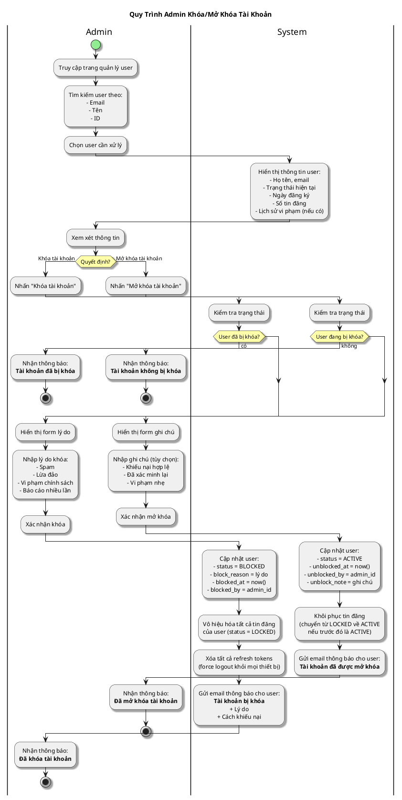

# Sơ Đồ Activity - Admin Khóa/Mở Khóa Tài Khoản

---

## Activity Diagram (Admin - System Interaction)

## Giải Thích

**Quy trình admin khóa/mở khóa tài khoản:**

**Khóa tài khoản:**
1. **Admin tìm user** → Xem thông tin và lịch sử
2. **Admin nhập lý do** → System cập nhật status = BLOCKED
3. **System xử lý**: Vô hiệu hóa tin đăng, force logout, gửi email thông báo

**Mở khóa tài khoản:**
1. **Admin chọn user bị khóa** → Nhập ghi chú (tùy chọn)
2. **System cập nhật** status = ACTIVE
3. **System khôi phục**: Tin đăng active trở lại, gửi email thông báo

**Lưu ý:** Khi khóa tài khoản, tất cả tin đăng của user cũng bị khóa và user bị đăng xuất khỏi mọi thiết bị.

---

**Cách xem sơ đồ**: Copy nội dung PlantUML vào https://www.plantuml.com/plantuml/uml/
