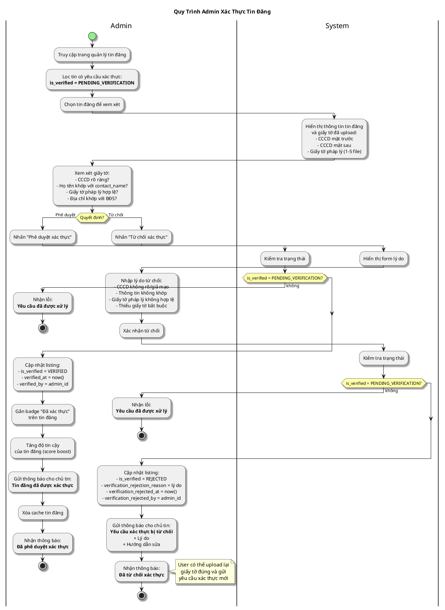

# Sơ Đồ Activity - Admin Xác Thực Tin Đăng

---

## Activity Diagram (Admin - System Interaction)

## Giải Thích

**Quy trình admin xác thực tin đăng:**

1. **Admin lọc tin cần xác thực** → Danh sách tin có status `PENDING_VERIFICATION`
2. **Admin xem giấy tờ** → CCCD 2 mặt + Giấy tờ pháp lý
3. **Admin kiểm tra**:
   - CCCD rõ ràng, không giả mạo
   - Họ tên trên CCCD khớp với thông tin liên hệ
   - Giấy tờ pháp lý hợp lệ (sổ đỏ, hợp đồng, etc.)
   - Địa chỉ trên giấy tờ khớp với địa chỉ BĐS
4. **Phê duyệt**: Tin được gắn badge "Đã xác thực", tăng độ tin cậy
5. **Từ chối**: Gửi lý do chi tiết, user có thể gửi lại

**Lợi ích của xác thực:**
- Tin đăng được gắn badge "Đã xác thực" (trustworthy)
- Tăng score → hiển thị ưu tiên hơn
- Người mua/thuê tin tưởng hơn

---

**Cách xem sơ đồ**: Copy nội dung PlantUML vào https://www.plantuml.com/plantuml/uml/
