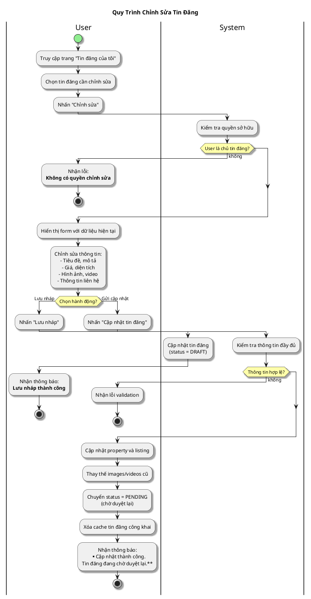

# Sơ Đồ Activity - Chỉnh Sửa Tin Đăng

---

## Activity Diagram (User - System Interaction)

## Giải Thích

**Quy trình chỉnh sửa tin đăng:**

1. **User chọn tin đăng** → System kiểm tra quyền sở hữu
2. **User chỉnh sửa thông tin** → Có thể lưu nháp hoặc gửi cập nhật
3. **Lưu nháp**: Cập nhật với status DRAFT (không cần duyệt lại)
4. **Gửi cập nhật**: Cập nhật và chuyển về status PENDING để admin duyệt lại

**Lưu ý:** Khi cập nhật tin đã ACTIVE, tin sẽ quay về trạng thái PENDING để admin kiểm duyệt lại nội dung mới.

---

**Cách xem sơ đồ**: Copy nội dung PlantUML vào https://www.plantuml.com/plantuml/uml/
