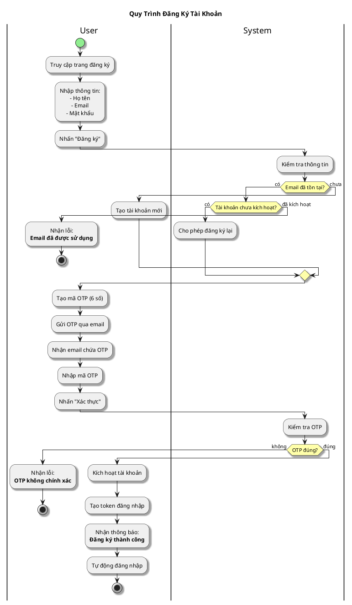

# Sơ Đồ Activity - Đăng Ký Tài Khoản

---

## Activity Diagram (User - System Interaction)

## Giải Thích

**Quy trình đăng ký gồm 2 bước:**

1. **User nhập thông tin** → System tạo tài khoản và gửi OTP qua email
2. **User nhập OTP** → System kích hoạt tài khoản và tự động đăng nhập

**Lưu ý:** Nếu email đã tồn tại nhưng chưa kích hoạt OTP, user có thể đăng ký lại (cập nhật thông tin và gửi OTP mới).

---

**Cách xem sơ đồ**: Copy nội dung PlantUML vào https://www.plantuml.com/plantuml/uml/
