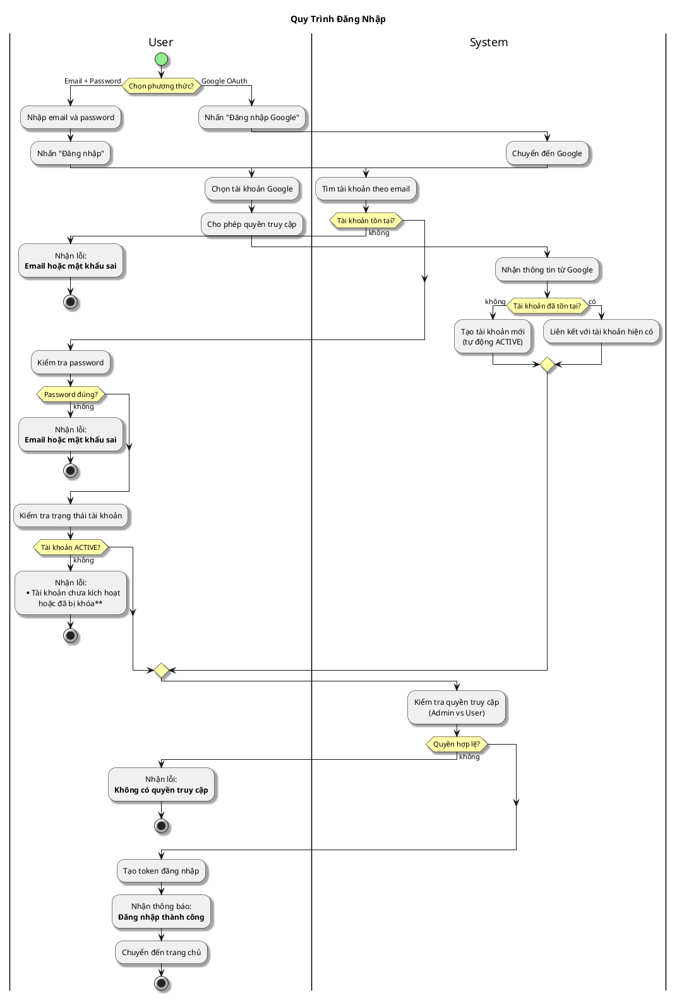

# Sơ Đồ Activity - Đăng Nhập

---

## Activity Diagram (User - System Interaction)

## Giải Thích

**Hệ thống hỗ trợ 2 phương thức đăng nhập:**

1. **Email + Password**: System kiểm tra tài khoản, password, và trạng thái → Tạo token nếu hợp lệ
2. **Google OAuth**: User đăng nhập Google → System tạo/liên kết tài khoản → Tạo token

**Lưu ý:** Hệ thống phân quyền Admin/User - mỗi client (web/admin) chỉ cho phép role tương ứng đăng nhập.

---

**Cách xem sơ đồ**: Copy nội dung PlantUML vào https://www.plantuml.com/plantuml/uml/
