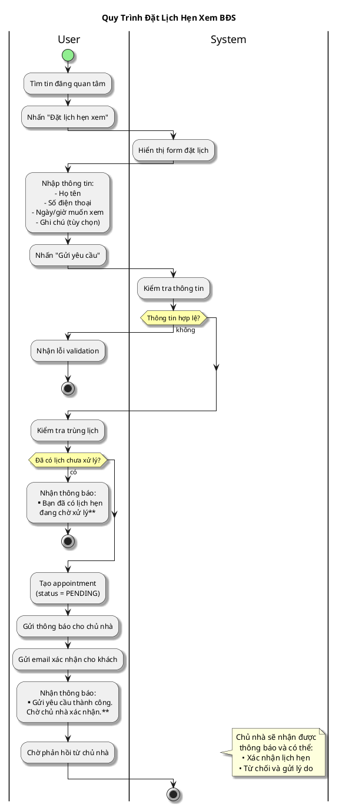

# Sơ Đồ Activity - Đặt Lịch Hẹn

---

## Activity Diagram (User - System Interaction)

## Giải Thích

**Quy trình đặt lịch hẹn xem BĐS:**

1. **User chọn tin đăng** → Nhấn "Đặt lịch hẹn"
2. **User nhập thông tin** → System tạo appointment với status PENDING
3. **System gửi thông báo** → Cho cả chủ nhà (app) và khách (email)
4. **User chờ xác nhận** → Chủ nhà sẽ xác nhận hoặc từ chối

**Lưu ý:** Mỗi user chỉ được có 1 lịch hẹn PENDING cho cùng 1 tin đăng. Nếu muốn đặt lại, phải hủy lịch cũ trước.

---

**Cách xem sơ đồ**: Copy nội dung PlantUML vào https://www.plantuml.com/plantuml/uml/
