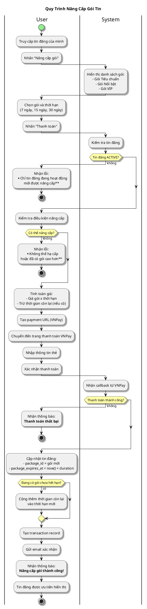

# Sơ Đồ Activity - Nâng Cấp Gói Tin

---

## Activity Diagram (User - System Interaction)

## Giải Thích

**Quy trình nâng cấp gói tin:**

1. **User chọn gói và thời hạn** → System tính giá và tạo payment URL
2. **User thanh toán qua VNPay** → System nhận callback
3. **Nếu thành công**: Cập nhật gói tin và thời hạn, gửi email xác nhận

**Tính năng đặc biệt:**
- **Gia hạn**: Nếu đang có gói chưa hết hạn và mua lại cùng gói → Thời hạn mới = thời hạn hiện tại + thời gian mua thêm
- **Nâng cấp**: Chỉ được nâng lên gói cao hơn, không được hạ cấp

---

**Cách xem sơ đồ**: Copy nội dung PlantUML vào https://www.plantuml.com/plantuml/uml/
