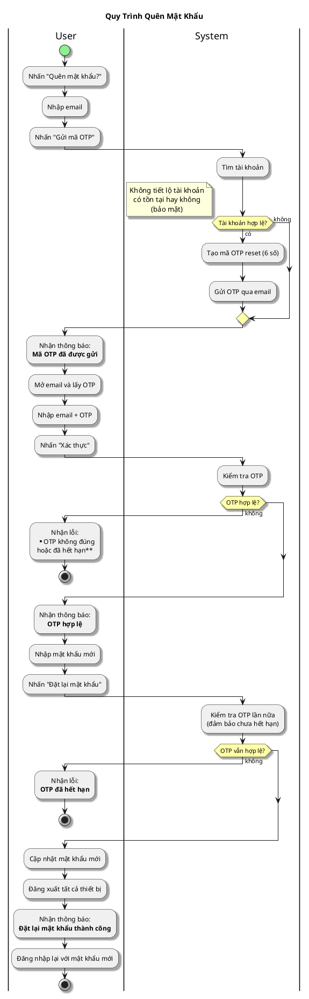

# Sơ Đồ Activity - Quên Mật Khẩu

---

## Activity Diagram (User - System Interaction)

## Giải Thích

**Quy trình reset mật khẩu gồm 3 bước:**

1. **User nhập email** → System gửi OTP qua email
2. **User nhập OTP** → System xác thực và cho phép đặt mật khẩu mới
3. **User nhập password mới** → System cập nhật và đăng xuất tất cả thiết bị

**Bảo mật:** System không tiết lộ email có tồn tại hay không. Sau khi reset thành công, tất cả session cũ bị đăng xuất để bảo mật.

---

**Cách xem sơ đồ**: Copy nội dung PlantUML vào https://www.plantuml.com/plantuml/uml/
