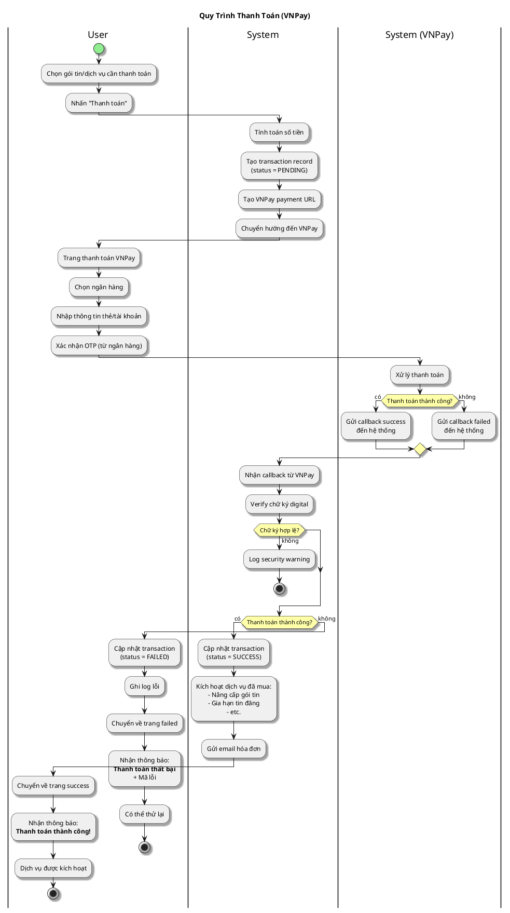

# Sơ Đồ Activity - Thanh Toán

---

## Activity Diagram (User - System Interaction)

## Giải Thích

**Quy trình thanh toán qua VNPay:**

1. **User chọn dịch vụ** → System tạo transaction và payment URL
2. **User thanh toán trên VNPay** → Nhập thông tin thẻ, xác nhận OTP
3. **VNPay xử lý** → Gửi callback về hệ thống (success/failed)
4. **System nhận callback** → Verify chữ ký, cập nhật transaction, kích hoạt dịch vụ

**Bảo mật:** System verify chữ ký digital từ VNPay để đảm bảo callback hợp lệ. Không verify → Từ chối xử lý.

---

**Cách xem sơ đồ**: Copy nội dung PlantUML vào https://www.plantuml.com/plantuml/uml/
