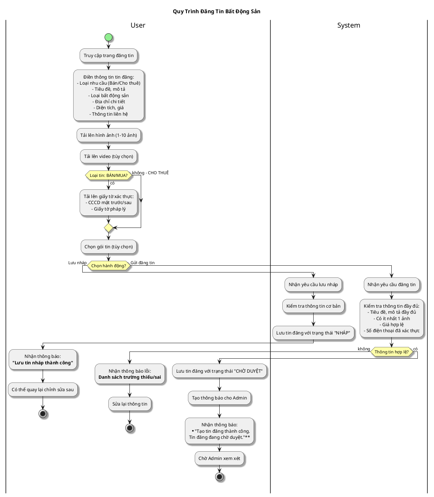

# Sơ Đồ Activity - Chức Năng Thêm Mới Tin Đăng

---

## Activity Diagram (User - System Interaction)



## Giải Thích Flow

### 🙋‍♂️ Phía User

1. **Truy cập trang đăng tin**
2. **Điền thông tin tin đăng** (form)
3. **Tải lên hình ảnh** (bắt buộc 1-10 ảnh)
4. **Tải lên video** (không bắt buộc)
5. **Tải giấy tờ xác thực** (chỉ với tin BÁN/MUA)
6. **Chọn gói tin** (không bắt buộc)
7. **Quyết định**: Lưu nháp hoặc Gửi đăng tin

### ⚙️ Phía System

#### Nếu User chọn "Lưu nháp":
- ✅ Kiểm tra thông tin cơ bản
- 💾 Lưu với trạng thái **NHÁP**
- 📢 Thông báo: "Lưu tin nháp thành công"
- User có thể quay lại chỉnh sửa bất cứ lúc nào

#### Nếu User chọn "Gửi đăng tin":
- ✅ Kiểm tra thông tin đầy đủ:
  - Tiêu đề >= 10 ký tự
  - Mô tả >= 20 ký tự
  - Có ít nhất 1 ảnh
  - Giá hợp lệ (nếu không thương lượng)
  - Số điện thoại đã xác thực
  
- **Nếu thiếu thông tin**:
  - ❌ Trả về danh sách lỗi
  - User phải sửa lại
  
- **Nếu thông tin đầy đủ**:
  - 💾 Lưu với trạng thái **CHỜ DUYỆT**
  - 🔔 Tạo thông báo cho Admin
  - 📢 Thông báo User: "Tạo tin đăng thành công. Tin đăng đang chờ duyệt."

## Trạng Thái Tin Đăng

```
┌─────────┐
│  NHÁP   │ ← User lưu nháp, chưa gửi
└────┬────┘
     │
     ├─ User có thể chỉnh sửa bất cứ lúc nào
     │
     └─→ Gửi đăng tin
          ↓
    ┌───────────┐
    │ CHỜ DUYỆT │ ← User đã gửi, đợi Admin
    └─────┬─────┘
          │
          ├─→ Admin DUYỆT → ✅ ĐANG HOẠT ĐỘNG (hiển thị công khai)
          │
          ├─→ Admin TỪ CHỐI → ❌ BỊ TỪ CHỐI (cần chỉnh sửa)
          │
          └─→ Admin KHÓA → 🔒 BỊ KHÓA (vi phạm quy định)
```

## API Endpoint

```
POST /api/v1/listings
```

**Request (Ví dụ đăng tin):**
```json
{
  "save_as_draft": false,
  "title": "Bán nhà 3 tầng Quận 1",
  "description": "Nhà mới xây, vị trí đẹp, gần chợ, trường học...",
  "demand_type": "SELL",
  "property_type": "HOUSE",
  "area": 100.5,
  "price": 5000000000,
  "contact_name": "Nguyễn Văn A",
  "contact_phone": "0901234567",
  "images": ["url1", "url2"],
  "identity_card_front": "url",
  "identity_card_back": "url",
  "legal_documents": ["url1"]
}
```

**Response (Thành công):**
```json
{
  "success": true,
  "message": "Tạo tin đăng thành công. Tin đăng đang chờ duyệt.",
  "data": {
    "id": 123,
    "status": "PENDING",
    "title": "Bán nhà 3 tầng Quận 1"
  }
}
```

**Response (Lỗi validation):**
```json
{
  "success": false,
  "message": "Thông tin chưa đầy đủ",
  "errors": {
    "title": ["Tiêu đề không được để trống"],
    "images": ["Bạn phải tải lên ít nhất 1 ảnh"]
  }
}
```

## Business Rules

| Trường hợp | Nháp | Đăng tin |
|------------|------|----------|
| Tiêu đề | Tùy chọn | **Bắt buộc** (>= 10 ký tự) |
| Mô tả | Tùy chọn | **Bắt buộc** (>= 20 ký tự) |
| Hình ảnh | Tùy chọn | **Bắt buộc** (1-10 ảnh) |
| Giá | Tùy chọn | **Bắt buộc** (nếu không thương lượng) |
| Xác thực SĐT | Không yêu cầu | **Bắt buộc** |
| Giấy tờ xác thực | Tùy chọn | Tùy chọn (cho tin BÁN/MUA) |

---

**Cách xem sơ đồ**: Copy nội dung PlantUML vào https://www.plantuml.com/plantuml/uml/

---
