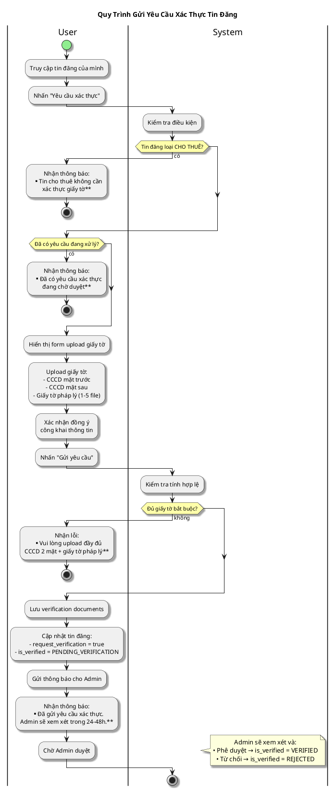

# Sơ Đồ Activity - Xác Thực Tin Đăng (User)

---

## Activity Diagram (User - System Interaction)

## Giải Thích

**Quy trình gửi yêu cầu xác thực tin đăng:**

1. **User chọn tin đăng** → Nhấn "Yêu cầu xác thực"
2. **System kiểm tra điều kiện** → Chỉ tin BÁN/MUA được xác thực
3. **User upload giấy tờ** → CCCD 2 mặt + Giấy tờ pháp lý
4. **System lưu documents** → Gửi thông báo cho Admin để duyệt

**Lưu ý:** 
- Chỉ tin đăng loại BÁN/MUA mới được xác thực (CHO THUÊ không cần)
- Phải upload đầy đủ CCCD 2 mặt + ít nhất 1 giấy tờ pháp lý

---

**Cách xem sơ đồ**: Copy nội dung PlantUML vào https://www.plantuml.com/plantuml/uml/
