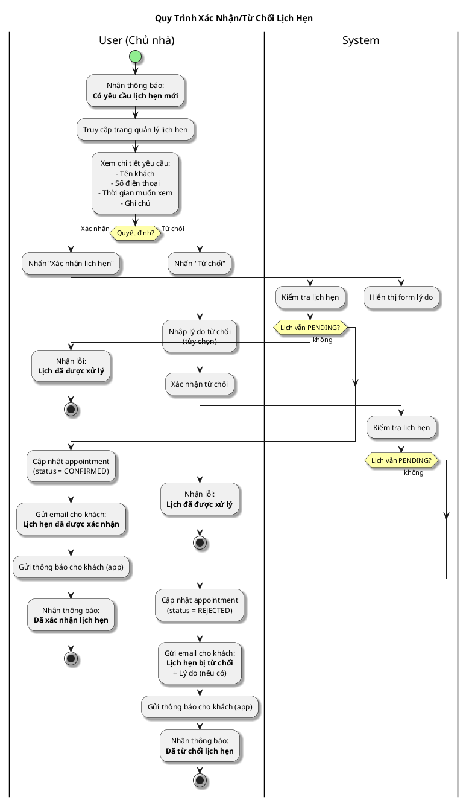

# Sơ Đồ Activity - Xác Nhận/Từ Chối Lịch Hẹn

---

## Activity Diagram (User - System Interaction)

## Giải Thích

**Quy trình xử lý lịch hẹn (từ phía chủ nhà):**

1. **Chủ nhà nhận thông báo** → Có yêu cầu lịch hẹn mới (status PENDING)
2. **Chủ nhà xem chi tiết** → Xem thông tin người đặt và thời gian
3. **Xác nhận**: Cập nhật status = CONFIRMED, gửi thông báo cho khách
4. **Từ chối**: Cập nhật status = REJECTED, gửi thông báo + lý do cho khách

**Lưu ý:** Mỗi lịch hẹn chỉ có thể xử lý 1 lần. Sau khi xác nhận hoặc từ chối, không thể thay đổi.

---

**Cách xem sơ đồ**: Copy nội dung PlantUML vào https://www.plantuml.com/plantuml/uml/
