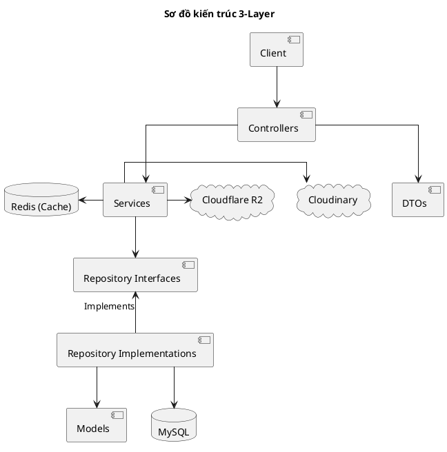

# Sơ đồ Kiến trúc 3-Layer - Propify

## 1. Sơ đồ Kiến trúc (PlantUML)

## 2. Mô tả các thành phần

*   **Client**: Giao diện người dùng gửi yêu cầu.
*   **Controllers**: Tiếp nhận, validate và định tuyến request.
*   **DTOs**: Cấu trúc hóa dữ liệu truyền nhận giữa Controller và Service.
*   **Services**: Xử lý logic nghiệp vụ chính của hệ thống.
*   **Repository Interfaces**: Định nghĩa các cổng giao tiếp dữ liệu (Interface).
*   **Repository Implementations**: Nơi hiện thực hóa truy vấn thực tế.
*   **Models**: Các thực thể dữ liệu (Eloquent Entities).
*   **MySQL & Redis**: Lưu trữ dữ liệu chính và cache/hàng đợi.
*   **Cloudinary & Cloudflare R2**: Lưu trữ media tĩnh và tệp đính kèm.
