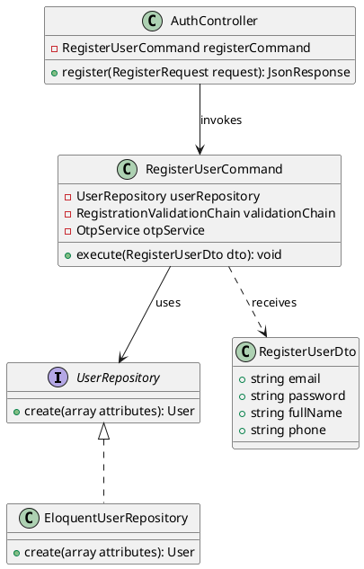
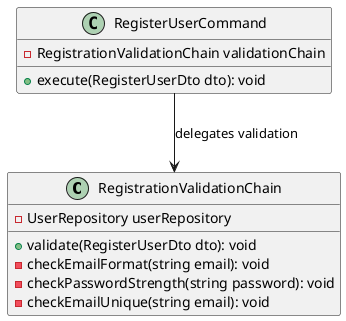
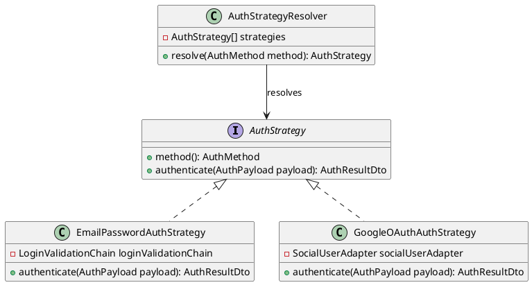
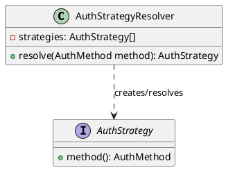
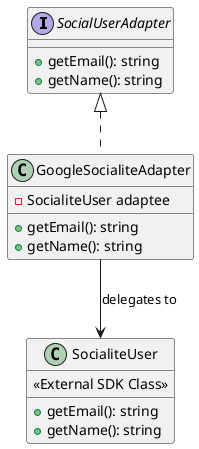
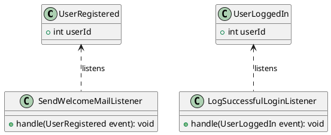

# Phân tích Design Pattern Chức năng: Đăng ký tài khoản / Đăng nhập

Tài liệu này phân tích chi tiết các Design Pattern được áp dụng trong phân hệ Xác thực (Authentication) của dự án Propify, bao gồm hai luồng chính là **Đăng ký tài khoản** và **Đăng nhập**.

---

## 1. Command Pattern (Đóng gói nghiệp vụ Đăng ký tài khoản)

### 1.1. Vấn đề cần giải quyết (Problem)
Luồng đăng ký thành viên chứa rất nhiều bước nghiệp vụ liên tiếp và phức tạp: kiểm tra định dạng dữ liệu đầu vào, lưu thông tin tài khoản thô vào database ở trạng thái chờ kích hoạt, tạo mã kích hoạt OTP, gửi email OTP và phát domain event chào mừng. Nếu viết trực tiếp toàn bộ logic này vào controller, controller sẽ bị phình to (Fat Controller), vi phạm Single Responsibility Principle (SRP) và khiến code cực kỳ khó tái sử dụng hoặc viết unit test độc lập.

### 1.2. Ánh xạ thành phần (Mapping)

| Thành phần chuẩn UML GoF | Lớp cụ thể trong dự án | Ghi chú |
|---|---|---|
| **Invoker** | `App\Http\Controllers\Api\V1\Auth\AuthController` | Nhận request, tạo DTO và gọi thực thi Command. |
| **Command (Interface)** | *(Không dùng do tận dụng DI & Class-based Command)* | Laravel Services/Commands thường viết trực tiếp dạng Concrete class. |
| **ConcreteCommand** | `App\Services\Auth\Registration\RegisterUserCommand` | Chứa logic điều phối và thực thi toàn bộ luồng đăng ký. |
| **Receiver** | `App\Repositories\UserRepository` | Thực hiện lưu trữ tài khoản xuống database. |

### 1.3. Giải thích Trách nhiệm (Responsibility)

- **`AuthController`**: Tiếp nhận HTTP Request từ client, thực hiện lọc dữ liệu đầu vào qua `FormRequest`, đóng gói vào `RegisterUserDto` và gọi phương thức `execute()` của `RegisterUserCommand`.
- **`RegisterUserCommand`**: Đóng gói quy trình tạo tài khoản mới. Có nhiệm vụ gọi Validator để kiểm tra điều kiện nghiệp vụ, tạo mật khẩu hash, gọi repository lưu dữ liệu, sinh mã OTP thông qua `OtpService` và phát đi event `UserRegistered`.
- **`UserRepository` (Eloquent implementation)**: Thực hiện hành động chèn bản ghi user mới vào cơ sở dữ liệu.

### 1.4. Sơ đồ lớp (Class Diagram) bằng PlantUML

### 1.5. Đánh giá ưu điểm

- **Tách biệt mối quan tâm (SoC)**: Đóng gói toàn bộ logic nghiệp vụ đăng ký vào một Command duy nhất, giúp `AuthController` cực kỳ mỏng nhẹ (Skinny Controller), chỉ lo việc giao tiếp HTTP.
- **Dễ kiểm thử độc lập (Testability)**: Do `RegisterUserCommand` nhận các dependency qua Constructor Injection (như `UserRepository`, `OtpService`), chúng ta có thể Mock toàn bộ các dependencies này để viết unit test cho Command một cách dễ dàng mà không cần truy cập Database hoặc SMTP Server thật.
- **Tái sử dụng cao**: Command có thể được gọi từ API Controller, Console Command (CLI) hay Jobs hàng đợi mà không cần viết lại logic.

---

## 2. Chain of Responsibility Pattern (Xác thực dữ liệu đầu vào tuần tự)

### 2.1. Vấn đề cần giải quyết (Problem)
Dữ liệu đăng ký/đăng nhập cần được xác thực nghiêm ngặt qua nhiều bước khác nhau (Email đúng định dạng -> Mật khẩu đủ mạnh -> Email chưa tồn tại ở đăng ký; hoặc Email tồn tại -> User đang active -> Mật khẩu trùng khớp ở đăng nhập). Nếu dùng các câu lệnh `if-else` lồng nhau để kiểm tra, code sẽ tạo thành mô hình "mũi tên thụt lề" (Arrow Anti-pattern), gây rối mắt, khó mở rộng khi cần thêm các bước kiểm tra mới (ví dụ: blacklist email hoặc giới hạn IP spam).

### 2.2. Ánh xạ thành phần (Mapping)

| Thành phần chuẩn UML GoF | Lớp cụ thể trong dự án | Ghi chú |
|---|---|---|
| **Handler (Interface)** | *(Không định nghĩa class cha do tích hợp Laravel Validation)* | Chuỗi được tổ chức thông qua một lớp Chain duy nhất thực thi các validator con tuần tự. |
| **Handler Chain** | `App\Services\Auth\Registration\RegistrationValidationChain` `App\Services\Auth\Login\LoginValidationChain` | Lớp đóng vai trò thiết lập và duyệt qua các quy tắc kiểm tra nghiệp vụ đầu vào. |

### 2.3. Giải thích Trách nhiệm (Responsibility)

- **`RegistrationValidationChain`**: Thiết lập một chuỗi các luật kiểm duyệt dữ liệu đăng ký (Ví dụ: Định dạng Email hợp lệ -> Kiểm tra Password mạnh -> Email chưa từng tồn tại). Nếu bất kỳ luật nào thất bại, nó sẽ ném ra `BusinessException` lập tức để ngắt chuỗi xử lý.
- **`LoginValidationChain`**: Đảm nhận nhiệm vụ validate dữ liệu đăng nhập tuần tự (Email tồn tại -> Trạng thái User là ACTIVE -> Đúng mật khẩu hash).

### 2.4. Sơ đồ lớp (Class Diagram) bằng PlantUML

### 2.5. Đánh giá ưu điểm

- **Dễ dàng bảo trì và bổ sung luật**: Nếu hệ thống cần thêm một bước kiểm tra mới (ví dụ: Blacklist email rác, hay chặn IP spam đăng ký), ta chỉ cần viết thêm một hàm kiểm duyệt và chèn vào chuỗi xử lý của Chain mà không phá vỡ logic cũ.
- **Cắt giảm If-Else lồng nhau**: Loại bỏ hoàn toàn mô hình chống mẫu "Arrow Anti-pattern" (các khối if-else lồng nhau sâu hoắm), làm cho mã nguồn trực quan, dễ đọc từ trên xuống dưới.

---

## 3. Strategy Pattern (Chiến lược đăng nhập linh hoạt tại Runtime)

### 3.1. Vấn đề cần giải quyết (Problem)
Hệ thống hỗ trợ nhiều phương thức đăng nhập khác nhau: Email/Password truyền thống và Google OAuth liên kết bên thứ ba. Nếu giải quyết bằng cách viết một hàm đăng nhập khổng lồ chứa câu lệnh `switch-case` hay `if (method == 'GOOGLE')`, hệ thống sẽ vi phạm nguyên tắc Open/Closed (OCP). Mỗi lần thêm một cổng đăng nhập mới (như Facebook, Apple ID), ta lại phải sửa đổi và chạy lại regression test cho toàn bộ phân hệ auth.

### 3.2. Ánh xạ thành phần (Mapping)

| Thành phần chuẩn UML GoF | Lớp cụ thể trong dự án | Ghi chú |
|---|---|---|
| **Context** | `App\Services\Auth\AuthStrategyResolver` | Duy trì tham chiếu đến các Strategy và phân giải Strategy phù hợp dựa vào request. |
| **Strategy (Interface)** | `App\Services\Auth\AuthStrategy` | Định nghĩa giao diện chung cho mọi chiến lược đăng nhập của hệ thống. |
| **ConcreteStrategy A** | `App\Services\Auth\Strategies\EmailPasswordAuthStrategy` | Triển khai đăng nhập bằng cặp tài khoản email/mật khẩu truyền thống. |
| **ConcreteStrategy B** | `App\Services\Auth\Strategies\GoogleOAuthAuthStrategy` | Triển khai đăng nhập thông qua bên thứ ba (Google OAuth). |

### 3.3. Giải thích Trách nhiệm (Responsibility)

- **`AuthStrategy`**: Định nghĩa phương thức `authenticate(AuthPayload $payload)` chung để mọi cơ chế đăng nhập bắt buộc phải tuân theo.
- **`EmailPasswordAuthStrategy`**: Chịu trách nhiệm xác thực thông tin đăng nhập truyền thống, gọi `LoginValidationChain` và sinh JWT Token.
- **`GoogleOAuthAuthStrategy`**: Tiếp nhận access token hoặc auth code của Google, kiểm tra thông tin qua Google SDK, lưu hoặc cập nhật thông tin user và cấp JWT Token tương ứng.
- **`AuthStrategyResolver`**: Quản lý danh sách các Strategy, nhận diện loại hình đăng nhập từ Client để cung cấp đối tượng Strategy xử lý tương thích.

### 3.4. Sơ đồ lớp (Class Diagram) bằng PlantUML

### 3.5. Đánh giá ưu điểm

- **Tuân thủ nguyên tắc Open/Closed (OCP)**: Khi hệ thống muốn tích hợp thêm phương thức đăng nhập bằng Facebook, Apple ID hay Github, lập trình viên chỉ cần tạo thêm class ConcreteStrategy mới thực thi `AuthStrategy` mà không cần sửa đổi bất kỳ dòng code nào trong `AuthStrategyResolver` hay `AuthController`.
- **Loại bỏ rẽ nhánh phức tạp**: Thay thế câu lệnh switch-case hoặc chuỗi if-else dài dòng trong Controller bằng cơ chế gọi động đa hình.

---

## 4. Factory Method Pattern (Khởi tạo Strategy đăng nhập)

### 4.1. Vấn đề cần giải quyết (Problem)
Mặc dù Strategy Pattern giúp tách biệt logic các cách đăng nhập khác nhau, lớp Client (Controller) vẫn phải đối mặt với khó khăn: Làm thế nào để biết cách khởi tạo Strategy nào tại runtime mà không cần phải viết code cứng `new GoogleOAuthAuthStrategy(...)`? Client không nên biết chi tiết cấu tạo bên trong hoặc các tham số khởi dựng phức tạp của từng Strategy cụ thể.

### 4.2. Ánh xạ thành phần (Mapping)

| Thành phần chuẩn UML GoF | Lớp cụ thể trong dự án | Ghi chú |
|---|---|---|
| **Creator (Factory)** | `App\Services\Auth\AuthStrategyResolver` | Vừa đóng vai trò Context cho Strategy, vừa trực tiếp hoạt động như một Factory sinh Strategy. |
| **Product** | `App\Services\Auth\AuthStrategy` | Sản phẩm được khởi tạo động bởi Factory. |

### 4.3. Giải thích Trách nhiệm (Responsibility)

- **`AuthStrategyResolver`**: Nhận vào danh sách các Strategy đã được đăng ký thông qua Container, triển khai hàm `resolve(AuthMethod $method)` để tìm kiếm Strategy có type tương khớp và trả về đối tượng đó cho Controller sử dụng.

### 4.4. Sơ đồ lớp (Class Diagram) bằng PlantUML

### 4.5. Đánh giá ưu điểm

- **Che giấu chi tiết khởi tạo**: Client (Controller) không cần biết cách khởi tạo `GoogleOAuthAuthStrategy` phức tạp như thế nào (cần nạp adapter nào, config ra sao). Nhiệm vụ này hoàn toàn do DI Container và Resolver đảm nhận.

---

## 5. Adapter Pattern (Thích ứng cấu trúc dữ liệu người dùng Google)

### 5.1. Vấn đề cần giải quyết (Problem)
Khi tích hợp đăng nhập qua Google OAuth, SDK bên thứ ba (như Laravel Socialite) trả về một đối tượng User thô có cấu trúc dữ liệu và tên phương thức (như `getId()`, `getAvatar()`, `user['emails'][0]`) hoàn toàn phụ thuộc vào nhà cung cấp SDK đó. Nếu ta sử dụng trực tiếp đối tượng thô này trong tầng nghiệp vụ lõi (Domain/Service), mã nguồn sẽ bị phụ thuộc chặt chẽ (tightly coupled) vào thư viện ngoài, khiến việc nâng cấp hoặc đổi nhà cung cấp SDK sau này trở nên cực kỳ rủi ro và tốn kém công sức sửa lỗi.

### 5.2. Ánh xạ thành phần (Mapping)

| Thành phần chuẩn UML GoF | Lớp cụ thể trong dự án | Ghi chú |
|---|---|---|
| **Target Interface** | `App\Services\Auth\SocialUserAdapter` | Giao diện chuẩn mực mà Domain của hệ thống yêu cầu đối với các tài khoản mạng xã hội. |
| **Adapter** | `App\Services\Auth\Adapters\GoogleSocialiteAdapter` | Lớp bọc bên ngoài lớp của SDK Google để chuyển đổi interface. |
| **Adaptee** | `Laravel\Socialite\Two\User` *(Từ SDK Socialite ngoài)* | Đối tượng người dùng trả về trực tiếp từ SDK bên thứ ba. |

### 5.3. Giải thích Trách nhiệm (Responsibility)

- **`SocialUserAdapter`**: Định nghĩa các phương thức chuẩn như `getEmail()`, `getName()`, `getAvatar()` để hệ thống sử dụng thống nhất.
- **`GoogleSocialiteAdapter`**: Triển khai interface `SocialUserAdapter`, chứa đối tượng người dùng thô của Google Socialite, gọi các hàm tương ứng của đối tượng này và định dạng lại đầu ra cho khớp với chuẩn Domain.

### 5.4. Sơ đồ lớp (Class Diagram) bằng PlantUML

### 5.5. Đánh giá ưu điểm

- **Cách ly thư viện bên thứ ba**: Nếu trong tương lai thư viện Socialite cập nhật và đổi tên hàm của đối tượng trả về (ví dụ từ `getEmail()` thành `getMailAddress()`), ta chỉ cần sửa duy nhất tại lớp `GoogleSocialiteAdapter` thay vì đi lục tìm và sửa hàng chục file nghiệp vụ khác.

---

## 6. Observer Pattern (Sự kiện đăng ký & đăng nhập thành công)

### 6.1. Vấn đề cần giải quyết (Problem)
Khi người dùng đăng ký hoặc đăng nhập thành công, hệ thống cần thực thi hàng loạt các nghiệp vụ phụ như: gửi email chào mừng, ghi nhận địa chỉ IP và trình duyệt đăng nhập vào nhật ký audit, đồng bộ giỏ hàng, v.v. Nếu lập trình viên cố nhét tất cả các logic không liên quan này vào luồng xử lý đăng ký/đăng nhập chính, hiệu năng phản hồi API của client sẽ bị chậm đi đáng kể và code nghiệp vụ lõi bị ô nhiễm bởi các nghiệp vụ phụ.

### 6.2. Ánh xạ thành phần (Mapping)

| Thành phần chuẩn UML GoF | Lớp cụ thể trong dự án | Ghi chú |
|---|---|---|
| **Subject (Event)** | `App\Events\Auth\UserRegistered` `App\Events\Auth\UserLoggedIn` | Các Domain Event phát tín hiệu khi có sự thay đổi. |
| **Observer (Listener)** | `App\Listeners\Auth\SendWelcomeMailListener` `App\Listeners\Auth\LogSuccessfulLoginListener` | Lắng nghe sự kiện để kích hoạt các nghiệp vụ phụ tương ứng. |

### 6.3. Giải thích Trách nhiệm (Responsibility)

- **`UserRegistered`**: Được phát đi từ `RegisterUserCommand` sau khi tài khoản được lưu.
- **`SendWelcomeMailListener`**: Lắng nghe `UserRegistered`, nhận thông tin email người dùng để đưa tác vụ gửi email chào mừng vào hàng đợi (Queue Job).
- **`UserLoggedIn`**: Phát ra khi đăng nhập thành công từ Strategy.
- **`LogSuccessfulLoginListener`**: Ghi log địa chỉ IP, User-Agent và thời gian đăng nhập vào cơ sở dữ liệu phục vụ audit bảo mật.

### 6.4. Sơ đồ lớp (Class Diagram) bằng PlantUML

### 6.5. Đánh giá ưu điểm

- **Khử ghép nối (Decoupling) tối đa**: Việc gửi email chào mừng hay ghi log đăng nhập hoàn toàn không làm ảnh hưởng đến thời gian phản hồi của luồng chính (đăng ký/đăng nhập), vì các Listener có thể chạy bất đồng bộ dưới hàng đợi.
