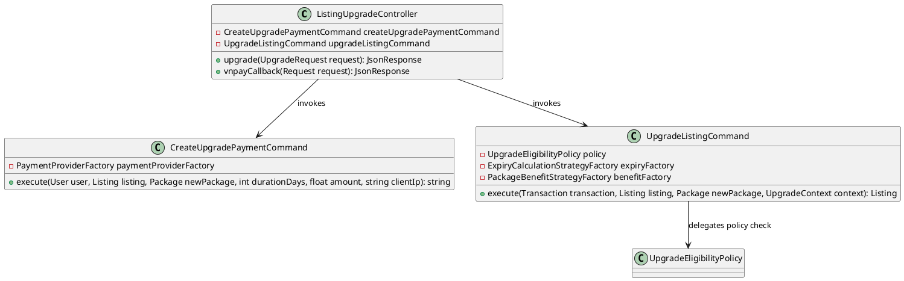
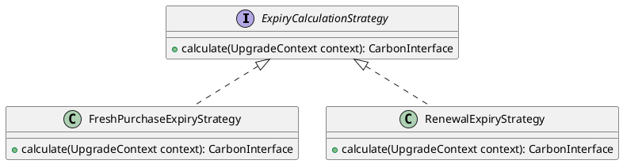
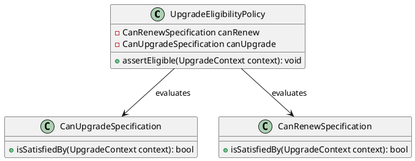
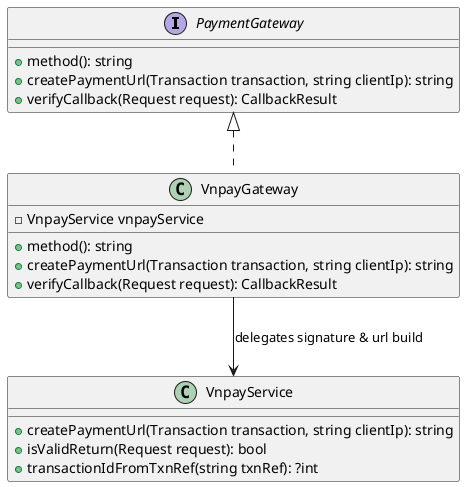

# Phân tích Design Pattern Chức năng: Nâng cấp tin đăng & Thanh toán

Tài liệu này phân tích chi tiết các Design Pattern được áp dụng trong phân hệ **Nâng cấp gói tin đăng** kết hợp xử lý **Thanh toán trực tuyến VNPAY** của dự án Propify.

---

## 1. Command Pattern (Đóng gói quy trình giao dịch nâng cấp)

### 1.1. Vấn đề cần giải quyết (Problem)
Quy trình nâng cấp tin đăng bất động sản là một chuỗi hành động phức tạp liên quan đến tài chính: Xác định tính hợp lệ của tin đăng -> Khởi tạo giao dịch ở trạng thái PENDING -> Sinh đường dẫn thanh toán -> Nhận phản hồi thanh toán -> Cập nhật trạng thái giao dịch SUCCESS -> Thay đổi gói tin và tính hạn dùng mới cho tin đăng -> Áp dụng quyền lợi ưu tiên -> Phát event xóa bộ nhớ đệm. Nếu không được đóng gói chặt chẽ, việc rải rác các bước này trong Controller sẽ dễ dẫn đến mất mát dữ liệu hoặc không đồng bộ trạng thái giao dịch khi xảy ra lỗi mạng hoặc lỗi cơ sở dữ liệu giữa chừng.

### 1.2. Ánh xạ thành phần (Mapping)

| Thành phần chuẩn UML GoF | Lớp cụ thể trong dự án | Ghi chú |
|---|---|---|
| **Invoker** | `App\Http\Controllers\Api\V1\Listing\ListingUpgradeController` | Tiếp nhận callback thanh toán hoặc gửi yêu cầu nâng cấp tin. |
| **ConcreteCommand A** | `App\Services\Listing\Upgrade\CreateUpgradePaymentCommand` | Đóng gói logic khởi tạo giao dịch PENDING và sinh link thanh toán. |
| **ConcreteCommand B** | `App\Services\Listing\Upgrade\UpgradeListingCommand` | Đóng gói logic áp dụng nâng cấp gói tin sau khi giao dịch thành công. |
| **Receiver** | `App\Models\Listing` `App\Models\Transaction` | Các model nhận lệnh thay đổi trạng thái trong CSDL. |

### 1.3. Giải thích Trách nhiệm (Responsibility)

- **`CreateUpgradePaymentCommand`**: Chịu trách nhiệm tạo bản ghi `Transaction` ở trạng thái `PENDING`, thiết lập thời gian hết hạn (15 phút), kích hoạt queue job tự động hủy nếu quá hạn và lấy URL thanh toán từ Payment Adapter để trả về cho người dùng.
- **`UpgradeListingCommand`**: Được gọi khi cổng thanh toán VNPAY trả kết quả thành công. Command này thực thi kiểm tra tính hợp lệ qua Policy, tính ngày hết hạn của gói mới, cập nhật trạng thái Transaction sang `SUCCESS`, thay đổi `package_id` và `package_expires_at` của Tin đăng, đồng thời phát event `ListingPackageUpgraded`.

### 1.4. Sơ đồ lớp (Class Diagram) bằng PlantUML

### 1.5. Đánh giá ưu điểm

- **Đảm bảo tính toàn vẹn giao dịch**: Việc đóng gói các bước phức tạp (cập nhật trạng thái Transaction, cập nhật hạn dùng Tin đăng, kích hoạt quyền lợi) vào một Command giúp bảo vệ tiến trình bằng Database Transaction. Nếu một trong các bước con xảy ra lỗi, toàn bộ giao dịch tiền tệ được rollback, ngăn ngừa mất mát dữ liệu hoặc sai lệch tài chính.

---

## 2. Strategy Pattern (Tính toán thời gian hết hạn gói tin đăng)

### 2.1. Vấn đề cần giải quyết (Problem)
Hệ thống cho phép cả hai hành vi: Nâng cấp gói tin mới (thời hạn tính từ hôm nay) và Gia hạn gói tin trùng loại (ngày hết hạn mới phải được cộng dồn vào ngày hết hạn cũ nếu tin đăng chưa hết hạn). Nếu gom chung các thuật toán tính hạn dùng này vào một khối code, logic tính toán ngày tháng sẽ trở nên vô cùng rắc rối, nhiều nhánh rẽ phức tạp và rất khó kiểm soát các lỗi về mặt thời gian, dẫn đến xung đột quyền lợi của khách hàng trả phí.

### 2.2. Ánh xạ thành phần (Mapping)

| Thành phần chuẩn UML GoF | Lớp cụ thể trong dự án | Ghi chú |
|---|---|---|
| **Context** | `App\Services\Listing\Upgrade\UpgradeListingCommand` | Lớp điều phối gọi Strategy để tính toán thời hạn. |
| **Strategy (Interface)** | `App\Services\Listing\Upgrade\Expiry\ExpiryCalculationStrategy` | Định nghĩa giao diện tính thời hạn hết hạn gói tin. |
| **ConcreteStrategy A** | `App\Services\Listing\Upgrade\Expiry\FreshPurchaseExpiryStrategy` | Tính toán hạn dùng cho trường hợp mua gói mới (tính từ thời điểm hiện tại). |
| **ConcreteStrategy B** | `App\Services\Listing\Upgrade\Expiry\RenewalExpiryStrategy` | Tính toán hạn dùng cho trường hợp gia hạn gói hiện tại (cộng dồn vào ngày cũ). |

### 2.3. Giải thích Trách nhiệm (Responsibility)

- **`ExpiryCalculationStrategy`**: Định nghĩa phương thức `calculate(UpgradeContext $context)` trả về đối tượng thời gian `CarbonInterface`.
- **`FreshPurchaseExpiryStrategy`**: Sử dụng thời gian hiện tại (`$context->now`) làm mốc bắt đầu, cộng thêm số ngày đặt mua (`durationDays`).
- **`RenewalExpiryStrategy`**: Kiểm tra ngày hết hạn gói tin cũ. Nếu ngày cũ vẫn còn hiệu lực (chưa hết hạn), nó sẽ cộng dồn số ngày mua mới vào ngày cũ này. Nếu đã quá hạn, nó sẽ lấy ngày hiện tại làm mốc rồi cộng thêm.

### 2.4. Sơ đồ lớp (Class Diagram) bằng PlantUML

### 2.5. Đánh giá ưu điểm

- **Cô lập logic nghiệp vụ phức tạp**: Loại bỏ các logic rẽ nhánh tính toán ngày tháng rườm rà khỏi Service chính. Mỗi Strategy chỉ chịu trách nhiệm giải quyết một công thức toán học/ngày tháng riêng biệt, làm giảm thiểu nguy cơ sinh lỗi về tính toán hạn dùng - một vấn đề thường gặp và dễ gây tranh chấp trong các hệ thống SaaS.

---

## 3. Specification Pattern (Kiểm định quy tắc nâng cấp gói hợp lệ)

### 3.1. Vấn đề cần giải quyết (Problem)
Quy tắc kiểm định điều kiện nâng cấp/gia hạn gói tin của hệ thống rất ngặt nghèo (ví dụ: Tin phải ACTIVE, người nâng cấp phải là chủ tin, gói mới phải đang hoạt động, và hoặc là nâng cấp lên gói có độ ưu tiên cao hơn, hoặc là gia hạn gói cùng loại). Nếu viết tất cả các điều kiện này bằng các câu lệnh `if-else` chồng chéo trong luồng thanh toán, mã nguồn sẽ trở nên cực kỳ khó đọc, không thể tái sử dụng các quy tắc kiểm định này ở nơi khác (như ẩn/hiện nút Nâng cấp ngoài giao diện), và khó thêm mới các luật kiểm duyệt khác trong tương lai.

### 3.2. Ánh xạ thành phần (Mapping)

| Thành phần chuẩn UML GoF | Lớp cụ thể trong dự án | Ghi chú |
|---|---|---|
| **Specification (A)** | `App\Services\Listing\Upgrade\Specifications\CanUpgradeSpecification` | Kiểm định điều kiện chuyển đổi từ gói thấp lên gói cao hơn. |
| **Specification (B)** | `App\Services\Listing\Upgrade\Specifications\CanRenewSpecification` | Kiểm định điều kiện gia hạn khi mua trùng gói cũ. |
| **Policy/Context** | `App\Services\Listing\Upgrade\UpgradeEligibilityPolicy` | Tổng hợp các Specification để đưa ra kết luận cuối cùng. |

### 3.3. Giải thích Trách nhiệm (Responsibility)

- **`CanUpgradeSpecification`**: Xác nhận yêu cầu nâng cấp là hợp lệ nếu: không phải yêu cầu gia hạn và độ ưu tiên (`priority`) của gói mới phải lớn hơn độ ưu tiên của gói hiện tại đang dùng.
- **`CanRenewSpecification`**: Xác nhận yêu cầu gia hạn là hợp lệ nếu: gói mới giống hệt gói cũ và tin đăng vẫn đang kích hoạt gói này.
- **`UpgradeEligibilityPolicy`**: Tiến hành kiểm định quyền sở hữu tin đăng, trạng thái tin đăng phải là `ACTIVE`, kiểm tra gói mới phải ở trạng thái đang mở (`is_active`), và cuối cùng là phải thỏa mãn một trong hai Specification trên.

### 3.4. Sơ đồ lớp (Class Diagram) bằng PlantUML

### 3.5. Đánh giá ưu điểm

- **Tái sử dụng các luật nghiệp vụ (Business Rules)**: Các Specification là các lớp độc lập nhỏ gọn, có thể dễ dàng tái sử dụng ở nhiều nơi khác (ví dụ: ở View phía Frontend để ẩn/hiện nút "Nâng cấp" tương ứng với trạng thái tin đăng).
- **Cực kỳ trực quan**: Cách viết `isSatisfiedBy()` giúp code phản ánh đúng ngôn ngữ nghiệp vụ của tài liệu phân tích đặc tả (SRS), giảm khoảng cách giữa lập trình viên và chuyên viên phân tích nghiệp vụ (BA).

---

## 4. Adapter Pattern (Thích ứng API và Xác thực chữ ký VNPAY)

### 4.1. Vấn đề cần giải quyết (Problem)
Việc tích hợp trực tiếp các hàm API của VNPAY vào code nghiệp vụ cốt lõi sẽ tạo ra sự phụ thuộc cứng vào cổng thanh toán này. Khi VNPAY thay đổi đặc tả kỹ thuật, hoặc khi doanh nghiệp có nhu cầu đổi sang Momo, ZaloPay, Stripe, lập trình viên sẽ phải viết lại gần như toàn bộ code của phân hệ thanh toán, nâng cấp, tiềm ẩn rủi ro phá vỡ tính ổn định của hệ thống tài chính sẵn có.

### 4.2. Ánh xạ thành phần (Mapping)

| Thành phần chuẩn UML GoF | Lớp cụ thể trong dự án | Ghi chú |
|---|---|---|
| **Target Interface** | `App\Services\Payment\Gateway\PaymentGateway` | Giao diện chuẩn cho tất cả các cổng thanh toán tích hợp. |
| **Adapter** | `App\Services\Payment\Gateway\VnpayGateway` | Lớp tiếp nhận giao tiếp từ Domain, chuyển đổi yêu cầu thành định dạng VNPAY. |
| **Adaptee** | `App\Services\Payment\VnpayService` | Dịch vụ nội bộ tương tác trực tiếp với API VNPAY (tạo hash HMAC, dựng query string). |

### 4.3. Giải thích Trách nhiệm (Responsibility)

- **`PaymentGateway`**: Định nghĩa các phương thức chuẩn cho cổng thanh toán bao gồm: tạo link thanh toán (`createPaymentUrl`), xác thực callback dữ liệu (`verifyCallback`) và phân giải mã giao dịch (`transactionIdFromReference`).
- **`VnpayGateway`**: Bọc `VnpayService` để điều phối tạo link, tiếp nhận Request callback từ Laravel Controller, map các trường dữ liệu cụ thể của VNPAY (như `vnp_ResponseCode`, `vnp_TxnRef`, `vnp_SecureHash`) thành một đối tượng kết quả chuẩn hóa `CallbackResult`.
- **`VnpayService`**: Trực tiếp chịu trách nhiệm thực thi các phép toán mã hóa bảo mật HMAC-SHA512 để ký và xác thực tính toàn vẹn của dữ liệu trả về từ cổng thanh toán.

### 4.4. Sơ đồ lớp (Class Diagram) bằng PlantUML

### 4.5. Đánh giá ưu điểm

- **Khả năng thay thế và tích hợp cổng mới**: Khi muốn tích hợp thêm Momo, ZaloPay hay Stripe, chúng ta chỉ việc tạo một Adapter mới (ví dụ: `MomoGateway` triển khai `PaymentGateway`) mà không cần thay đổi bất kỳ dòng mã nào trong lớp xử lý nghiệp vụ `CreateUpgradePaymentCommand` hay Controller.
- **Tính bảo mật cao**: Tách rời logic mã hóa và kiểm tra chữ ký HMAC của cổng thanh toán giúp dễ dàng nâng cấp bảo mật (ví dụ: nâng cấp thuật toán từ SHA256 lên SHA512) mà không làm gián đoạn luồng xử lý giao dịch.
