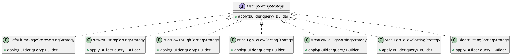
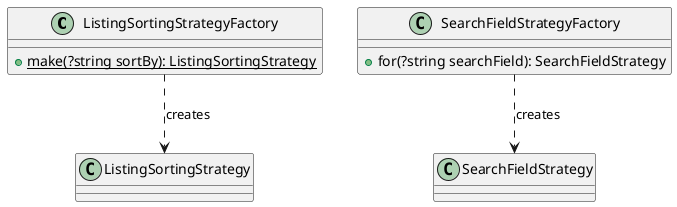
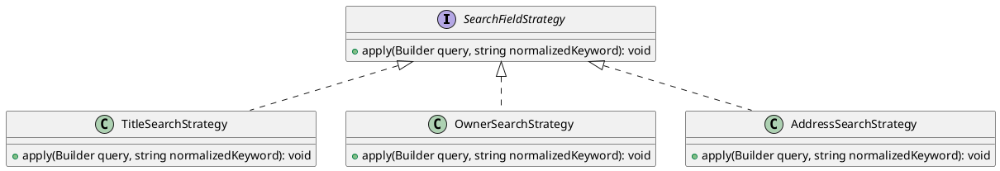

# Phân tích Design Pattern Chức năng: Thuật toán sắp xếp hiển thị & Lọc dữ liệu

Tài liệu này phân tích chi tiết các Design Pattern được áp dụng trong phân hệ **Sắp xếp hiển thị tin đăng** và **Lọc tìm kiếm tin đăng** của dự án Propify.

---

## 1. Strategy Pattern (Đóng gói thuật toán sắp xếp trên Eloquent Query Builder)

### 1.1. Vấn đề cần giải quyết (Problem)
Trang danh sách tin đăng của nền tảng bất động sản yêu cầu sắp xếp linh hoạt theo nhiều tiêu chí khác nhau: Mặc định (ưu tiên gói VIP x điểm chất lượng x hệ số suy giảm thời gian đăng tin), Sắp xếp theo giá tăng/giảm dần, Diện tích tăng/giảm dần, Ngày đăng mới nhất - cũ nhất. Nếu xử lý tất cả các biến thể sắp xếp bằng một câu lệnh `switch-case` đơn khối trong Repository, bất kỳ thay đổi nhỏ nào ở một biến thể sắp xếp cũng đòi hỏi phải chạy regression trên tất cả các biến thể khác, vi phạm nghiêm trọng nguyên tắc Open/Closed (OCP).

### 1.2. Ánh xạ thành phần (Mapping)

| Thành phần chuẩn UML GoF | Lớp cụ thể trong dự án | Ghi chú |
|---|---|---|
| **Context** | `App\Services\Listing\Impl\ListingServiceImpl` | Service gọi Factory để nhận Strategy, sau đó chuyển cho Repository. |
| **Strategy (Interface)** | `App\Services\Listing\Sorting\ListingSortingStrategy` | Định nghĩa phương thức `apply(Builder $query): Builder`. |
| **ConcreteStrategy A** | `App\Services\Listing\Sorting\Strategies\DefaultPackageScoreSortingStrategy` | Sắp xếp mặc định theo công thức điểm ưu tiên gói tin x điểm chất lượng x hệ số suy giảm thời gian. |
| **ConcreteStrategy B** | `App\Services\Listing\Sorting\Strategies\NewestListingSortingStrategy` | Sắp xếp theo ngày đăng giảm dần (mới nhất đầu). |
| **ConcreteStrategy C** | `App\Services\Listing\Sorting\Strategies\OldestListingSortingStrategy` | Sắp xếp theo ngày đăng tăng dần (cũ nhất đầu). |
| **ConcreteStrategy D** | `App\Services\Listing\Sorting\Strategies\PriceLowToHighSortingStrategy` | Sắp xếp theo giá tăng dần. |
| **ConcreteStrategy E** | `App\Services\Listing\Sorting\Strategies\PriceHighToLowSortingStrategy` | Sắp xếp theo giá giảm dần. |
| **ConcreteStrategy F** | `App\Services\Listing\Sorting\Strategies\AreaLowToHighSortingStrategy` | Sắp xếp theo diện tích tăng dần. |
| **ConcreteStrategy G** | `App\Services\Listing\Sorting\Strategies\AreaHighToLowSortingStrategy` | Sắp xếp theo diện tích giảm dần. |

### 1.3. Giải thích Trách nhiệm (Responsibility)

- **`ListingSortingStrategy`**: Quy ước giao diện chung - nhận vào một Eloquent `Builder` đang ở trạng thái query có sẵn (đã lọc listing công khai), và thực hiện thao tác điều chỉnh `ORDER BY` câu truy vấn để đạt thứ tự sắp xếp mong muốn.
- **`DefaultPackageScoreSortingStrategy`**: Triển khai công thức sắp xếp mặc định cao cấp: Sử dụng `leftJoin` bảng `packages`, tính điểm ưu tiên với công thức suy giảm theo thời gian và query nhân với `decay_rate`, đảm bảo tin VIP ở vị trí cao và những tin mới đăng vẫn được ưu tiên hơn tin cũ.
- **`PriceLowToHighSortingStrategy`**: Đơn giản là `orderBy('listings.price', 'asc')`.
- **`NewestListingSortingStrategy`**: Sắp xếp theo `published_at` và `id` giảm dần để tin mới nhất xuất hiện đầu danh sách.

### 1.4. Sơ đồ lớp (Class Diagram) bằng PlantUML

### 1.5. Đánh giá ưu điểm

- **Công thức sắp xếp linh hoạt và pluggable**: Hệ thống có tới 7+ chiến lược sắp xếp được đóng gói hoàn toàn riêng biệt. Việc bổ sung thêm chiến lược (ví dụ: khoảng cách địa lý, độ phù hợp AI) chỉ cần tạo class mới mà không sửa đổi bất kỳ dòng code Repository hay Controller.
- **Tối ưu hóa riêng cho từng loại sắp xếp**: `DefaultPackageScoreSortingStrategy` chứa công thức SQL phức tạp (tích hợp hệ số `decay_rate`, `priority`) nhằm tối ưu hóa kết quả hiển thị cho luồng chính (trang chủ/trang kết quả tìm kiếm). Các Strategy còn lại đơn giản hơn, nhắm đến hiệu năng tối ưu khi người dùng lọc nâng cao.

---

## 2. Factory Method Pattern (Khởi tạo Strategy sắp xếp và tìm kiếm)

### 2.1. Vấn đề cần giải quyết (Problem)
Các Service/Controller tìm kiếm và sắp xếp cần phải nhận biết và khởi tạo đúng loại Strategy dựa vào query parameter từ HTTP Client (ví dụ: `sort_by=price_asc` hoặc `search_field=owner`). Nếu Client trực tiếp khởi tạo các Strategy bằng từ khóa `new`, code sẽ phụ thuộc chặt chẽ vào tên lớp cụ thể, vi phạm nguyên tắc Dependency Inversion và làm cho việc mở rộng các cách sắp xếp mới trở nên khó khăn hơn.

### 2.2. Ánh xạ thành phần (Mapping)

| Thành phần chuẩn UML GoF | Lớp cụ thể trong dự án | Ghi chú |
|---|---|---|
| **Creator (Factory)** | `App\Services\Listing\Sorting\ListingSortingStrategyFactory` `App\Services\Listing\Filter\Search\SearchFieldStrategyFactory` | Lớp đặc nhiệm sinh ra đối tượng Strategy thích hợp dựa trên tham số đầu vào. |
| **Product** | `ListingSortingStrategy` `SearchFieldStrategy` | Interface sản phẩm. |

### 2.3. Giải thích Trách nhiệm (Responsibility)

- **`ListingSortingStrategyFactory`**: Nhận vào tham số `sortBy` được parse từ query string của HTTP Request (ví dụ: `sort_by=price_asc`) và khởi tạo đối tượng Strategy tương ứng. Nếu không có đối số hoặc không nhận diện được, Factory mặc định trả về `DefaultPackageScoreSortingStrategy`.
- **`SearchFieldStrategyFactory`**: Nhận vào `search_field` (ví dụ: `owner`, `address`, `title`) và khởi tạo Strategy tìm kiếm con phù hợp. Mặc định là `TitleSearchStrategy`.

### 2.4. Sơ đồ lớp (Class Diagram) bằng PlantUML

### 2.5. Đánh giá ưu điểm

- **Kiến trúc dễ mở rộng**: Chỉ cần thêm một nhánh `match` mới trong Factory là có thể tích hợp thêm một chiến lược sắp xếp mới. Điều này đặc biệt quan trọng đối với các ứng dụng BĐS, nơi thường xuyên yêu cầu bổ sung các tiêu chí lọc nâng cao hay sắp xếp đặc thù vùng miền.

---

## 3. Strategy Pattern (Chiến lược tìm kiếm theo trường dữ liệu)

### 3.1. Vấn đề cần giải quyết (Problem)
Người dùng cần có khả năng tìm kiếm tin đăng qua các trường dữ liệu khác nhau: theo tiêu đề tin, theo tên người đăng, và theo địa chỉ bất động sản. Mỗi loại tìm kiếm có cách thức truy vấn hoàn toàn khác nhau (một số trường tìm liên kết, một số khác tìm trong cùng bảng). Nếu nhồi nhét tất cả các logic tìm kiếm này vào một hàm duy nhất, code sẽ phát triển thành một khối `if-else` đồ sộ và việc thêm một trường tìm kiếm mới đồng nghĩa với việc phải can thiệp sâu vào các lớp Repository chính.

### 3.2. Ánh xạ thành phần (Mapping)

| Thành phần chuẩn UML GoF | Lớp cụ thể trong dự án | Ghi chú |
|---|---|---|
| **Context** | `App\Services\Listing\Impl\ListingServiceImpl` hoặc `Repository` | Service hoặc Repository gọi Factory để lấy chiến lược tìm kiếm. |
| **Strategy (Interface)** | `App\Services\Listing\Filter\Search\SearchFieldStrategy` | Định nghĩa `apply(Builder $query, string $normalizedKeyword)`. |
| **ConcreteStrategy A** | `App\Services\Listing\Filter\Search\TitleSearchStrategy` | Tìm theo tiêu đề tin đăng, có mở rộng loại nhu cầu nếu từ khoá chứa "cho thuê"/"mua bán". |
| **ConcreteStrategy B** | `App\Services\Listing\Filter\Search\OwnerSearchStrategy` | Tìm theo tên người đăng tin (owner). |
| **ConcreteStrategy C** | `App\Services\Listing\Filter\Search\AddressSearchStrategy` | Tìm theo địa chỉ bất động sản. |

### 3.3. Giải thích Trách nhiệm (Responsibility)

- **`SearchFieldStrategy`**: Định nghĩa giao diện `apply()` để can thiệp vào query tìm kiếm listing, áp điều kiện `LIKE` con tại cột thích hợp của cơ sở dữ liệu.
- **`TitleSearchStrategy`**: Thực hiện tìm kiếm trên cột `title` (tiêu đề) và có behaviour thông minh: nếu từ khoá có chứa "cho" hoặc "thuê", nó sẽ mở rộng thêm điều kiện `demand_type = 'RENT'`. Nếu chứa "mua" hoặc "bán", nó thêm `demand_type = 'SALE'`.
- **`OwnerSearchStrategy`**: Tìm kiếm dựa trên tên người sở hữu tin đăng (`owner.full_name`).
- **`AddressSearchStrategy`**: Tìm kiếm dựa trên trường địa chỉ của bất động sản.

### 3.4. Sơ đồ lớp (Class Diagram) bằng PlantUML

### 3.5. Đánh giá ưu điểm

- **Dễ thêm trường tìm kiếm mới**: Nếu sau này cần tìm kiếm theo mã tin đăng (`listing_code`) hoặc theo danh mục tài sản (ví dụ: "chung cư", "biệt thự"), ta chỉ cần viết một Strategy mới mà không ảnh hưởng đến logic tìm kiếm tại các tầng Repository.
- **Hành vi tìm kiếm thông minh cục bộ**: `TitleSearchStrategy` chứa logic semantic parsing đơn giản (phát hiện mục đích mua/thuê ngay trong từ khóa) giúp giảm thiểu các bước filter phụ và tăng trải nghiệm người dùng.
