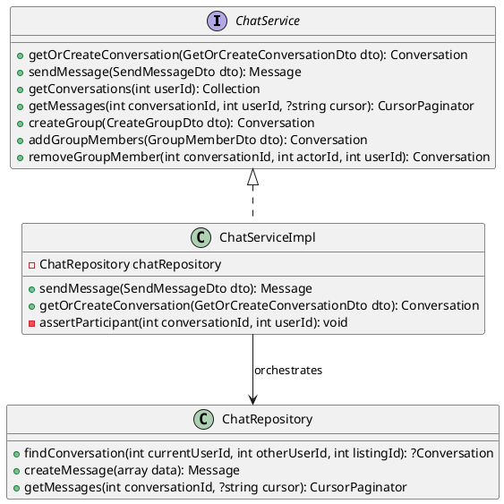
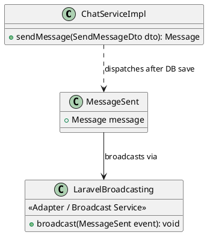

# Phân tích Design Pattern Chức năng: Chat

Tài liệu này phân tích chi tiết các Design Pattern được áp dụng trong phân hệ **Chat** (tin nhắn realtime) của dự án Propify.

---

## 1. Facade Pattern (Giao diện đơn giản cho phân hệ Chat phức tạp)

### 1.1. Ánh xạ thành phần (Mapping)

| Thành phần chuẩn UML GoF | Lớp cụ thể trong dự án | Ghi chú |
|---|---|---|
| **Facade Interface** | `App\Services\Chat\ChatService` | Interface Service phân hệ Chat. |
| **Facade Implementation** | `App\Services\Chat\Impl\ChatServiceImpl` | Lớp che giấu độ phức tạp: Conversation, Message, GroupMember, Participant. |
| **Subsystems (Repositories)** | `App\Repositories\ChatRepository` | Nhiều Repository phối hợp lưu dữ liệu hội thoại, tin nhắn, thành viên. |

### 1.2. Giải thích Trách nhiệm (Responsibility)

- **`ChatService` (Facade)**: Định nghĩa các phương thức nghiệp vụ của phân hệ Chat: tạo/conversation, gửi tin nhắn, tạo nhóm chat, quản lý thành viên, đọc tin nhắn, đánh dấu đã đọc.
- **`ChatServiceImpl`**: Lớp triển khai quy tụ tất cả logic điều hướng dữ liệu giữa các Repository và các models như `Conversation`, `Message`, `User`. Nó chịu trách nhiệm kiểm tra xem user có quyền truy cập vào conversation hay không (`assertParticipant`), lấy ra danh sách tin nhắn phân trang, và đảm bảo sự đồng bộ dữ liệu giữa các bảng.
- **`ChatRepository`**: Đảm nhận các thao tác cơ sở dữ liệu cụ thể: tìm conversation, lấy messages dạng cursor pagination, tạo message, cập nhật `last_seen`.

### 1.3. Sơ đồ lớp (Class Diagram) bằng PlantUML

### 1.4. Đánh giá ưu điểm

- **Đơn giản hóa giao tiếp**: Controller tương tác với phân hệ chat chỉ qua một Service đơn nhất (`ChatService`) thay vì phải truy cập rải rác qua nhiều tầng Conversation/Message/GroupMember repositories, giữ cho Controllers mỏng nhẹ.
- **Đóng gói quy tắc nghiệp vụ**: Các logic như `assertParticipant` (chỉ người tham gia mới được gửi/đọc tin nhắn) được tập trung trong Facade thay vì rải rác khắp nơi, giúp dễ dàng bảo trì và kiểm thử.

---

## 2. Observer & Adapter Pattern (Đồng bộ truyền phát realtime qua WebSocket)

### 2.1. Ánh xạ thành phần (Mapping)

| Thành phần chuẩn UML GoF | Lớp cụ thể trong dự án | Ghi chú |
|---|---|---|
| **Subject (Event)** | `App\Events\Chat\MessageSent` | Phát đi sự kiện ngay sau khi tin nhắn được ghi nhận vào CSDL. |
| **Observer** | `App\Listeners\Chat\BroadcastMessageListener` (nếu có) hoặc direct dispatch của `Laravel Reverb` | Lắng nghe và Broadcast tới WebSocket. |
| **Adapter/Service** | `Laravel\Reverb` (Through Laravel Broadcasting) | Dịch vụ WebSocket native của Laravel, đóng vai trò Adapter phát tín hiệu realtime. |

### 2.2. Giải thích Trách nhiệm (Responsibility)

- **`MessageSent`**: Event chứa toàn bộ đối tượng Message (bao gồm sender, body, file_url, metadata...). Event được dispatch ngay trong phương thức `ChatServiceImpl::sendMessage()` sau khi message được lưu vào database thành công.
- **Laravel Broadcasting + Reverb**: Hệ thống `ShouldBroadcast` của Laravel đảm nhận vai trò Adapter, nhận Event từ code PHP và chuyển đổi thành tín hiệu WebSocket gửi realtime đến các client đang kết nối. Các bên liên quan (chủ nhà, người xem tin) ngay lập tức nhận được thông báo tin nhắn mới.

### 2.3. Sơ đồ lớp (Class Diagram) bằng PlantUML

### 2.4. Đánh giá ưu điểm

- **Đảm bảo tính realtime**: Sự kiện được phát ngay sau khi ghi database thành công. Nếu quá trình Broadcast gặp lỗi (ví dụ: Redis queue không hoạt động), hệ thống chỉ log lỗi mà không làm gián đoạn việc ghi nhận tin nhắn trong CSDL (Fail-safe).
- **Không block tiến trình chính**: Việc broadcast tin nhắn được đẩy vào Queue (Laravel Queue) thông qua cơ chế `ShouldBroadcast`, đảm bảo thời gian phản hồi API không bị ảnh hưởng bởi độ trễ của WebSocket.
