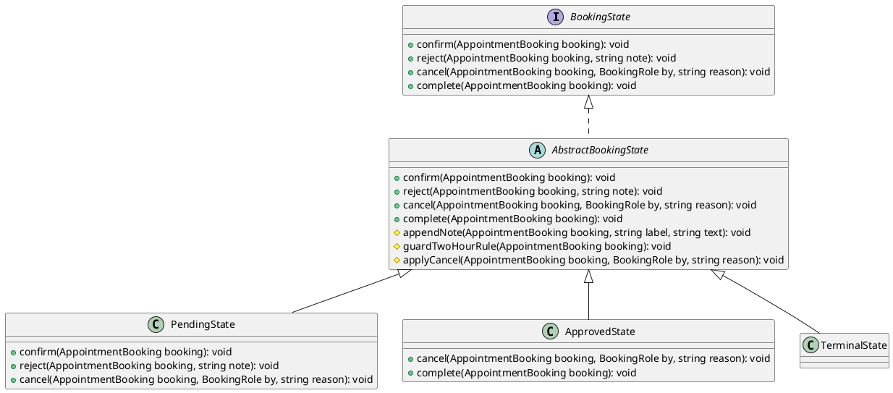
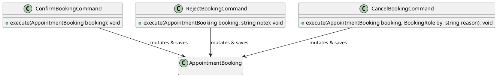
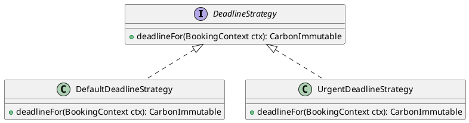

# Phân tích Design Pattern Chức năng: Đặt lịch hẹn

Tài liệu này phân tích chi tiết các Design Pattern được áp dụng trong phân hệ **Đặt lịch hẹn & Quản lý vòng đời cuộc hẹn** (Appointment Booking) của dự án Propify.

---

## 1. State Pattern (Quản lý trạng thái và Vòng đời lịch hẹn)

### 1.1. Ánh xạ thành phần (Mapping)

| Thành phần chuẩn UML GoF | Lớp cụ thể trong dự án | Ghi chú |
|---|---|---|
| **Context** | `App\Models\AppointmentBooking` | Model duy trì trạng thái (`status`) và cung cấp phương thức `state()` để lấy đối tượng State động. |
| **State (Interface)** | `App\Services\Appointment\State\BookingState` | Định nghĩa các hành vi chuyển trạng thái: `confirm`, `reject`, `cancel`, `complete`. |
| **AbstractState** | `App\Services\Appointment\State\AbstractBookingState` | Lớp cơ sở ném lỗi mặc định và triển khai các hàm dùng chung (như quy tắc 2 giờ). |
| **ConcreteState A** | `App\Services\Appointment\State\PendingState` | Trạng thái Chờ xử lý. Cho phép xác nhận, từ chối, hủy. |
| **ConcreteState B** | `App\Services\Appointment\State\ApprovedState` | Trạng thái Đã duyệt. Cho phép hủy và hoàn thành. |
| **ConcreteState C** | `App\Services\Appointment\State\TerminalState` | Trạng thái Kết thúc (Đã hủy / Quá hạn / Hoàn thành). Mọi thao tác đều bị cấm. |

### 1.2. Giải thích Trách nhiệm (Responsibility)

- **`AppointmentBooking` (Context)**: Lưu giá trị trạng thái hiện tại dưới dạng chuỗi trong CSDL. Khi gọi hàm `state()`, nó khởi tạo đối tượng State con tương ứng (`PendingState`, `ApprovedState` hoặc `TerminalState`).
- **`AbstractBookingState`**: Mặc định ném ra `BusinessException(BookingNotPending)` đối với mọi hành vi không được hỗ trợ. Nó cũng chứa logic quy tắc 2 giờ (`guardTwoHourRule`: chỉ được phép hủy trước giờ hẹn ít nhất 2 tiếng).
- **`PendingState`**: Chỉ cho phép chủ nhà gọi `confirm()` (chuyển sang `APPROVED`), `reject()` (chuyển sang `CANCELLED_BY_POSTER`), hoặc cho phép hủy (`cancel()`).
- **`ApprovedState`**: Cho phép hủy (`cancel()`) và hoàn thành (`complete()`). Không cho phép duyệt hay từ chối lại.
- **`TerminalState`**: Chặn đứng mọi tác vụ, không thể chuyển đổi đi bất kỳ trạng thái nào khác.

### 1.3. Sơ đồ lớp (Class Diagram) bằng PlantUML

### 1.4. Đánh giá ưu điểm

- **Khử bỏ các khối IF-ELSE khổng lồ**: Tránh được các lỗi logic khi viết nhiều khối if-else lồng nhau để kiểm soát xem ở trạng thái này có được gọi hành động kia hay không. Các quy tắc chuyển đổi trạng thái được tự động quản lý rõ ràng bên trong từng lớp State cụ thể.
- **Kiểm soát tính hợp lệ tuyệt đối**: Ngăn chặn hoàn toàn việc chuyển trạng thái bất hợp pháp (ví dụ: cuộc hẹn đã hoàn thành thì không thể bị chủ nhà bấm từ chối hay khách hàng bấm hủy).

---

## 2. Command Pattern (Đóng gói thao tác Xử lý lịch hẹn)

### 2.1. Ánh xạ thành phần (Mapping)

| Thành phần chuẩn UML GoF | Lớp cụ thể trong dự án | Ghi chú |
|---|---|---|
| **Invoker** | `App\Services\Appointment\Impl\AppointmentBookingServiceImpl` | Service nhận lệnh từ Controller và kích hoạt thực thi Command. |
| **ConcreteCommand A** | `App\Services\Appointment\Command\ConfirmBookingCommand` | Thực thi lệnh chủ nhà xác nhận cuộc hẹn. |
| **ConcreteCommand B** | `App\Services\Appointment\Command\RejectBookingCommand` | Thực thi lệnh chủ nhà từ chối cuộc hẹn. |
| **ConcreteCommand C** | `App\Services\Appointment\Command\CancelBookingCommand` | Thực thi lệnh khách/chủ nhà hủy cuộc hẹn. |
| **Receiver** | `App\Models\AppointmentBooking` | Model tiếp nhận lệnh lưu trữ trạng thái mới. |

### 2.2. Giải thích Trách nhiệm (Responsibility)

- **`ConfirmBookingCommand`**: Gọi đối tượng State thực hiện `confirm()`, lưu thay đổi xuống database và phát sự kiện `AppointmentBookingStatusUpdated`.
- **`RejectBookingCommand`**: Gọi đối tượng State thực hiện `reject()`, lưu note lý do từ chối vào database và phát sự kiện `AppointmentBookingStatusUpdated`.
- **`CancelBookingCommand`**: Gọi đối tượng State thực hiện `cancel()`, kiểm tra quy tắc 2 tiếng trước giờ hẹn và cập nhật trạng thái tương ứng với vai trò của người hủy.

### 2.3. Sơ đồ lớp (Class Diagram) bằng PlantUML

### 2.4. Đánh giá ưu điểm

- **Cô lập tác vụ thay đổi dữ liệu**: Việc tách biệt logic lưu trữ (`save()`) và phát sự kiện ra khỏi các State Object giúp cho các State Object chỉ tập trung duy nhất vào logic kiểm soát trạng thái (Single Responsibility Principle). Tầng Command làm nhiệm vụ điều phối cơ sở hạ tầng (Database + Event Dispatcher).

---

## 3. Strategy Pattern (Chiến lược tính hạn xác nhận cuộc hẹn)

### 3.1. Ánh xạ thành phần (Mapping)

| Thành phần chuẩn UML GoF | Lớp cụ thể trong dự án | Ghi chú |
|---|---|---|
| **Context** | `App\Services\Appointment\Impl\AppointmentBookingServiceImpl` | Service tạo booking áp dụng Strategy để tính toán hạn xác nhận. |
| **Strategy (Interface)** | `App\Services\Appointment\Booking\Deadline\DeadlineStrategy` | Định nghĩa giao diện tính hạn xác nhận (`confirm_deadline`). |
| **ConcreteStrategy A** | `App\Services\Appointment\Booking\Deadline\DefaultDeadlineStrategy` | Tính hạn xác nhận theo luật mặc định: 6 tiếng từ khi đặt. |
| **ConcreteStrategy B** | `App\Services\Appointment\Booking\Deadline\UrgentDeadlineStrategy` | Tính hạn xác nhận cho trường hợp khẩn cấp (đặt hẹn dưới 6 tiếng trước giờ gặp). |

### 3.2. Giải thích Trách nhiệm (Responsibility)

- **`DeadlineStrategy`**: Định nghĩa phương thức `deadlineFor(BookingContext $ctx)` trả về mốc thời gian hết hạn dạng `CarbonImmutable`.
- **`DefaultDeadlineStrategy`**: Theo đặc tả SRS, hạn xác nhận mặc định là 6 tiếng kể từ lúc tạo yêu cầu đặt lịch.
- **`UrgentDeadlineStrategy`**: Nếu đặt hẹn gấp (khoảng cách giờ đặt và giờ gặp ít hơn 6 tiếng), hạn xác nhận sẽ bằng: `Thời điểm gặp - 1 tiếng` (đảm bảo tối thiểu 1 tiếng để chủ nhà xác nhận trước giờ gặp).

### 3.3. Sơ đồ lớp (Class Diagram) bằng PlantUML

### 3.4. Đánh giá ưu điểm

- **Dễ cấu hình và mở rộng**: Dễ dàng điều chỉnh công thức tính thời gian chờ xác nhận mà không cần sửa đổi mã nguồn nghiệp vụ chính. Có thể linh động áp dụng cho các gói VIP (ví dụ: VIP được tự động tăng thời gian chờ hoặc ngược lại).
