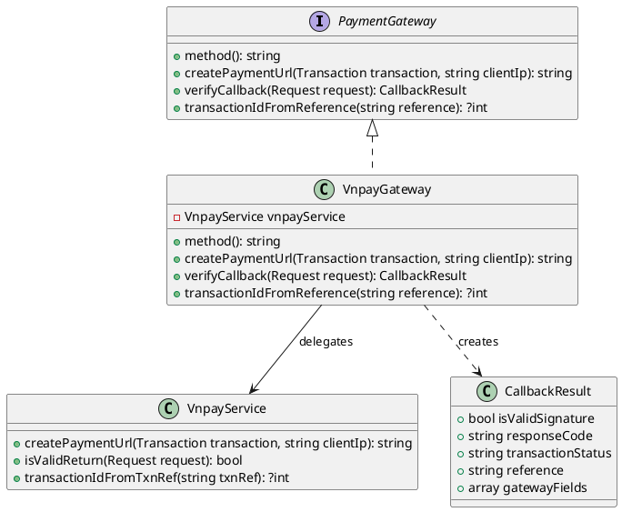
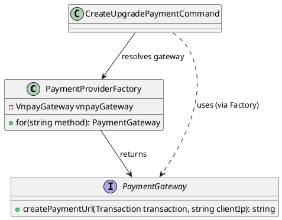

# Phân tích Design Pattern Chức năng: Thanh toán

Tài liệu này phân tích chi tiết các Design Pattern được áp dụng trong phân hệ **Thanh toán trực tuyến** (VNPAY) của dự án Propify.

---

## 1. Adapter Pattern (Thích ứng và chuẩn hóa cổng thanh toán)

### 1.1. Ánh xạ thành phần (Mapping)

| Thành phần chuẩn UML GoF | Lớp cụ thể trong dự án | Ghi chú |
|---|---|---|
| **Target Interface** | `App\Services\Payment\Gateway\PaymentGateway` | Định nghĩa giao diện chung cho mọi cổng thanh toán (VNPAY, MOMO, Stripe...). |
| **Adapter** | `App\Services\Payment\Gateway\VnpayGateway` | Lớp triển khai bọc `VnpayService` và map dữ liệu gốc từ cổng thành `CallbackResult` chuẩn hóa. |
| **Adaptee** | `App\Services\Payment\VnpayService` | Dịch vụ tính toán và xác thực giao dịch trực tiếp với API VNPAY. |

### 1.2. Giải thích Trách nhiệm (Responsibility)

- **`PaymentGateway`**: Target Interface mô tả các hoạt động của một cổng thanh toán: tạo URL chuyển hướng đến cổng (`createPaymentUrl`), xác thực callback từ cổng (`verifyCallback`), và lấy mã giao dịch nội bộ từ mã tham chiếu (`transactionIdFromReference`).
- **`VnpayGateway`**: Chuyển đổi các yêu cầu từ Use Case (giao dịch nội bộ) thành tham số VNPAY, gọi `VnpayService` để tạo chữ ký HMAC-SHA512 và build URL; ngược lại, map các query parameter trả về (`vnp_TxnRef`, `vnp_ResponseCode`, `vnp_TransactionStatus`, `vnp_SecureHash`) vào đối tượng `CallbackResult` chuẩn.
- **`VnpayService`**: Dịch vụ xử lý mức thấp: tạo chữ ký bảo mật, kiểm tra tính toàn vẹn của dữ liệu callback, phân giải mã giao dịch từ chuỗi `vnp_TxnRef`.

### 1.3. Sơ đồ lớp (Class Diagram) bằng PlantUML

### 1.4. Đánh giá ưu điểm

- **Kiến trúc mở cho nhiều cổng thanh toán**: Với interface `PaymentGateway` chuẩn hóa, hệ thống có thể tích hợp thêm Momo, ZaloPay, Stripe chỉ bằng cách viết các Adapter tương ứng mà không cần thay đổi bất kỳ code Use Case nào (OCP).
- **Bảo mật tách biệt**: Logic xác thực chữ ký HMAC của VNPAY được đóng gói trong `VnpayService` và không rò rỉ ra các tầng sử dụng. Adapter `VnpayGateway` đảm bảo callback validation thông qua `isValidReturn()` trước khi gọi bước xử lý tiếp theo.

---

## 2. Factory Method Pattern (Khởi tạo cổng thanh toán động tại runtime)

### 2.1. Ánh xạ thành phần (Mapping)

| Thành phần chuẩn UML GoF | Lớp cụ thể trong dự án | Ghi chú |
|---|---|---|
| **Creator (Factory)** | `App\Services\Payment\Gateway\PaymentProviderFactory` | Nhận tham số `method` từ client, trả về Adapter cổng thanh toán thích hợp. |
| **Product** | `App\Services\Payment\Gateway\PaymentGateway` | Sản phẩm chính là interface cổng thanh toán. |

### 2.2. Giải thích Trách nhiệm (Responsibility)

- **`PaymentProviderFactory`**: Lớp Factory ánh xạ phương thức thanh toán (`VNPAY`, `MOMO`, `STRIPE`) với Gateway tương ứng. Khi có yêu cầu tạo payment URL, `CreateUpgradePaymentCommand` gọi Factory để lấy đối tượng gateway và gọi `createPaymentUrl()`. Factory đảm bảo các Use Case không phải khởi tạo trực tiếp Adapter cụ thể.

### 2.3. Sơ đồ lớp (Class Diagram) bằng PlantUML

### 2.4. Đánh giá ưu điểm

- **Giảm phụ thuộc trực tiếp**: Use case `CreateUpgradePaymentCommand` không import trực tiếp `VnpayGateway` hay `MomoGateway`. Nó chỉ phụ thuộc vào Factory và interface `PaymentGateway`. Điều này giúp mã nguồn tuân thủ **Dependency Inversion Principle (DIP)** đồng thời thúc đẩy khả năng mở rộng.
