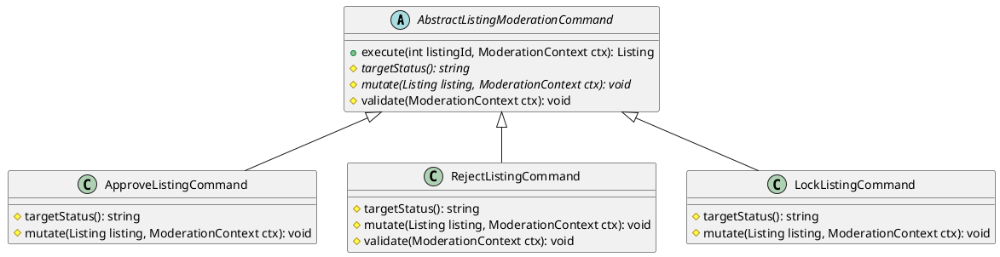
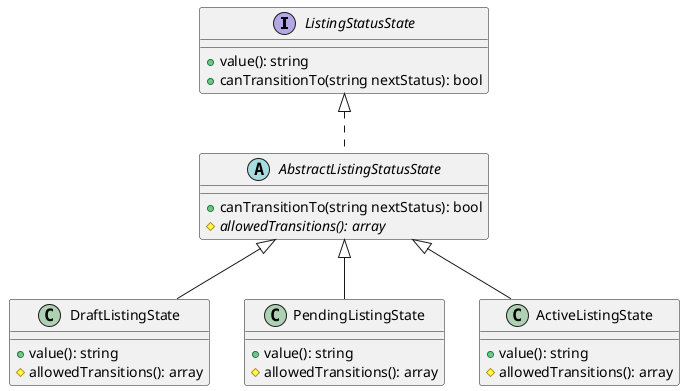

# Phân tích Design Pattern Chức năng: Tạo tin đăng & Admin duyệt / từ chối tin

Tài liệu này phân tích chi tiết các Design Pattern được áp dụng trong phân hệ **Tạo tin đăng, cập nhật và Kiểm duyệt tin đăng** của dự án Propify.

---

## 1. Template Method Pattern (Khung xử lý kiểm duyệt tin đăng của Admin)

### 1.1. Ánh xạ thành phần (Mapping)

| Thành phần chuẩn UML GoF | Lớp cụ thể trong dự án | Ghi chú |
|---|---|---|
| **AbstractClass** | `App\Services\Listing\Moderation\AbstractListingModerationCommand` | Định nghĩa thuật toán khung (Template Method) cho mọi thao tác duyệt/khóa tin. |
| **ConcreteClass A** | `App\Services\Listing\Moderation\ApproveListingCommand` | Duyệt tin: chuyển sang ACTIVE, lưu ngày duyệt. |
| **ConcreteClass B** | `App\Services\Listing\Moderation\RejectListingCommand` | Từ chối tin: yêu cầu bắt buộc nhập lý do, chuyển sang REJECTED. |
| **ConcreteClass C** | `App\Services\Listing\Moderation\LockListingCommand` | Khóa tin đăng: chuyển sang LOCKED. |

### 1.2. Giải thích Trách nhiệm (Responsibility)

- **`AbstractListingModerationCommand`**: Thiết lập khung thuật toán cố định trong phương thức `final public function execute(int $listingId, ModerationContext $ctx)`:
  1. `validate()`: Gọi hook kiểm tra dữ liệu đầu vào.
  2. `DB::transaction()`: Bắt đầu giao dịch dữ liệu.
  3. `lockForUpdate()`: Khóa dòng dữ liệu tin đăng trong database để tránh xung đột.
  4. `assertCanTransition()`: Gọi State check xem trạng thái hiện tại có được phép chuyển qua trạng thái đích hay không.
  5. `mutate()`: Gọi hook cập nhật dữ liệu của lớp con.
  6. `ListingStatusHistory::create()`: Ghi nhận lịch sử thay đổi trạng thái của Admin.
  7. `ListingSaved::dispatch()`: Phát Domain Event để kích hoạt listener (ví dụ: gửi mail kết quả cho user, xóa cache).
- **`ApproveListingCommand`**: Thực hiện điền trạng thái đích là `ACTIVE`, điền trường `published_at` và `approved_by`.
- **`RejectListingCommand`**: Triển khai thêm hook `validate()` để bắt buộc nhập lý do từ chối, điền trạng thái đích là `REJECTED` và lưu lý do.
- **`LockListingCommand`**: Điền trạng thái đích là `LOCKED`.

### 1.3. Sơ đồ lớp (Class Diagram) bằng PlantUML

### 1.4. Đánh giá ưu điểm

- **Tái sử dụng mã nguồn tối đa (Code Reuse)**: Toàn bộ quy trình nặng về mặt hạ tầng (Transaction, Lock database, ghi nhận Status History, Dispatch Event, Nạp các quan hệ dữ liệu liên quan) được viết duy nhất một lần ở lớp cha `AbstractListingModerationCommand`.
- **An toàn bảo mật dữ liệu**: Các lớp con không cần lo lắng về việc mở/đóng transaction hay quên phát Event, giúp triệt tiêu các lỗi rò rỉ dữ liệu hoặc bỏ sót sự kiện hệ thống.

---

## 2. State Pattern (Quản lý trạng thái vòng đời của Tin đăng)

### 2.1. Ánh xạ thành phần (Mapping)

| Thành phần chuẩn UML GoF | Lớp cụ thể trong dự án | Ghi chú |
|---|---|---|
| **Context** | `App\Models\Listing` *(Trực gián tiếp qua Factory)* | Model lưu trạng thái hiện tại (`status`). |
| **State (Interface)** | `App\Services\Listing\State\ListingStatusState` | Quy định giao diện trạng thái của tin đăng. |
| **AbstractState** | `App\Services\Listing\State\AbstractListingStatusState` | Lớp cơ sở kiểm tra việc chuyển trạng thái dựa trên danh sách cho phép. |
| **ConcreteState** | `DraftListingState`, `PendingListingState`, `ActiveListingState`, `RejectedListingState`, `LockedListingState`, `UnlistedListingState` | Các trạng thái cụ thể của tin đăng trong hệ thống. |

### 2.2. Giải thích Trách nhiệm (Responsibility)

- **`ListingStatusState`**: Khai báo phương thức `value()` trả về chuỗi trạng thái và `canTransitionTo(string $nextStatus)` trả về boolean.
- **`AbstractListingStatusState`**: Triển khai `canTransitionTo()` bằng cách kiểm tra giá trị trạng thái đích nằm trong mảng `allowedTransitions()` của trạng thái hiện tại.
- **`DraftListingState` (DRAFT)**: Chỉ được phép chuyển sang `PENDING`.
- **`PendingListingState` (PENDING)**: Chỉ cho phép Admin duyệt (`ACTIVE`) hoặc từ chối (`REJECTED`).
- **`ActiveListingState` (ACTIVE)**: Có thể bị khóa (`LOCKED`), từ chối (`REJECTED`), hoặc người dùng ẩn tin (`UNLISTED`).
- **`UnlistedListingState` (UNLISTED)**: Là trạng thái kết thúc, không được chuyển sang trạng thái nào khác.

### 2.3. Sơ đồ lớp (Class Diagram) bằng PlantUML

### 2.4. Đánh giá ưu điểm

- **Khóa chặt luồng dữ liệu (Data Integrity)**: Đảm bảo một tin đăng nháp (`DRAFT`) không thể nhảy cóc thẳng lên `ACTIVE` mà bắt buộc phải qua `PENDING` chờ duyệt. Tương tự, tin đăng đang bị khóa `LOCKED` bắt buộc phải duyệt lại (`ACTIVE`) chứ không thể đổi trạng thái lung tung.
- **Dễ dàng bảo trì**: Tất cả luật chuyển đổi trạng thái của tin đăng được khai báo tập trung trong thuộc tính `allowedTransitions` của từng lớp, làm mã nguồn vô cùng sạch sẽ.

---

## 3. Command Pattern (Đóng gói nghiệp vụ Tạo/Cập nhật tin đăng)

### 3.1. Ánh xạ thành phần (Mapping)

| Thành phần chuẩn UML GoF | Lớp cụ thể trong dự án | Ghi chú |
|---|---|---|
| **Invoker** | `App\Http\Controllers\Api\V1\Listing\ListingController` | Controller gọi Command thực hiện các thao tác tạo/sửa tin. |
| **ConcreteCommand** | `App\Services\Listing\Commands\CreateListingCommand` | Đóng gói logic tạo mới tin đăng (bao gồm lưu BĐS, hình ảnh, video). |
| **Receiver** | `App\Repositories\ListingRepository` | Repository thực hiện lưu thông tin xuống database. |

### 3.2. Giải thích Trách nhiệm (Responsibility)

- **`CreateListingCommand`**: Có nhiệm vụ:
  1. Gọi Pipeline validate dữ liệu nghiệp vụ tin đăng (`ListingSubmissionValidationPipeline`).
  2. Bắt đầu transaction.
  3. Tạo thực thể BĐS liên đới (`Property`) trước.
  4. Xác định trạng thái ban đầu (`DRAFT` hoặc `PENDING`) dựa trên tùy chọn lưu nháp của người dùng.
  5. Tính toán điểm chất lượng tin đăng (`calculateContentScore`) dựa trên mật độ chữ, hình ảnh, video đi kèm.
  6. Lưu trữ thông tin tài liệu xác minh (nếu người dùng yêu cầu xác thực).
  7. Phát event `ListingSaved` để kích hoạt các nghiệp vụ ngoài (ví dụ gửi mail thông báo cho admin).

### 3.3. Đánh giá ưu điểm

- **Cô lập hoàn toàn quy trình tạo tin phức tạp**: Quá trình tạo một tin đăng bất động sản chứa rất nhiều thông tin đính kèm (hình ảnh, video, tài liệu pháp lý, thuộc tính chi tiết căn hộ). Command Pattern giúp tách biệt hoàn toàn luồng xử lý phức tạp này khỏi Controller, đảm bảo tính dễ bảo trì.
- **Tính toán điểm chất lượng tự động**: Hàm `calculateContentScore` được đóng gói bên trong Command giúp hệ thống tự động chuẩn hóa điểm chất lượng tin trước khi lưu CSDL, đảm bảo dữ liệu luôn chính xác và đồng nhất.
