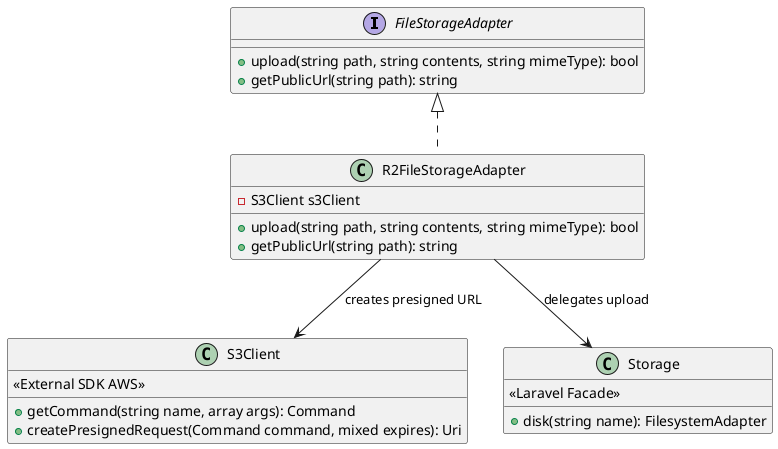
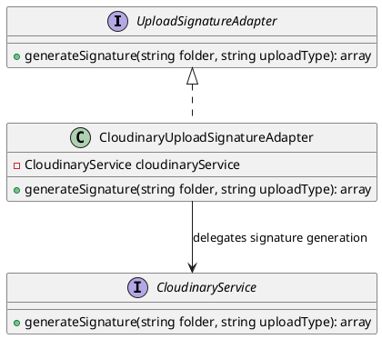

# Phân tích Design Pattern Chức năng: Lưu trữ & Truyền tải Media

Tài liệu này phân tích chi tiết các Design Pattern được áp dụng trong phân hệ **Lưu trữ file và Truyền tải Media** (Cloudflare R2, Cloudinary upload signature) của dự án Propify.

---

## 1. Adapter Pattern (Thích ứng dịch vụ lưu trữ Cloudflare R2)

### 1.1. Vấn đề cần giải quyết (Problem)
Hệ thống cần lưu trữ các file đính kèm (hình ảnh tin đăng, video, tài liệu xác minh) lên Cloudflare R2, một dịch vụ lưu trữ đám mây tương thích với S3 API. Việc sử dụng trực tiếp các lệnh `Storage::disk('r2')->put(...)` trong các lớp Service/Repository sẽ tạo ra sự phụ thuộc cứng vào cấu hình Laravel Filesystem Disk và vào Cloudflare R2 (dựa trên S3Client). Điều này khiến việc thay đổi nhà cung cấp Cloud Storage sau này (sang AWS S3, Google Cloud Storage, DigitalOcean Spaces) trở nên cực kỳ khó khăn và đòi hỏi sửa đổi hàng loạt file.

### 1.2. Ánh xạ thành phần (Mapping)

| Thành phần chuẩn UML GoF | Lớp cụ thể trong dự án | Ghi chú |
|---|---|---|
| **Target Interface** | `App\Services\Media\FileStorageAdapter` | Định nghĩa giao diện chuẩn cho dịch vụ lưu trữ file đám mây. |
| **Adapter** | `App\Services\Media\R2FileStorageAdapter` | Bọc Laravel Storage disk và S3Client để thích ứng với Cloudflare R2. |
| **Adaptee** | `Illuminate\Support\Facades\Storage` (với disk `r2`) `Aws\S3\S3Client` | API Laravel Filesystem và AWS S3 SDK (dùng để tạo URL có chữ ký - presigned URL). |

### 1.3. Giải thích Trách nhiệm (Responsibility)

- **`FileStorageAdapter`**: Định nghĩa hai phương thức chuẩn: `upload()` để đẩy file lên storage và trả về `bool` thành công; `getPublicUrl()` để lấy URL truy cập công khai (dạng presigned URL 7 ngày) cho file đã upload.
- **`R2FileStorageAdapter`**: Triển khai upload bằng cách gọi `Storage::disk('r2')->put()`. Triển khai lấy public URL bằng cách tạo một `PresignedRequest` thông qua `S3Client` với thời hạn 7 ngày, cho phép Frontend hoặc người dùng truy cập file mà không cần cấu hình bucket công khai.

### 1.4. Sơ đồ lớp (Class Diagram) bằng PlantUML

### 1.5. Đánh giá ưu điểm

- **Dễ dàng chuyển đổi nhà cung cấp cloud**: Khi cần chuyển từ Cloudflare R2 sang AWS S3, Google Cloud Storage hay MinIO, lập trình viên chỉ cần viết thêm một Adapter mới (ví dụ: `S3FileStorageAdapter`) và thay đổi binding ở Service Provider. Toàn bộ code nghiệp vụ sử dụng interface `FileStorageAdapter` không bị ảnh hưởng.
- **Bảo mật tốt hơn**: URL truy cập file được tạo dưới dạng "Presigned URL" với thời hạn 7 ngày, giúp bucket R2 có thể để chế độ Private hoàn toàn, an toàn trước truy cập trái phép. Việc thay đổi thời hạn hiệu lực của URL chỉ cần can thiệp vào Adapter, không phải sửa tầng Service.

---

## 2. Adapter Pattern (Thích ứng dịch vụ tạo chữ ký upload Cloudinary)

### 2.1. Vấn đề cần giải quyết (Problem)
Hệ thống sử dụng Cloudinary làm dịch vụ quản lý và tối ưu hóa hình ảnh/video. Cloudinary yêu cầu một chữ ký số (signature) được tạo bằng mã hóa HMAC-SHA1 dựa trên tham số upload, timestamp và API Secret. Công thức sinh chữ ký này rất đặc thù cho Cloudinary. Nếu các Controller/Service gọi trực tiếp hàm `generateSignature()` của Cloudinary SDK, hệ thống sẽ bị phụ thuộc cứng vào Cloudinary; đổi qua dịch vụ khác (Imgix, Uploadcare, Cloudflare Images) đồng nghĩa với việc phải viết lại từ đầu.

### 2.2. Ánh xạ thành phần (Mapping)

| Thành phần chuẩn UML GoF | Lớp cụ thể trong dự án | Ghi chú |
|---|---|---|
| **Target Interface** | `App\Services\Media\UploadSignatureAdapter` | Định nghĩa giao diện chuẩn cho dịch vụ tạo chữ ký upload file từ Frontend. |
| **Adapter** | `App\Services\Media\CloudinaryUploadSignatureAdapter` | Bọc `CloudinaryService` để thích ứng với Cloudinary API. |
| **Adaptee** | `App\Services\Cloudinary\CloudinaryService` | Dịch vụ nội bộ giao tiếp trực tiếp với Cloudinary API (tạo chữ ký, tính timestamp). |

### 2.3. Giải thích Trách nhiệm (Responsibility)

- **`UploadSignatureAdapter`**: Định nghĩa phương thức `generateSignature(string $folder, string $uploadType)` trả về mảng chứa các thông số cấu hình upload (signature, api_key, cloud_name, timestamp, folder, upload_preset). Frontend sẽ dùng các thông số này để upload file trực tiếp lên Cloudinary mà không cần lưu tạm qua Backend Server.
- **`CloudinaryUploadSignatureAdapter`**: Triển khai `generateSignature()` bằng cách gọi xuống `CloudinaryService::generateSignature()`, định dạng kết quả trả về theo chuẩn của interface.

### 2.4. Sơ đồ lớp (Class Diagram) bằng PlantUML

### 2.5. Đánh giá ưu điểm

- **Frontend Upload trực tiếp**: Adapter cho phép Backend sinh chữ ký và trả về cho Frontend, giúp Frontend upload file thẳng lên CDN mà không cần tốn băng thông và xử lý server, giảm tải CPU và I/O cho Backend Server.
- **Giảm phụ thuộc vào Cloudinary**: Nếu sau này muốn chuyển từ Cloudinary sang Cloudflare Images, lập trình viên chỉ cần tạo `CloudflareImageSignatureAdapter` triển khai `UploadSignatureAdapter` mà không cần sửa bất kỳ dòng code nào ở Controller hay Service.
