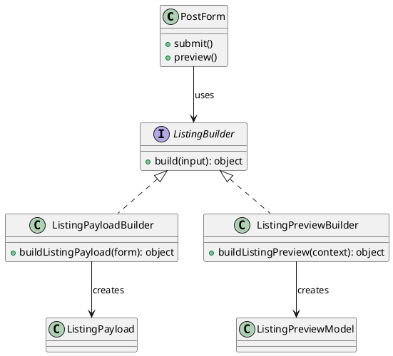
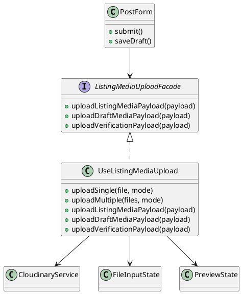
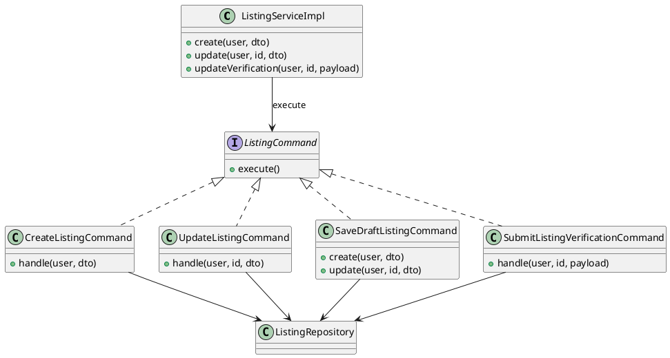
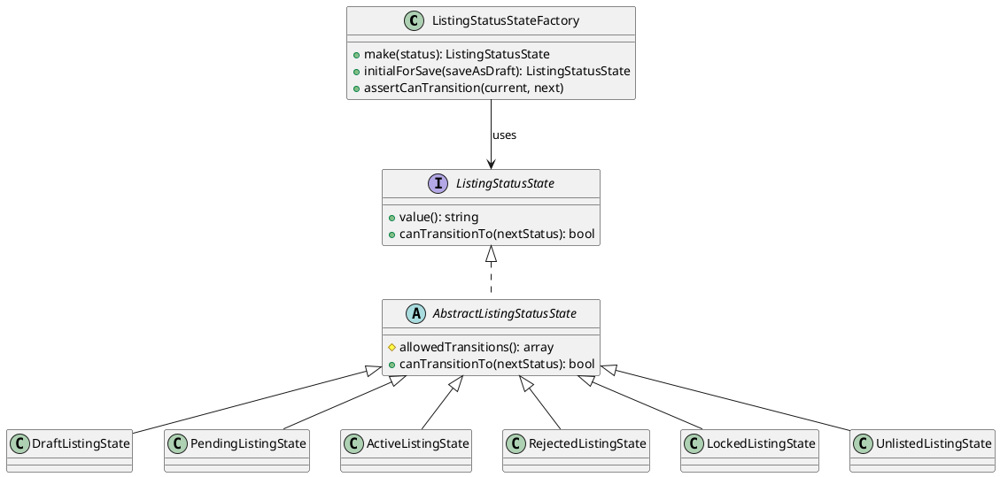
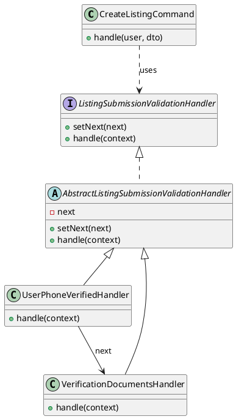
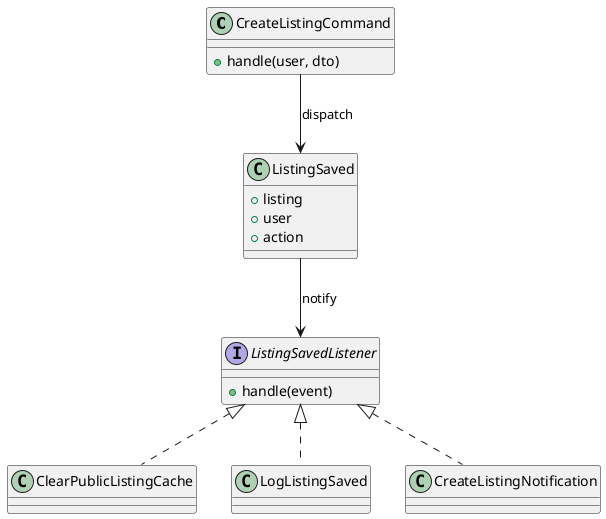
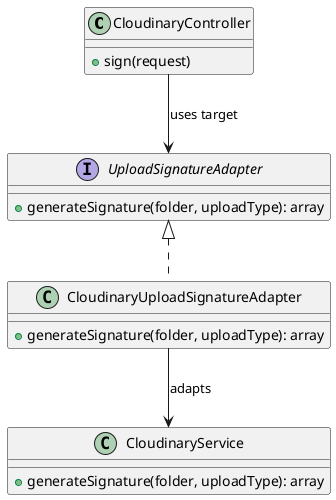

# Phân tích Design Pattern Chức năng: Đăng tin bất động sản

Tài liệu này trình bày các Design Pattern đang được áp dụng trong chức năng **Đăng tin bất động sản** của Propify. Nội dung bám theo tài liệu triển khai trong `architecture/listing-posting-design-patterns.md` và cách trình bày UML trong các slide pattern của dự án.

Các pattern được áp dụng:

```text
Builder Pattern
Facade Pattern
Command Pattern
State Pattern
Chain of Responsibility Pattern
Observer Pattern
Adapter Pattern
```

---

## 1. Builder Pattern

### 1.1. Vấn đề cần giải quyết (Problem)

Form đăng tin có rất nhiều dữ liệu: nhu cầu mua bán/cho thuê, loại nhà đất, địa chỉ, giá, diện tích, ảnh, video, giấy tờ pháp lý, thông tin liên hệ và lịch hẹn xem nhà. Nếu component form tự dựng payload gửi API hoặc tự dựng object xem trước tin đăng, `PostForm.vue` sẽ bị phình to và lặp mapping field ở nhiều nơi.

Builder Pattern được dùng để tách logic dựng object phức tạp ra khỏi component. Component chỉ truyền dữ liệu đầu vào, builder chịu trách nhiệm tạo object cuối cùng đúng cấu trúc.

### 1.2. Ánh xạ thành phần (Mapping)

| Thành phần chuẩn UML GoF | Lớp cụ thể trong dự án | Ghi chú |
|---|---|---|
| **Director / Client** | `PropifyFrontend/src/pages/Listings/PostForm.vue` | Thu thập dữ liệu form và gọi builder khi đăng tin hoặc xem trước. |
| **Builder** | `PropifyFrontend/src/services/listingPayloadBuilder.js` | Dựng payload gửi API từ dữ liệu form. |
| **Builder** | `PropifyFrontend/src/services/listingPreviewBuilder.js` | Dựng dữ liệu preview để dùng lại giao diện chi tiết tin đăng. |
| **Product** | Listing payload / Listing preview object | Object hoàn chỉnh được tạo ra sau quá trình build. |

### 1.3. Giải thích Trách nhiệm (Responsibility)

- **`PostForm.vue`**: Giữ trạng thái form, gọi builder khi cần submit hoặc xem trước.
- **`buildListingPayload()`**: Chuyển dữ liệu frontend sang payload backend, ví dụ `camelCase` sang `snake_case`, xử lý array, boolean và field rỗng.
- **`buildListingPreview()`**: Tạo object preview có shape phù hợp để render bằng giao diện chi tiết tin đăng.
- **Product**: Là payload cuối cùng gửi API hoặc object preview dùng cho UI.

### 1.4. Sơ đồ lớp (Class Diagram) bằng PlantUML



### 1.5. Đánh giá ưu điểm

- **Giảm lặp mapping field** giữa tạo tin, cập nhật tin và lưu nháp.
- **Component gọn hơn** vì không chứa logic build payload dài.
- **Dễ bảo trì** khi thêm field mới vào form đăng tin.

---

## 2. Facade Pattern

### 2.1. Vấn đề cần giải quyết (Problem)

Khi đăng tin, người dùng có thể upload ảnh, video, CCCD mặt trước, CCCD mặt sau và giấy tờ pháp lý. Nếu `PostForm.vue` tự gọi từng hàm upload, tự phân biệt từng loại file và tự gán URL trả về, component sẽ phụ thuộc quá nhiều vào chi tiết upload media.

Facade Pattern được dùng để tạo một “mặt tiền” đơn giản cho toàn bộ nghiệp vụ upload media. Component chỉ gọi một vài hàm cấp cao, còn chi tiết upload được che giấu bên trong facade.

### 2.2. Ánh xạ thành phần (Mapping)

| Thành phần chuẩn UML GoF | Lớp cụ thể trong dự án | Ghi chú |
|---|---|---|
| **Client** | `PropifyFrontend/src/pages/Listings/PostForm.vue` | Chỉ gọi các hàm upload cấp cao. |
| **Facade Interface** | Conceptual `ListingMediaUploadFacade` | Interface khái niệm theo UML slide, đại diện API đơn giản mà client sử dụng. |
| **Facade** | `PropifyFrontend/src/composables/useListingMediaUpload.js` | Gom logic upload ảnh, video, giấy tờ pháp lý. |
| **Subsystem** | `cloudinaryService`, file input state, preview state | Các hệ thống con được facade điều phối. |

### 2.3. Giải thích Trách nhiệm (Responsibility)

- **`PostForm.vue`**: Gọi facade như `uploadListingMediaPayload()`, `uploadDraftMediaPayload()`, `uploadVerificationPayload()`.
- **`useListingMediaUpload.js`**: Che giấu chi tiết upload một file, nhiều file, upload ảnh/video/giấy tờ và gán URL về payload.
- **Subsystems**: Xử lý ký upload, gửi file lên Cloudinary và quản lý file/preview ở frontend.

### 2.4. Sơ đồ lớp (Class Diagram) bằng PlantUML



### 2.5. Đánh giá ưu điểm

- **Client đơn giản**: Form không cần biết chi tiết upload từng loại file.
- **Che giấu độ phức tạp** của Cloudinary và file state.
- **Dễ thay đổi provider upload** hoặc rule upload mà ít ảnh hưởng component.

---

## 3. Command Pattern

### 3.1. Vấn đề cần giải quyết (Problem)

Chức năng đăng tin có nhiều hành động nghiệp vụ: tạo tin, cập nhật tin, lưu nháp, gửi/cập nhật xác thực. Mỗi hành động đều gồm nhiều bước như validate, lưu property, lưu listing, lưu media, tính điểm, xử lý trạng thái và phát event. Nếu toàn bộ logic nằm trong `ListingServiceImpl`, service sẽ phình to và khó mở rộng.

Command Pattern đóng gói từng hành động thành một command object riêng. Invoker chỉ gọi command, không cần biết chi tiết xử lý bên trong.

### 3.2. Ánh xạ thành phần (Mapping)

| Thành phần chuẩn UML GoF | Lớp cụ thể trong dự án | Ghi chú |
|---|---|---|
| **Invoker** | `App\Services\Listing\impl\ListingServiceImpl` | Nhận yêu cầu từ controller và gọi command tương ứng. |
| **Command (Interface)** | Không tách interface riêng do dùng Laravel DI & class-based command | Theo slide có interface `Command`, còn project inject trực tiếp concrete command. |
| **ConcreteCommand** | `CreateListingCommand`, `UpdateListingCommand`, `SaveDraftListingCommand`, `SubmitListingVerificationCommand` | Mỗi class đóng gói một hành động nghiệp vụ. |
| **Receiver** | `App\Repositories\ListingRepository` và các service liên quan | Thực hiện thao tác lưu dữ liệu, trạng thái, media, giấy tờ. |

### 3.3. Giải thích Trách nhiệm (Responsibility)

- **`ListingServiceImpl`**: Đóng vai trò invoker, chọn command phù hợp với thao tác người dùng.
- **`CreateListingCommand`**: Xử lý tạo tin đăng mới.
- **`UpdateListingCommand`**: Xử lý cập nhật tin đăng.
- **`SaveDraftListingCommand`**: Xử lý lưu nháp khi người dùng chưa gửi duyệt.
- **`SubmitListingVerificationCommand`**: Xử lý gửi/cập nhật thông tin xác thực BĐS.
- **Receiver**: Cung cấp thao tác lưu trữ và các service phụ trợ để command thực thi nghiệp vụ.

### 3.4. Sơ đồ lớp (Class Diagram) bằng PlantUML



### 3.5. Đánh giá ưu điểm

- **Tách từng hành động thành class riêng**, đúng tinh thần slide Command.
- **Dễ mở rộng**: Thêm command mới mà không nhồi thêm logic vào service.
- **Dễ test** từng nghiệp vụ như tạo tin, cập nhật tin, lưu nháp.

---

## 4. State Pattern

### 4.1. Vấn đề cần giải quyết (Problem)

Tin đăng có nhiều trạng thái: `DRAFT`, `PENDING`, `ACTIVE`, `REJECTED`, `LOCKED`, `UNLISTED`. Mỗi trạng thái chỉ cho phép chuyển sang một số trạng thái hợp lệ. Nếu xử lý bằng nhiều `if/else` hoặc `switch`, logic trạng thái dễ bị rải rác và khó kiểm soát.

State Pattern tách từng trạng thái thành class riêng. Mỗi state tự biết giá trị của mình và những trạng thái tiếp theo được phép chuyển.

### 4.2. Ánh xạ thành phần (Mapping)

| Thành phần chuẩn UML GoF | Lớp cụ thể trong dự án | Ghi chú |
|---|---|---|
| **Context** | `ListingStatusStateFactory` và luồng xử lý `Listing` | Tạo state hiện tại và kiểm tra chuyển trạng thái. |
| **State Interface** | `ListingStatusState` | Khai báo `value()` và `canTransitionTo()`. |
| **Base State** | `AbstractListingStatusState` | Cài đặt logic chung dựa trên `allowedTransitions()`. |
| **ConcreteState** | `DraftListingState`, `PendingListingState`, `ActiveListingState`, `RejectedListingState`, `LockedListingState`, `UnlistedListingState` | Mỗi class đại diện một trạng thái tin đăng. |

### 4.3. Giải thích Trách nhiệm (Responsibility)

- **`ListingStatusState`**: Interface chung cho các trạng thái.
- **`AbstractListingStatusState`**: Cung cấp logic kiểm tra transition chung.
- **Concrete states**: Tự định nghĩa `value()` và danh sách trạng thái được phép chuyển.
- **`ListingStatusStateFactory`**: Tạo state tương ứng, xác định trạng thái ban đầu và kiểm tra chuyển trạng thái hợp lệ.

### 4.4. Sơ đồ lớp (Class Diagram) bằng PlantUML



### 4.5. Đánh giá ưu điểm

- **Loại bỏ if/else trạng thái phức tạp**.
- **Luật chuyển trạng thái rõ ràng** trong từng state class.
- **Dễ mở rộng workflow** khi thêm trạng thái mới.

---

## 5. Chain of Responsibility Pattern

### 5.1. Vấn đề cần giải quyết (Problem)

Trước khi lưu tin đăng, hệ thống phải kiểm tra nhiều rule nghiệp vụ theo thứ tự. Ví dụ: người dùng phải có số điện thoại; nếu yêu cầu xác thực BĐS thì phải có đủ giấy tờ. Sau này có thể thêm rule kiểm tra quota, tài khoản bị khóa, số lượng ảnh hoặc lịch hẹn.

Chain of Responsibility tách mỗi rule thành một handler riêng và nối các handler thành chuỗi.

### 5.2. Ánh xạ thành phần (Mapping)

| Thành phần chuẩn UML GoF | Lớp cụ thể trong dự án | Ghi chú |
|---|---|---|
| **Client** | `CreateListingCommand` | Gọi pipeline kiểm tra trước khi lưu tin. |
| **Handler Interface** | `ListingSubmissionValidationHandler` | Khai báo `setNext()` và `handle()`. |
| **Base Handler** | `AbstractListingSubmissionValidationHandler` | Giữ handler kế tiếp và gọi tiếp sau khi xử lý. |
| **ConcreteHandler** | `UserPhoneVerifiedHandler`, `VerificationDocumentsHandler` | Mỗi handler kiểm tra một rule nghiệp vụ. |

### 5.3. Giải thích Trách nhiệm (Responsibility)

- **`CreateListingCommand`**: Gọi validation chain trước khi mở transaction lưu tin.
- **`ListingSubmissionValidationHandler`**: Contract chung cho các handler.
- **`AbstractListingSubmissionValidationHandler`**: Cài đặt cơ chế `next`.
- **`UserPhoneVerifiedHandler`**: Kiểm tra người dùng có số điện thoại.
- **`VerificationDocumentsHandler`**: Kiểm tra giấy tờ khi người dùng yêu cầu xác thực BĐS.

### 5.4. Sơ đồ lớp (Class Diagram) bằng PlantUML



### 5.5. Đánh giá ưu điểm

- **Mỗi rule là một handler riêng**, dễ đọc và dễ test.
- **Dễ thêm rule mới** bằng cách thêm handler vào chain.
- **Dừng sớm khi lỗi**, tránh chạy tiếp các bước lưu dữ liệu không cần thiết.

---

## 6. Observer Pattern

### 6.1. Vấn đề cần giải quyết (Problem)

Sau khi tạo hoặc cập nhật tin, hệ thống cần xử lý nhiều side effect như xóa cache, ghi log và tạo notification. Nếu command gọi trực tiếp tất cả xử lý phụ này, command sẽ biết quá nhiều observer cụ thể và vi phạm SRP/OCP.

Observer Pattern được áp dụng theo hướng event-driven: command chỉ phát event, listener nào quan tâm thì tự xử lý.

### 6.2. Ánh xạ thành phần (Mapping)

| Thành phần chuẩn UML GoF | Lớp cụ thể trong dự án | Ghi chú |
|---|---|---|
| **Subject / Event** | `App\Events\Listing\ListingSaved` | Event được phát sau khi tin thay đổi. |
| **Publisher** | `CreateListingCommand`, `UpdateListingCommand`, `SubmitListingVerificationCommand` | Phát event sau khi lưu dữ liệu. |
| **Observer Interface** | Laravel listener contract qua method `handle()` | Project không cần interface riêng, listener được Laravel gọi bằng `handle()`. |
| **ConcreteObserver** | `ClearPublicListingCache`, `LogListingSaved`, `CreateListingNotification` | Các listener xử lý side effect độc lập. |

### 6.3. Giải thích Trách nhiệm (Responsibility)

- **Publisher command**: Dispatch `ListingSaved` sau khi hoàn tất nghiệp vụ chính.
- **`ListingSaved`**: Mang dữ liệu listing, user và action.
- **`ClearPublicListingCache`**: Xóa cache danh sách tin công khai.
- **`LogListingSaved`**: Ghi log thay đổi tin đăng.
- **`CreateListingNotification`**: Tạo thông báo cho người dùng.

### 6.4. Sơ đồ lớp (Class Diagram) bằng PlantUML



### 6.5. Đánh giá ưu điểm

- **Command không biết observer cụ thể nào**, đúng tinh thần slide Observer.
- **Dễ thêm side effect mới** như gửi email, audit, analytics.
- **Giảm coupling** giữa nghiệp vụ lưu tin và các xử lý phụ.

---

## 7. Adapter Pattern

### 7.1. Vấn đề cần giải quyết (Problem)

Chức năng đăng tin cần upload ảnh, video và giấy tờ lên Cloudinary. Nếu controller phụ thuộc trực tiếp vào `CloudinaryService`, hệ thống sẽ bị gắn chặt với một provider. Khi đổi provider upload, nhiều nơi phải sửa code.

Adapter Pattern tạo một interface chung cho việc sinh upload signature, còn adapter cụ thể bọc Cloudinary.

### 7.2. Ánh xạ thành phần (Mapping)

| Thành phần chuẩn UML GoF | Lớp cụ thể trong dự án | Ghi chú |
|---|---|---|
| **Client** | `CloudinaryController` | Chỉ biết interface upload signature chung. |
| **Target Interface** | `UploadSignatureAdapter` | Interface mà client phụ thuộc vào. |
| **Adapter** | `CloudinaryUploadSignatureAdapter` | Chuyển lời gọi chung sang Cloudinary service. |
| **Adaptee** | `CloudinaryService` | Service cụ thể xử lý Cloudinary. |

### 7.3. Giải thích Trách nhiệm (Responsibility)

- **`CloudinaryController`**: Gọi `UploadSignatureAdapter`, không phụ thuộc trực tiếp Cloudinary.
- **`UploadSignatureAdapter`**: Chuẩn hóa method `generateSignature(string $folder, string $uploadType): array`.
- **`CloudinaryUploadSignatureAdapter`**: Bọc `CloudinaryService` và chuyển lời gọi.
- **`CloudinaryService`**: Xử lý chi tiết tạo chữ ký upload Cloudinary.

### 7.4. Sơ đồ lớp (Class Diagram) bằng PlantUML



### 7.5. Đánh giá ưu điểm

- **Controller không phụ thuộc trực tiếp Cloudinary**.
- **Dễ thay provider upload** bằng adapter mới.
- **Đúng tinh thần slide Adapter**: business chỉ biết interface chung, adapter giấu chi tiết SDK/provider.

