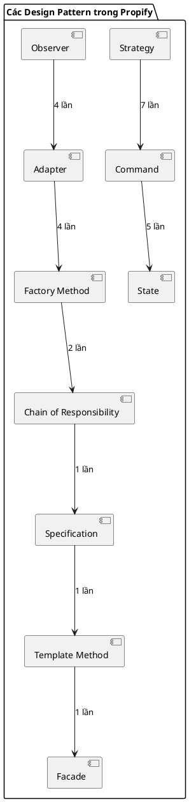

# Báo cáo Phân tích Design Pattern Dự án Propify

Thư mục này chứa phân tích chi tiết các **Design Pattern** được áp dụng trong từng chức năng cụ thể của hệ thống nền tảng dịch vụ bất động sản Propify. Mỗi file dưới đây đều được trình bày theo cấu trúc: **Ánh xạ thành phần → Giải thích trách nhiệm → Sơ đồ Class PlantUML → Đánh giá ưu điểm**.

## Danh sách phân tích chi tiết

| # | Chức năng | Các Design Pattern áp dụng | Số lượng |
|---|-----------|----------------------------|----------|
| 1 | [Đăng ký tài khoản / Đăng nhập](01_auth.md) | `Command`, `Chain of Responsibility`, `Strategy`, `Factory Method`, `Adapter`, `Observer` | **6** |
| 2 | [Nâng cấp tin đăng & Thanh toán](02_listing_upgrade.md) | `Command`, `Strategy` (tính hạn dùng), `Specification`, `Adapter` (VNPAY), `Factory Method` | **5** |
| 3 | [Thuật toán sắp xếp & Lọc dữ liệu](03_filter_sorting.md) | `Strategy` (sắp xếp), `Strategy` (tìm kiếm), `Factory Method` | **3** |
| 4 | [Chat](04_chat.md) | `Facade`, `Observer`, `Adapter` (Broadcast WebSocket) | **3** |
| 5 | [Đặt lịch hẹn / Xử lý lịch hẹn](05_appointment.md) | `State` (quản lý vòng đời), `Command` (action), `Strategy` (tính hạn chờ) | **3** |
| 6 | [Thanh toán](06_payment.md) | `Adapter` (PaymentGateway), `Factory Method` (PaymentProviderFactory) | **2** |
| 7 | [Tạo tin / Admin duyệt tin](07_admin_moderation.md) | `Template Method` (khung kiểm duyệt), `State` (trạng thái tin đăng), `Command` (tạo tin) | **3** |

**Tổng cộng: 7 chức năng → 25 lần áp dụng Design Pattern**

## Biểu đồ tổng quan

> **Ghi chú:** Thứ tự trong bảng trên mỗi dòng là độc lập và số lần áp dụng là ước lượng dựa trên tổng số lớp/interface GoF (mỗi lần triển khai/reference là 1 lần áp dụng).
