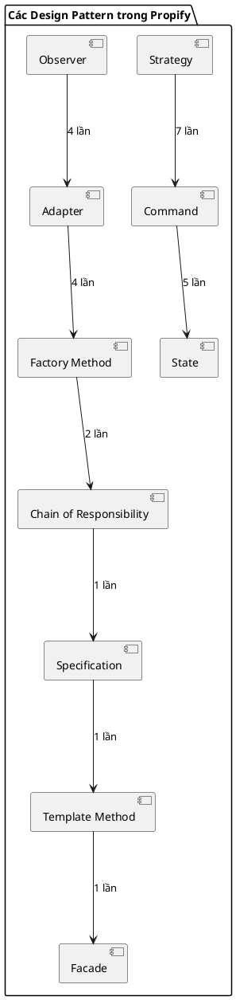

# Báo cáo Phân tích Design Pattern Dự án Propify

Thư mục này chứa phân tích chi tiết các **Design Pattern** được áp dụng trong từng chức năng cụ thể của hệ thống nền tảng dịch vụ bất động sản Propify. Mỗi file dưới đây đều được trình bày theo cấu trúc: **Vấn đề cần giải quyết → Ánh xạ thành phần → Giải thích trách nhiệm → Sơ đồ Class PlantUML → Đánh giá ưu điểm**.

## Danh sách tài liệu phân tích

- **[🏗️ Kiến Trúc Tổng Thể Hệ Thống](kien_truc_tong_the.md)** - Phân tích kiến trúc PM (Clean + Hexagonal Architecture), sơ đồ tổng thể các layer và luồng data.
- **[🗺️ Sơ Đồ Lớp Tổng Thể Toàn Project](class_diagram_tong_the.md)** - Sơ đồ class tổng thể của dự án (Class Diagram), chia theo các phân hệ nghiệp vụ, biểu diễn mối quan hệ phụ thuộc.
- **[📚 Lý Thuyết & Triển Khai Chi Tiết](ly_thuyet_va_trien_khai_chi_tiet.md)** - File chính để trình bày với giảng viên: Lý do chọn pattern, tác dụng, code triển khai, trích dẫn code mẫu cho tất cả 10 Design Pattern.
- **[📊 Bảng Tổng Hợp Design Pattern & Chức Năng](tong_hop_design_pattern.md)** - Bảng đối chiếu toàn bộ 35 lần áp dụng pattern.

## Danh sách phân tích theo chức năng

| # | Chức năng | Các Design Pattern áp dụng | Số lượng |
|---|-----------|----------------------------|----------|
| 1 | [Đăng ký tài khoản / Đăng nhập](01_auth.md) | `Command`, `Chain of Responsibility`, `Strategy`, `Factory Method`, `Adapter`, `Observer` | **6** |
| 2 | [Nâng cấp tin đăng & Thanh toán](02_listing_upgrade.md) | `Command`, `Strategy` (tính hạn dùng), `Specification`, `Adapter` (VNPAY), `Factory Method` | **5** |
| 3 | [Thuật toán sắp xếp & Lọc dữ liệu](03_filter_sorting.md) | `Strategy` (sắp xếp), `Strategy` (tìm kiếm), `Factory Method` | **3** |
| 4 | [Chat](04_chat.md) | `Facade`, `Observer`, `Adapter` (Broadcast WebSocket) | **3** |
| 5 | [Đặt lịch hẹn / Xử lý lịch hẹn](05_appointment.md) | `State` (quản lý vòng đời), `Command` (action), `Strategy` (tính hạn chờ) | **3** |
| 6 | [Thanh toán](06_payment.md) | `Adapter` (PaymentGateway), `Factory Method` (PaymentProviderFactory) | **2** |
| 7 | [Tạo tin / Admin duyệt tin](07_admin_moderation.md) | `Template Method` (khung kiểm duyệt), `State` (trạng thái tin đăng), `Command` (tạo tin) | **3** |
| 8 | [Lưu trữ & Truyền tải Media](08_media_storage.md) | `Adapter` (Cloudflare R2), `Adapter` (Cloudinary signature) | **2** |

**Tổng cộng: 8 phân hệ → 27 lần áp dụng Design Pattern trong phân tích chi tiết (Tổng 35 lần áp dụng thực tế)**

## Biểu đồ tổng quan

> **Ghi chú:** Thứ tự trong bảng trên mỗi dòng là độc lập và số lần áp dụng là ước lượng dựa trên tổng số lớp/interface GoF (mỗi lần triển khai/reference là 1 lần áp dụng).
