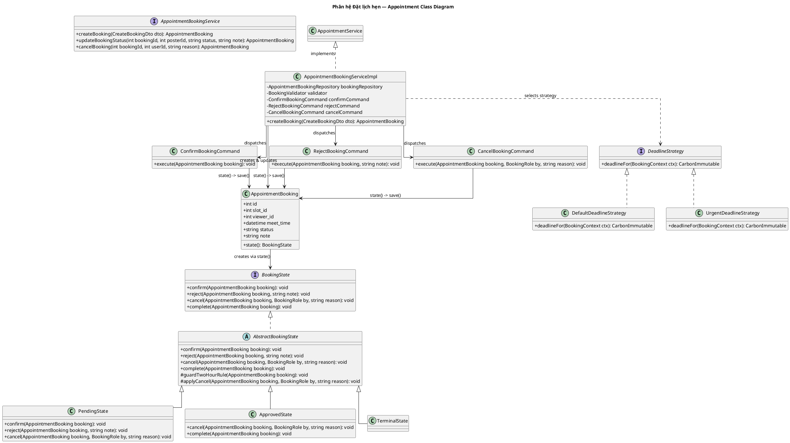

# Sơ đồ Lớp Phân hệ: Đặt lịch hẹn (Appointment Booking Class Diagram)

Sơ đồ lớp chi tiết của phân hệ Đặt lịch hẹn bao gồm quản lý vòng đời trạng thái (State), đóng gói thao tác (Command) và chiến lược tính hạn xác nhận (Strategy).

---

## Sơ đồ Lớp (PlantUML)

