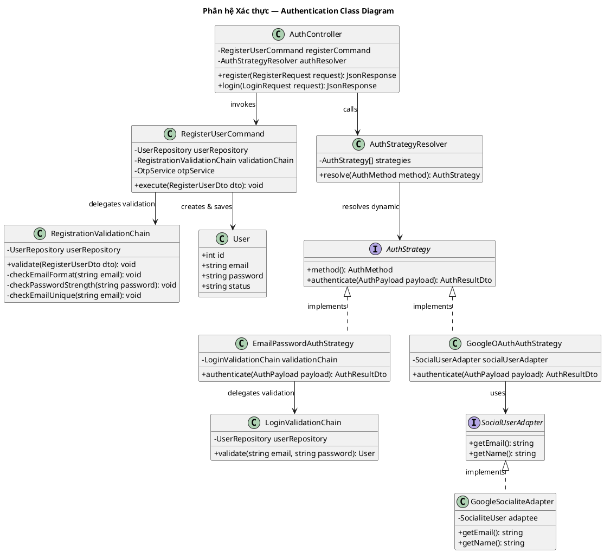

# Sơ đồ Lớp Phân hệ: Xác thực (Authentication Class Diagram)

Sơ đồ lớp chi tiết của phân hệ Xác thực (Authentication Subsystem) bao gồm các chức năng Đăng ký, Đăng nhập, và Tích hợp bên thứ ba (Google Login).

---

## Sơ đồ Lớp (PlantUML)

