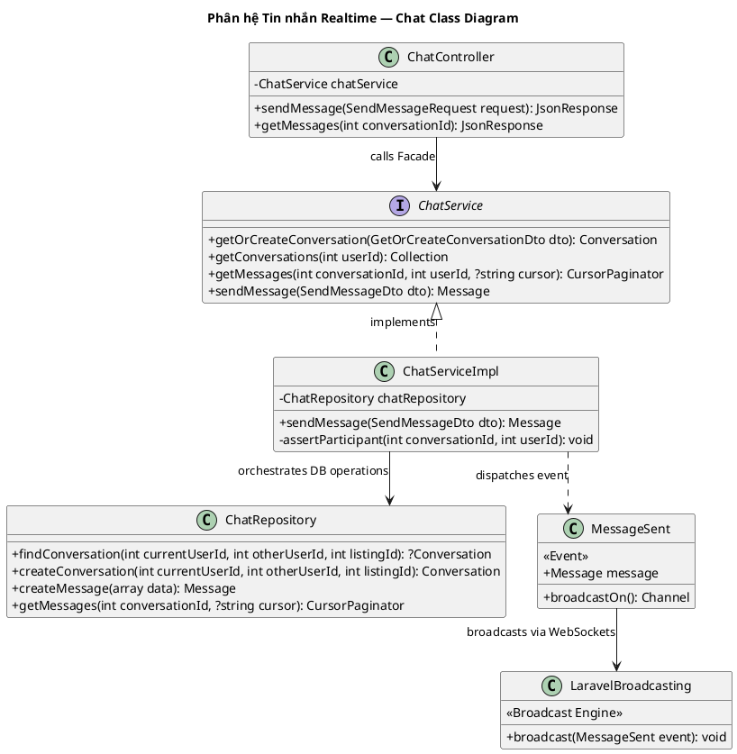

# Sơ đồ Lớp Phân hệ: Tin nhắn Realtime (Chat Subsystem Class Diagram)

Sơ đồ lớp chi tiết của phân hệ Nhắn tin trò chuyện realtime và WebSocket Broadcasting (Facade & Observer Pattern).

---

## Sơ đồ Lớp (PlantUML)

