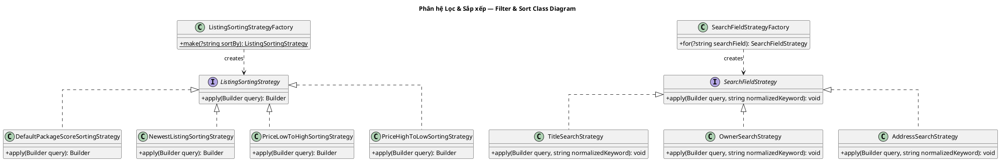

# Sơ đồ Lớp Phân hệ: Lọc & Sắp xếp tin (Filtering & Sorting Class Diagram)

Sơ đồ lớp chi tiết của phân hệ Sắp xếp hiển thị và Tìm kiếm lọc tin đăng (Strategy & Factory Method).

---

## Sơ đồ Lớp (PlantUML)

