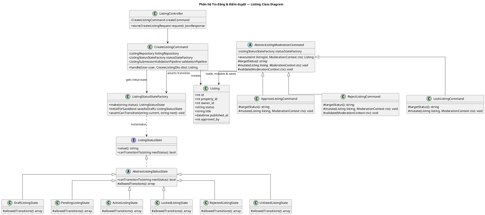

# Sơ đồ Lớp Phân hệ: Tin đăng & Kiểm duyệt (Listing & Moderation Class Diagram)

Sơ đồ lớp chi tiết của phân hệ Tạo tin đăng, cập nhật và Kiểm duyệt tin đăng bởi Admin (Template Method & State Pattern).

---

## Sơ đồ Lớp (PlantUML)

