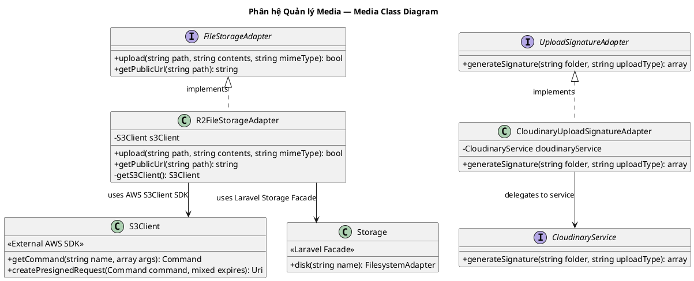

# Sơ đồ Lớp Phân hệ: Quản lý Media (Media Subsystem Class Diagram)

Sơ đồ lớp chi tiết của phân hệ Lưu trữ và Tạo chữ ký tải lên hình ảnh/video (Adapter Pattern).

---

## Sơ đồ Lớp (PlantUML)

```plantuml
@startuml
title Phân hệ Quản lý Media — Media Class Diagram

skinparam linetype ortho
skinparam classAttributeIconSize 0

interface FileStorageAdapter {
  +upload(string path, string contents, string mimeType): bool
  +getPublicUrl(string path): string
}

class R2FileStorageAdapter {
  -S3Client s3Client
  +upload(string path, string contents, string mimeType): bool
  +getPublicUrl(string path): string
  -getS3Client(): S3Client
}

class S3Client {
  <<External AWS SDK>>
  +getCommand(string name, array args): Command
  +createPresignedRequest(Command command, mixed expires): Uri
}

class Storage {
  <<Laravel Facade>>
  +disk(string name): FilesystemAdapter
}

interface UploadSignatureAdapter {
  +generateSignature(string folder, string uploadType): array
}

class CloudinaryUploadSignatureAdapter {
  -CloudinaryService cloudinaryService
  +generateSignature(string folder, string uploadType): array
}

interface CloudinaryService {
  +generateSignature(string folder, string uploadType): array
}

FileStorageAdapter <|.. R2FileStorageAdapter : "implements"
R2FileStorageAdapter --> S3Client : "uses AWS S3Client SDK"
R2FileStorageAdapter --> Storage : "uses Laravel Storage Facade"

UploadSignatureAdapter <|.. CloudinaryUploadSignatureAdapter : "implements"
CloudinaryUploadSignatureAdapter --> CloudinaryService : "delegates to service"
@enduml
```
