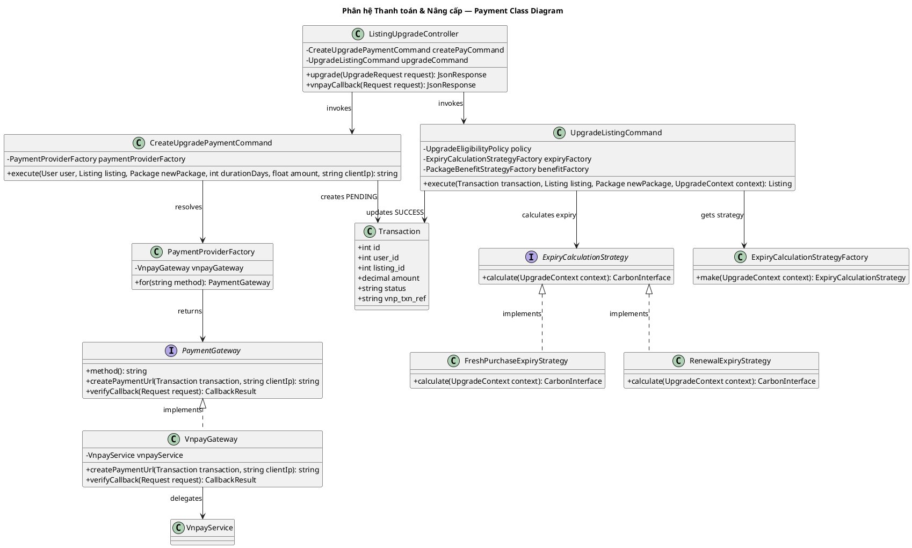

# Sơ đồ Lớp Phân hệ: Thanh toán & Nâng cấp (Payment & Upgrade Class Diagram)

Sơ đồ lớp chi tiết của phân hệ Thanh toán trực tuyến và Nâng cấp gói tin (Command, Adapter, Factory Method).

---

## Sơ đồ Lớp (PlantUML)

