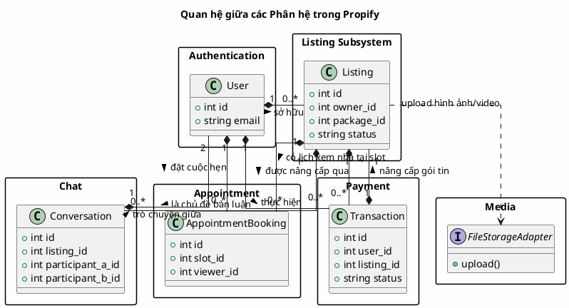

# Sơ đồ Lớp Hệ thống (Class Diagrams)

Tài liệu này cung cấp **Sơ đồ lớp (Class Diagram) tổng thể** cho toàn bộ dự án Propify và các liên kết dẫn đến sơ đồ lớp chi tiết của từng phân hệ nghiệp vụ cụ thể.

---

## 1. Danh sách Sơ đồ Lớp theo Phân hệ

Để dễ quan sát cấu trúc chi tiết, các sơ đồ lớp đã được tách biệt theo từng phân hệ nghiệp vụ:

1. **[🔐 Phân hệ Xác thực (Authentication)](class_diagram_auth.md)** — Đăng ký, đăng nhập truyền thống, và Google Login.
2. **[📅 Phân hệ Đặt lịch hẹn (Appointment Booking)](class_diagram_appointment.md)** — Quản lý lịch hẹn, xác nhận/hủy lịch với State & Command.
3. **[📝 Phân hệ Tin đăng & Kiểm duyệt (Listing & Moderation)](class_diagram_listing.md)** — Tạo tin, sửa tin, duyệt tin theo Template Method.
4. **[🔍 Phân hệ Lọc & Sắp xếp tin](class_diagram_filter_sorting.md)** — Các thuật toán lọc, tìm kiếm, sắp xếp theo Strategy.
5. **[💳 Phân hệ Thanh toán & Nâng cấp](class_diagram_payment.md)** — Tích hợp VNPAY, nâng cấp gói tin và xử lý giao dịch.
6. **[📁 Phân hệ Quản lý Media (Storage)](class_diagram_media.md)** — Kết nối Cloudflare R2 Cloud Storage và Cloudinary.
7. **[💬 Phân hệ Tin nhắn Realtime (Chat)](class_diagram_chat.md)** — Trò chuyện trực tiếp và WebSocket Broadcasting qua Reverb.

---

## 2. Sơ đồ Quan hệ Giữa các Phân hệ (Subsystem Relationships)

Dưới đây là sơ đồ lớp mức cao (High-Level Class Diagram) mô tả cách các phân hệ tương tác và liên kết với nhau thông qua cơ sở dữ liệu và các Port/Interface:

### Giải thích Tương tác chéo:
- **User** là thực thể trung tâm liên kết với tất cả các hoạt động nghiệp vụ khác như đăng tin (`Listing`), đặt lịch (`AppointmentBooking`), và thanh toán (`Transaction`).
- **Listing** là lõi của hệ thống bất động sản, được tham chiếu bởi lịch hẹn xem nhà, giao dịch thanh toán nâng cấp gói VIP, cuộc trò chuyện chat trực tiếp và các adapter lưu trữ media tĩnh.
