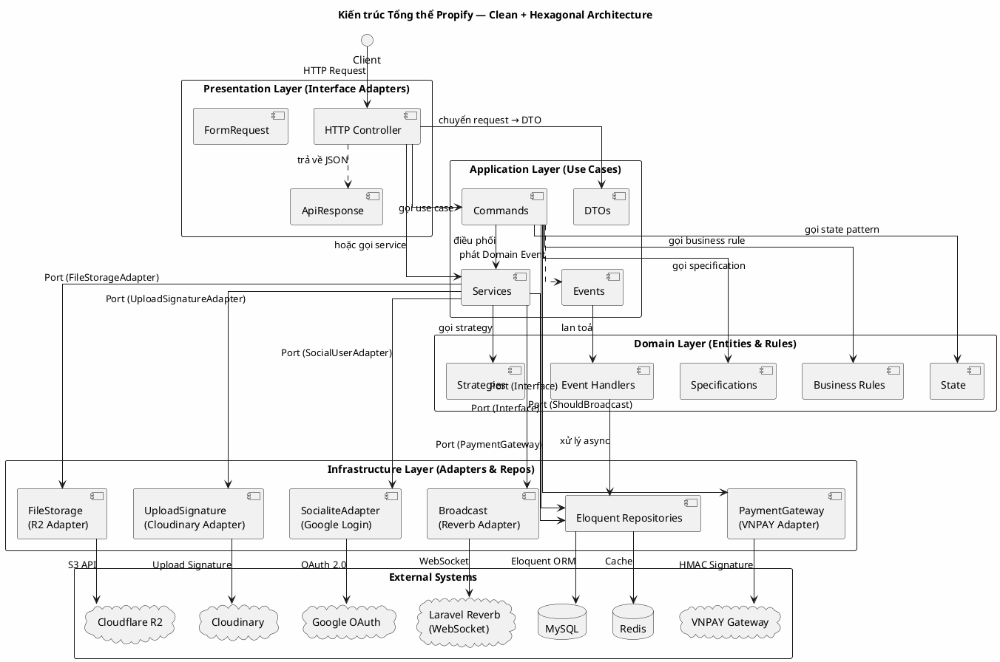
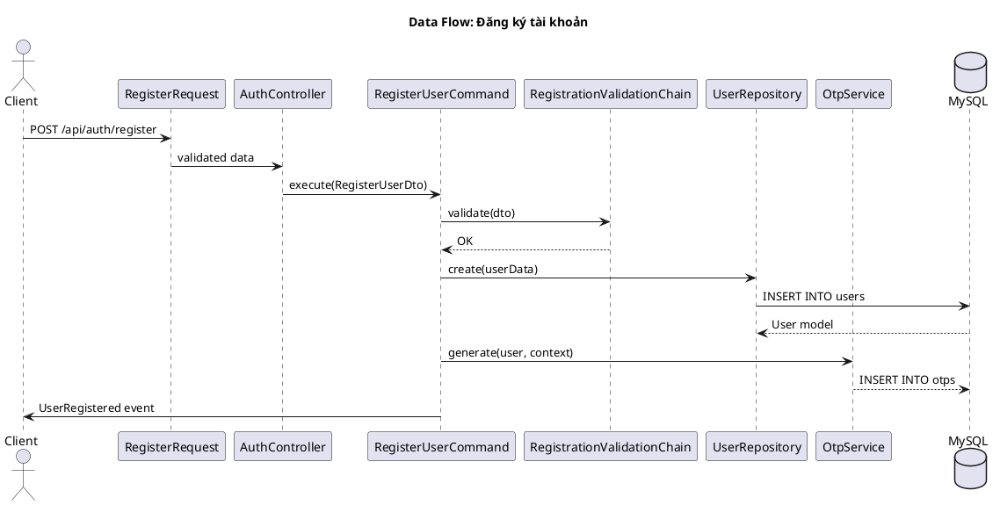
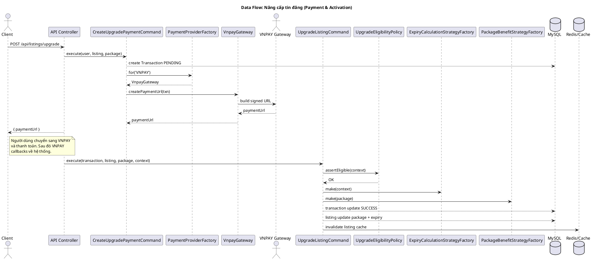
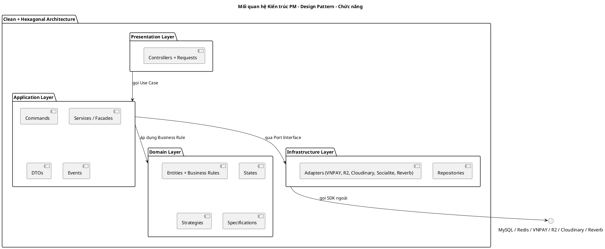

# Kiến trúc Tổng thể Hệ thống Propify

Tài liệu này phân tích kiến trúc phần mềm (Software Architecture) tổng thể của dự án Propify, xác định rõ **Mô hình kiến trúc PM** (Pattern-based Architecture Model) được áp dụng, lý do lựa chọn và cách các thành phần tương tác.

---

## 1. Kiến trúc PM đã sử dụng

### 1.1. Ba mô hình kết hợp (Layered + Clean + Hexagonal)

Dự án Propify áp dụng **Kiến trúc kết hợp 3 mô hình**:

| # | Mô hình Kiến trúc | Vai trò trong dự án |
|---|---|---|
| **1** | **3-Layer Architecture** (Kiến trúc 3 lớp) | Tổ chức mã nguồn theo lớp dọc: Presentation → Application → Data. |
| **2** | **Clean Architecture** (Kiến trúc sạch - Robert C. Martin) | Quy tắc phụ thuộc chiều: các layer ngoài phụ thuộc vào layer trong. Layer trong (Domain) không biết gì về layer ngoài. |
| **3** | **Hexagonal Architecture** (Cổng và Bộ điều hợp - Alistair Cockburn) | Sử dụng Port (Interface) và Adapter để giao tiếp với các hệ thống bên ngoài (Database, Cache, Payment Gateway, CDN). |

### 1.2. Lý do lựa chọn kiến trúc này

- **Yêu cầu nghiệp vụ phức tạp**: Hệ thống gồm nhiều chức năng đăng tin, chat, thanh toán, nâng cấp gói, lọc, sắp xếp với các quy tắc nghiệp vụ đan xen; đòi hỏi tách biệt rõ ràng.
- **Dễ kiểm thử (Testability)**: Domain/business logic thuần khiết trong các Service/Command không phụ thuộc Laravel Facade, cho phép Unit Test dễ dàng.
- **Dễ thay đổi hạ tầng**: Database có thể chuyển từ MySQL sang PostgreSQL, Cache từ Redis sang Memcached, Storage từ R2 sang S3 mà không cần sửa logic nghiệp vụ nhờ các Port/Adapter.
- **Bảo trì lâu dài**: Kiến trúc sạch giúp các lập trình viên mới nhanh chóng hiểu cách tổ chức code.

---

## 2. Sơ đồ Kiến trúc Tổng thể (PlantUML)

---

## 3. Giải thích các Layer

### 3.1. Presentation Layer (Tầng Giao diện)

| Thành phần | Trách nhiệm |
|---|---|
| **HTTP Controller** | Tiếp nhận HTTP Request từ client, trích xuất tham số, gọi use case và trả về JSON Response. **Không chứa logic nghiệp vụ.** |
| **FormRequest** | Validate dữ liệu đầu vào (định dạng, kiểu dữ liệu) trước khi đến Controller. |
| **ApiResponse** | Helper chuẩn hóa định dạng JSON trả về (status, message, data, errors). |

**Ví dụ:** `AuthController::register(RegisterRequest $request)` — chỉ nhận request, tạo dto và gọi `RegisterUserCommand`.

### 3.2. Application Layer (Tầng Ứng dụng)

| Thành phần | Trách nhiệm |
|---|---|
| **DTO** | Giữ dữ liệu giao tiếp giữa Controller và Service/Command. |
| **Commands** | Đóng gói 1 Use Case cụ thể — **Command Pattern**. Điều phối Business Rules, Strategy, Adapter và Repository. |
| **Services** | Logic nghiệp vụ tầm trung — điều phối giữa các Repository (Facade). |
| **Events** | Domain Event phát ra khi có thay đổi quan trọng (UserRegistered, MessageSent, ListingPackageUpgraded). |

### 3.3. Domain Layer (Tầng Nghiệp vụ cốt lõi)

| Thành phần | Trách nhiệm |
|---|---|
| **Business Rules** | Các luật không đổi của hệ thống (VD: Booking 2h rule, CanUpgradeSpecification). |
| **State** | Quản lý vòng đời đối tượng (BookingState, ListingStatusState). |
| **Strategies** | Thuật toán thay đổi theo ngữ cảnh (Sorting, Search, Deadline). |
| **Specifications** | Kiểm định quy tắc nghiệp vụ (CanUpgrade, CanRenew). |

### 3.4. Infrastructure Layer (Tầng Hạ tầng)

| Thành phần | Trách nhiệm |
|---|---|
| **Eloquent Repositories** | Triển khai interface Repository (Port) — là Adapter cho Database. |
| **PaymentGateway (Adapter)** | Bọc VNPAY API thành interface `PaymentGateway` chung. |
| **FileStorage (Adapter)** | Bọc Cloudflare R2 thành interface `FileStorageAdapter`. |
| **UploadSignature (Adapter)** | Bọc Cloudinary thành interface `UploadSignatureAdapter`. |
| **SocialiteAdapter (Adapter)** | Bọc Google OAuth SDK thành interface `SocialUserAdapter`. |
| **Broadcast (Adapter)** | Chuyển đổi Event PHP thành WebSocket Realtime. |

---

## 4. Luồng Dữ Liệu (Data Flow) — Ví dụ

### 4.1. Luồng Đăng ký tài khoản

### 4.2. Luồng Nâng cấp tin đăng (Luồng xuyên suốt các tầng)

---

## 5. Chiến lược Kiến trúc theo Layer và Design Pattern

| Tầng | Design Pattern liên quan | Mục đích |
|---|---|---|
| **Presentation** | *Không dùng pattern cụ thể* | Giữ Controller mỏng (Skinny Controller). |
| **Application** | **Command**, **Facade**, **Observer**, **DTO** | Đóng gói use case, che giấu độ phức tạp, phát sự kiện domain. |
| **Domain** | **State**, **Strategy**, **Specification** | Đóng gói quy tắc kinh doanh, cho phép thay đổi linh hoạt. |
| **Infrastructure (Ports)** | *Interface (Port)* | Định nghĩa giao diện chuẩn cho mỗi dịch vụ ngoài. |
| **Infrastructure (Adapters)** | **Adapter**, **Repository**, **Factory Method** | Triển khai interface, thích ứng với từng SDK ngoài. |

---

## 6. Ưu điểm và Nhược điểm

### ✅ Ưu điểm

- **Tuân thủ Dependency Inversion Principle (DIP)**: Các lớp Application/Service chỉ phụ thuộc vào Interface (Port), không phụ thuộc vào triển khai cụ thể. Đảo ngược chiều phụ thuộc: Layer ngoài phụ thuộc vào Layer trong.
- **Khả năng kiểm thử cao**: Domain Layers và Application Layers có thể kiểm thử độc lập với Database, Cache, và các External Services nhờ khả năng Mock các Port/Interface.
- **Tái sử dụng Business Rule**: Các Rules (State, Strategy, Specification) là các class độc lập, có thể tái sử dụng giữa các use case, Controller, và cả Frontend (qua API check).
- **Dễ dàng mở rộng (Scalability)**: Thêm cổng thanh toán mới, thêm CDN mới, thêm phương thức login mới chỉ là việc viết Adapter mới. Thêm luật nghiệp vụ mới chỉ là việc thêm lớp State/Strategy/Specification mới.

### ⚠️ Nhược điểm & Giải pháp

| Nhược điểm | Giải pháp |
|---|---|
| Số lượng class nhiều (khoảng ~200+ files cho tất cả Adapter, Command, State, Strategy, Event...) | Tổ chức thư mục theo chức năng (Auth/Appointment/Payment/Listing/...) thay vì theo pattern. |
| Phức tạp cho lập trình viên mới | Tài liệu hóa kiến trúc (chính là tài liệu này) + pair programming giai đoạn đầu. |
| Over-engineering với chức năng đơn giản | Các chức năng đơn giản có thể bỏ qua pattern (VD: CRUD thuần dùng Eloquent trực tiếp). |

---

## 7. Tổng kết

Hệ thống Propify áp dụng mô hình kiến trúc **Clean Architecture + Hexagonal Architecture trên nền tảng 3-Layer**, tận dụng sức mạnh của 10 Design Pattern khác nhau để tổ chức code một cách khoa học, linh hoạt và dễ bảo trì.

> **Kiến trúc sạch + Hexagonal = Hệ thống linh hoạt, dễ bảo trì và sẵn sàng cho sự thay đổi.**
