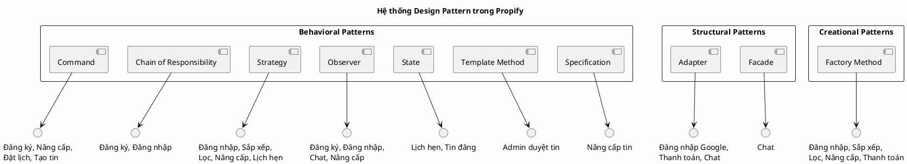

# Bảng Tổng Hợp Design Pattern - Dự án Propify

Tài liệu tổng hợp tất cả các Design Pattern đã được áp dụng trong hệ thống, ánh xạ với chức năng nghiệp vụ và mô tả mục đích sử dụng của từng pattern.

---

## Danh sách Design Pattern

| # | Design Pattern | Chức năng nghiệp vụ | Lớp/Thành phần chính | Vai trò / Mục đích |
|---|---|---|---|---|
| **1** | **Adapter** | Lưu trữ Media (Cloudflare R2) | `FileStorageAdapter` / `R2FileStorageAdapter` | Chuẩn hóa thao tác upload và tạo URL truy cập file lên Cloudflare R2 (S3-compatible). Bọc S3Client để tạo Presigned URL bảo mật. |
| **2** | **Adapter** | Upload chữ ký Media (Cloudinary) | `UploadSignatureAdapter` / `CloudinaryUploadSignatureAdapter` | Chuẩn hóa tạo chữ ký upload cho Frontend (signature, api_key, cloud_name, timestamp) để upload file trực tiếp lên Cloudinary CDN. |
| **3** | **Command** | Đăng ký tài khoản | `RegisterUserCommand` | Đóng gói toàn bộ quy trình tạo tài khoản (validate, hash mật khẩu, lưu DB, sinh OTP, phát event) khỏi Controller. |
| **4** | **Command** | Nâng cấp tin đăng | `CreateUpgradePaymentCommand` | Đóng gói quy trình sinh giao dịch PENDING và link thanh toán VNPAY. |
| **5** | **Command** | Nâng cấp tin đăng | `UpgradeListingCommand` | Đóng gói quy trình nâng cấp gói tin sau khi thanh toán thành công (cập nhật trạng thái, tính hạn dùng, phát event). |
| **6** | **Command** | Đặt lịch hẹn | `ConfirmBookingCommand` | Đóng gói thao tác xác nhận lịch hẹn bởi chủ nhà (gọi State, lưu DB, phát event). |
| **7** | **Command** | Đặt lịch hẹn | `RejectBookingCommand` | Đóng gói thao tác từ chối lịch hẹn kèm ghi chú lý do. |
| **8** | **Command** | Đặt lịch hẹn | `CancelBookingCommand` | Đóng gói thao tác hủy lịch hẹn của cả khách và chủ nhà. |
| **9** | **Command** | Tạo tin đăng | `CreateListingCommand` | Đóng gói quy trình tạo tin đăng mới (lưu Property, hình ảnh, video, tài liệu pháp lý, tính điểm chất lượng, phát event). |
| **10** | **Chain of Responsibility** | Đăng ký tài khoản | `RegistrationValidationChain` | Chuỗi kiểm tra tuần tự dữ liệu đăng ký: định dạng Email -> Password mạnh -> Email chưa tồn tại. |
| **11** | **Chain of Responsibility** | Đăng nhập | `LoginValidationChain` | Chuỗi kiểm tra tuần tự dữ liệu đăng nhập: Email tồn tại -> User ACTIVE -> Đúng mật khẩu. |
| **12** | **Strategy** | Đăng nhập | `AuthStrategy`  (`EmailPasswordAuthStrategy`, `GoogleOAuthAuthStrategy`) | Cho phép chuyển đổi linh hoạt giữa các phương thức xác thực đăng nhập tại runtime. |
| **13** | **Strategy** | Sắp xếp hiển thị tin | `ListingSortingStrategy`  (7 Strategies: DefaultPackageScore, Newest, Oldest, PriceAsc, PriceDesc, AreaAsc, AreaDesc) | Đóng gói từng thuật toán `ORDER BY` riêng biệt, cho phép thêm/sửa cách sắp xếp mà không sửa Repository. |
| **14** | **Strategy** | Lọc dữ liệu tìm kiếm | `SearchFieldStrategy`  (`TitleSearchStrategy`, `OwnerSearchStrategy`, `AddressSearchStrategy`) | Đóng gói chiến lược tìm kiếm theo từng trường dữ liệu khác nhau. |
| **15** | **Strategy** | Nâng cấp tin - Tính hạn dùng | `ExpiryCalculationStrategy`  (`FreshPurchaseExpiryStrategy`, `RenewalExpiryStrategy`) | Cô lập thuật toán tính ngày hết hạn gói tin (mới mua hay gia hạn). |
| **16** | **Strategy** | Nâng cấp tin - Quyền lợi | `PackageBenefitStrategy`  (`DataDrivenBenefitStrategy`) | Đóng gói logic áp dụng các quyền lợi hiển thị của gói VIP lên tin đăng. |
| **17** | **Strategy** | Đặt lịch hẹn - Hạn chờ | `DeadlineStrategy`  (`DefaultDeadlineStrategy`, `UrgentDeadlineStrategy`) | Tính toán thời hạn xác nhận cuộc hẹn theo các quy tắc kinh doanh khác nhau. |
| **18** | **Factory Method** | Đăng nhập | `AuthStrategyResolver` | Phân giải và khởi tạo đối tượng AuthStrategy tương ứng với phương thức đăng nhập. |
| **19** | **Factory Method** | Sắp xếp hiển thị | `ListingSortingStrategyFactory` | Sinh Strategy sắp xếp dựa trên tham số `sortBy` từ query string. |
| **20** | **Factory Method** | Lọc dữ liệu | `SearchFieldStrategyFactory` | Sinh Strategy tìm kiếm dựa trên tham số `search_field`. |
| **21** | **Factory Method** | Nâng cấp tin - Hạn dùng | `ExpiryCalculationStrategyFactory` | Chọn lựa chiến lược tính hạn dùng phù hợp (mới mua hoặc gia hạn). |
| **22** | **Factory Method** | Nâng cấp tin - Quyền lợi | `PackageBenefitStrategyFactory` | Khởi tạo chiến lược áp dụng quyền lợi của gói tin. |
| **23** | **Factory Method** | Thanh toán | `PaymentProviderFactory` | Trả về đối tượng Gateway thanh toán tương ứng (VNPAY, MOMO,...). |
| **24** | **Adapter** | Đăng nhập Google | `GoogleSocialiteAdapter` (bọc `SocialiteUser`) + `SocialUserAdapter` | Chuẩn hóa dữ liệu người dùng Google SDK về interface Domain thống nhất. |
| **25** | **Adapter** | Thanh toán | `VnpayGateway` (bọc `VnpayService`) + `PaymentGateway` | Chuẩn hóa giao tiếp với cổng thanh toán VNPAY qua interface chung. |
| **26** | **Adapter** | Chat - WebSocket | `Laravel Broadcasting / Reverb` | Chuyển đổi Domain Event thành tín hiệu WebSocket realtime. |
| **27** | **Observer** | Đăng ký thành công | `UserRegistered` → `SendWelcomeMailListener` | Gửi email chào mừng người dùng mới qua hàng đợi (Queue), không block API. |
| **28** | **Observer** | Đăng nhập thành công | `UserLoggedIn` → `LogSuccessfulLoginListener` | Ghi nhật ký audit đăng nhập (IP, User-Agent, thời gian). |
| **29** | **Observer** | Tin nhắn Chat | `MessageSent` → `Broadcast via Reverb` | Phát tin nhắn realtime đến người nhận qua WebSocket. |
| **30** | **Observer** | Nâng cấp tin thành công | `ListingPackageUpgraded` → `CacheInvalidationListener` | Xóa bộ nhớ đệm danh sách tin công cộng để hiển thị thứ tự mới tức thì. |
| **31** | **State** | Đặt lịch hẹn | `BookingState` (`PendingState`, `ApprovedState`, `TerminalState`) trên model `AppointmentBooking` | Quản lý vòng đời lịch hẹn: PENDING -> APPROVED/COMPLETED/CANCELLED, đảm bảo mỗi trạng thái tự kiểm soát hành vi cho phép. |
| **32** | **State** | Tin đăng - Vòng đời | `ListingStatusState` (`Draft`, `Pending`, `Active`, `Rejected`, `Locked`, `Unlisted`) trên model `Listing` | Quản lý chuyển đổi trạng thái tin đăng: DRAFT -> PENDING -> ACTIVE/LOCKED/REJECTED/UNLISTED, khóa chặt luồng hợp lệ. |
| **33** | **Template Method** | Admin duyệt tin | `AbstractListingModerationCommand`  (`ApproveListingCommand`, `RejectListingCommand`, `LockListingCommand`) | Định nghĩa khung xử lý kiểm duyệt (Transaction, Lock DB, Check State, Save, Log History, Dispatch Event); các lớp con chỉ cần điền `targetStatus()` + `mutate()`. |
| **34** | **Specification** | Nâng cấp tin đăng | `CanUpgradeSpecification`, `CanRenewSpecification` trong `UpgradeEligibilityPolicy` | Đóng gói các luật kiểm định nghiệp vụ (nâng cấp gói cao hơn hoặc gia hạn gói cùng loại) thành các lớp độc lập, dễ tái sử dụng. |
| **35** | **Facade** | Chat | `ChatService` / `ChatServiceImpl` | Cung cấp interface đơn giản cho phân hệ Chat phức tạp (Che giấu Conversation, Message, GroupMember, Participant). |

---

## Thống kê

| Tiêu chí | Số lượng |
|---|---|
| **Tổng Design Pattern khác nhau** | **10** (Command, Chain of Responsibility, Strategy, Factory Method, Adapter, Observer, State, Template Method, Specification, Facade) |
| **Tổng số lần áp dụng** | **35** |
| **Số chức năng nghiệp vụ được phân tích** | **8** (Đăng ký/Đăng nhập, Nâng cấp tin & Thanh toán, Sắp xếp & Lọc, Chat, Đặt lịch hẹn, Thanh toán, Admin duyệt tin, Media Storage)

---

## Biểu đồ PlantUML thể hiện mối quan hệ giữa các Design Pattern

