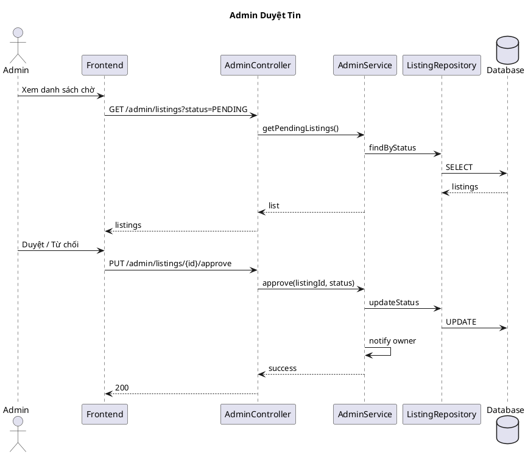

# Sequence Diagram - Admin Duyệt Tin

```plantuml
@startuml
title Admin Duyệt Tin

actor "Admin" as Admin
participant "Frontend" as FE
participant "AdminController" as Controller
participant "AdminService" as Service
participant "ListingRepository" as Repo
database "Database" as DB

Admin -> FE: Xem danh sách chờ
FE -> Controller: GET /admin/listings?status=PENDING
Controller -> Service: getPendingListings()
Service -> Repo: findByStatus
Repo -> DB: SELECT
DB --> Repo: listings
Service --> Controller: list
Controller --> FE: listings
Admin -> FE: Duyệt / Từ chối
FE -> Controller: PUT /admin/listings/{id}/approve
Controller -> Service: approve(listingId, status)
Service -> Repo: updateStatus
Repo -> DB: UPDATE
Service -> Service: notify owner
Service --> Controller: success
Controller --> FE: 200
@enduml
```

**3-layer:** Controller -> Service -> Repository -> DB.
