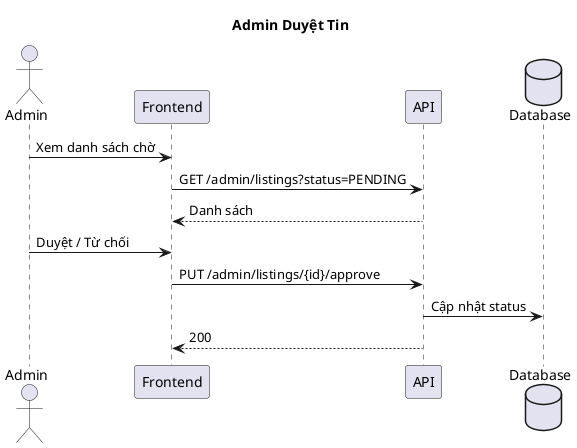

# Sequence Diagram - Admin Duyệt Tin

```plantuml
@startuml
title Admin Duyệt Tin

actor "Admin" as Admin
participant "Frontend" as FE
participant "API" as API
database "Database" as DB

Admin -> FE: Xem danh sách chờ
FE -> API: GET /admin/listings?status=PENDING
API --> FE: Danh sách
Admin -> FE: Duyệt / Từ chối
FE -> API: PUT /admin/listings/{id}/approve
API -> DB: Cập nhật status
API --> FE: 200
@enduml
```

**Luồng:** Xem → Duyệt → Cập nhật.
