# Sequence Diagram - Admin Duyệt/Từ Chối Tin Đăng

```plantuml
@startuml

title Admin Duyệt/Từ Chối Tin Đăng

actor "Admin" as Admin
participant "AdminPanel\n/ Frontend" as FE
participant "AdminListingController\n/ API" as Controller
participant "ChangeStatusRequest\n«validation»" as Validation
participant "ListingService" as ListingService
participant "ApproveListingCommand" as ApproveCmd
participant "RejectListingCommand" as RejectCmd
participant "LockListingCommand" as LockCmd
participant "ModerationContext" as ModerationCtx
participant "ListingStatusStateFactory" as StateFactory
participant "Listing\n«entity»" as Listing
participant "ListingRepository\n«repository»" as ListingRepo
participant "NotificationService" as NotificationService
database "Database" as DB

Admin -> FE: Truy cập trang quản lý tin đăng
Admin -> FE: Lọc theo status: PENDING

FE -> Controller: GET /api/v1/admin/listings?status=PENDING

Controller -> ListingService: getAllForAdmin(status, ...)

ListingService -> ListingRepo: paginateAdmin(...)
ListingRepo -> DB: SELECT * FROM listings\nWHERE status = 'PENDING'\nORDER BY submitted_at DESC
DB --> ListingRepo: listings[]

ListingRepo --> ListingService: PaginatedResult
ListingService --> Controller: PaginatedResult
Controller --> FE: 200 OK + listings
FE --> Admin: Hiển thị danh sách tin chờ duyệt

Admin -> FE: Chọn tin đăng để xem chi tiết

FE -> Controller: GET /api/v1/admin/listings/{id}

Controller -> ListingService: getListingDetailsForAdmin(id)

ListingService -> ListingRepo: findById(id)
ListingRepo -> DB: SELECT * FROM listings\nWHERE id = ?\nAND status != 'DRAFT'
DB --> ListingRepo: listing with relations

ListingService --> Controller: Listing
Controller --> FE: 200 OK + ListingResource
FE --> Admin: Hiển thị chi tiết:\n- Tiêu đề, mô tả\n- Hình ảnh, video\n- Thông tin BĐS\n- Giấy tờ xác thực (nếu có)

Admin -> Admin: Xem xét nội dung

alt Admin phê duyệt
    Admin -> FE: Nhấn "Phê duyệt"
    
    FE -> Controller: PUT /api/v1/admin/listings/{id}/status\n{status: 'ACTIVE'}
    
    Controller -> Validation: validate()
    Validation --> Controller: ChangeStatusDto
    
    Controller -> ListingService: changeStatusForAdmin(listing_id,\n'ACTIVE', null, admin_id)
    
    ListingService -> ModerationCtx: new ModerationContext(admin_id, null)
    
    ListingService -> ApproveCmd: execute(listing_id, context)
    
    ApproveCmd -> ListingRepo: findById(listing_id)
    ListingRepo -> DB: SELECT * FROM listings\nWHERE id = ? FOR UPDATE
    DB --> ListingRepo: listing
    
    alt Listing không tồn tại
        ListingRepo --> ApproveCmd: NotFoundException
        ApproveCmd --> ListingService: Exception
        ListingService --> Controller: Exception
        Controller --> FE: 404 Not Found
        FE --> Admin: "Tin đăng không tồn tại"
    else Listing tồn tại
        
        ApproveCmd -> StateFactory: assertCanTransition(current_status, 'ACTIVE')
        
        alt Không thể chuyển sang ACTIVE
            StateFactory --> ApproveCmd: BusinessException
            ApproveCmd --> ListingService: Exception
            ListingService --> Controller: Exception
            Controller --> FE: 400 Bad Request
            FE --> Admin: "Trạng thái không hợp lệ"
        else Có thể chuyển sang ACTIVE
            
            ApproveCmd -> ApproveCmd: BEGIN TRANSACTION
            
            ApproveCmd -> ListingRepo: update(listing_id, data)
            ListingRepo -> DB: UPDATE listings SET\nstatus = 'ACTIVE',\napproved_at = NOW(),\napproved_by = ?
            DB --> ListingRepo: affected rows
            
            ApproveCmd -> DB: INSERT INTO listing_status_histories\n(listing_id, from_status, to_status,\nchanged_by, changed_at)
            DB --> ApproveCmd: history_id
            
            ApproveCmd -> ApproveCmd: COMMIT TRANSACTION
            
            ApproveCmd -> NotificationService: notifyOwner(listing.owner_id)
            
            NotificationService -> DB: INSERT INTO notifications\n(user_id, type, data)
            DB --> NotificationService: notification_id
            
            NotificationService -> NotificationService: Gửi email:\n"Tin đăng đã được duyệt"
            
            NotificationService -> NotificationService: Push notification
            
            NotificationService --> ApproveCmd: success
            
            ApproveCmd -> ApproveCmd: Clear cache listings
            
            ApproveCmd --> ListingService: Listing updated
            ListingService --> Controller: Listing
            
            Controller --> FE: 200 OK\n"Đã phê duyệt tin đăng"
            FE --> Admin: Hiển thị thông báo
        end
    end
    
else Admin từ chối
    Admin -> FE: Nhấn "Từ chối"
    
    FE -> FE: Hiển thị form lý do
    
    Admin -> FE: Nhập lý do từ chối:
    note right
      - Vi phạm nội dung
      - Hình ảnh không phù hợp
      - Thông tin không chính xác
      - Spam
    end note
    
    Admin -> FE: Xác nhận từ chối
    
    FE -> Controller: PUT /api/v1/admin/listings/{id}/status\n{status: 'REJECTED',\nrejection_reason: '...'}
    
    Controller -> Validation: validate()
    Validation --> Controller: ChangeStatusDto
    
    Controller -> ListingService: changeStatusForAdmin(listing_id,\n'REJECTED', rejection_reason, admin_id)
    
    ListingService -> ModerationCtx: new ModerationContext(admin_id,\nrejection_reason)
    
    ListingService -> RejectCmd: execute(listing_id, context)
    
    RejectCmd -> ListingRepo: findById(listing_id)
    ListingRepo -> DB: SELECT * FROM listings\nWHERE id = ? FOR UPDATE
    DB --> ListingRepo: listing
    
    RejectCmd -> StateFactory: assertCanTransition(current_status, 'REJECTED')
    
    alt Có thể chuyển sang REJECTED
        
        RejectCmd -> RejectCmd: BEGIN TRANSACTION
        
        RejectCmd -> ListingRepo: update(listing_id, data)
        ListingRepo -> DB: UPDATE listings SET\nstatus = 'REJECTED',\nrejection_reason = ?,\nrejected_at = NOW(),\nrejected_by = ?
        DB --> ListingRepo: affected rows
        
        RejectCmd -> DB: INSERT INTO\nlisting_status_histories\n(listing_id, from_status,\nto_status, reason,\nchanged_by, changed_at)
        DB --> RejectCmd: history_id
        
        RejectCmd -> RejectCmd: COMMIT TRANSACTION
        
        RejectCmd -> NotificationService: notifyOwner(listing.owner_id)
        
        NotificationService -> DB: INSERT INTO notifications
        DB --> NotificationService: notification_id
        
        NotificationService -> NotificationService: Gửi email:\n"Tin đăng bị từ chối"\n+ Lý do\n+ Hướng dẫn sửa
        
        NotificationService -> NotificationService: Push notification
        
        NotificationService --> RejectCmd: success
        
        RejectCmd --> ListingService: Listing updated
        ListingService --> Controller: Listing
        
        Controller --> FE: 200 OK\n"Đã từ chối tin đăng"
        FE --> Admin: Hiển thị thông báo
    end
    
else Admin khóa tin đăng
    Admin -> FE: Nhấn "Khóa tin đăng"
    
    FE -> FE: Hiển thị form lý do
    
    Admin -> FE: Nhập lý do khóa:
    note right
      - Vi phạm nghiêm trọng
      - Lừa đảo
      - Báo cáo nhiều lần
    end note
    
    Admin -> FE: Xác nhận khóa
    
    FE -> Controller: PUT /api/v1/admin/listings/{id}/status\n{status: 'LOCKED',\nlock_reason: '...'}
    
    Controller -> ListingService: changeStatusForAdmin(listing_id,\n'LOCKED', lock_reason, admin_id)
    
    ListingService -> ModerationCtx: new ModerationContext(admin_id,\nlock_reason)
    
    ListingService -> LockCmd: execute(listing_id, context)
    
    LockCmd -> ListingRepo: findById(listing_id)
    ListingRepo -> DB: SELECT * FROM listings FOR UPDATE
    DB --> ListingRepo: listing
    
    LockCmd -> StateFactory: assertCanTransition(current_status, 'LOCKED')
    
    alt Có thể khóa
        
        LockCmd -> LockCmd: BEGIN TRANSACTION
        
        LockCmd -> ListingRepo: update(listing_id, data)
        ListingRepo -> DB: UPDATE listings SET\nstatus = 'LOCKED',\nlock_reason = ?,\nlocked_at = NOW(),\nlocked_by = ?
        DB --> ListingRepo: affected rows
        
        LockCmd -> DB: INSERT INTO\nlisting_status_histories
        DB --> LockCmd: history_id
        
        LockCmd -> LockCmd: COMMIT TRANSACTION
        
        LockCmd -> NotificationService: notifyOwner(listing.owner_id)
        
        NotificationService -> DB: INSERT INTO notifications
        DB --> NotificationService: notification_id
        
        NotificationService -> NotificationService: Gửi email:\n"Tin đăng bị khóa"\n+ Lý do\n+ Cách khiếu nại
        
        NotificationService --> LockCmd: success
        
        LockCmd -> LockCmd: Xóa khỏi cache public
        
        LockCmd --> ListingService: Listing updated
        ListingService --> Controller: Listing
        
        Controller --> FE: 200 OK\n"Đã khóa tin đăng"
        FE --> Admin: Hiển thị thông báo
    end
end

@enduml
```



## Giải Thích

**Quy trình admin duyệt tin đăng:**

### 1. Xem danh sách tin chờ duyệt
**Endpoint**: GET /api/v1/admin/listings?status=PENDING

```sql
SELECT l.*, p.*, u.full_name as owner_name
FROM listings l
JOIN properties p ON l.property_id = p.id
JOIN users u ON l.owner_id = u.id
WHERE l.status = 'PENDING'
ORDER BY l.submitted_at DESC
```

### 2. Xem chi tiết tin đăng
**Endpoint**: GET /api/v1/admin/listings/{id}

Load đầy đủ thông tin:
- Listing + Property details
- Images, videos
- Verification documents (nếu có)
- Owner information
- Status history

### 3. Phê duyệt tin đăng
**Endpoint**: PUT /api/v1/admin/listings/{id}/status

**Command Pattern**: ApproveListingCommand

**State Validation:**
```
ListingStatusStateFactory.assertCanTransition(current, 'ACTIVE')

Valid transitions to ACTIVE:
- PENDING → ACTIVE ✅
- REJECTED → ACTIVE ✅
- DRAFT → ACTIVE ❌
- LOCKED → ACTIVE ❌
```

**Update Database:**
```sql
UPDATE listings 
SET status = 'ACTIVE',
    approved_at = NOW(),
    approved_by = ?
WHERE id = ?
```

**Status History:**
```sql
INSERT INTO listing_status_histories (
  listing_id, from_status, to_status,
  changed_by, changed_at, reason
) VALUES (?, 'PENDING', 'ACTIVE', ?, NOW(), null)
```

**Notifications:**
- Database notification
- Email: "Tin đăng đã được duyệt"
- Push notification
- Tin xuất hiện công khai trên trang chủ

### 4. Từ chối tin đăng
**Command**: RejectListingCommand

**Input**: rejection_reason (required, max 500 chars)

**Update:**
```sql
UPDATE listings 
SET status = 'REJECTED',
    rejection_reason = ?,
    rejected_at = NOW(),
    rejected_by = ?
WHERE id = ?
```

**Notifications:**
- Email với lý do từ chối
- Hướng dẫn sửa và gửi lại
- User có thể chỉnh sửa và submit lại

### 5. Khóa tin đăng
**Command**: LockListingCommand

**Dùng khi**: Vi phạm nghiêm trọng, lừa đảo, báo cáo spam

**Update:**
```sql
UPDATE listings 
SET status = 'LOCKED',
    lock_reason = ?,
    locked_at = NOW(),
    locked_by = ?
WHERE id = ?
```

**Effects:**
- Tin bị xóa khỏi trang công khai
- User không thể chỉnh sửa
- User có thể khiếu nại (appeal)

### Status Flow

```
DRAFT → (User submit) → PENDING

PENDING → (Admin approve) → ACTIVE
        → (Admin reject)  → REJECTED
        → (Admin lock)    → LOCKED

REJECTED → (User re-submit) → PENDING
         → (Admin approve)  → ACTIVE

ACTIVE → (User unlist)    → UNLISTED
       → (Admin lock)     → LOCKED

LOCKED → (Admin unlock)   → ACTIVE (via appeal)
```

**Design Patterns:**
- ✅ **Command Pattern**: ApproveListingCommand, RejectListingCommand, LockListingCommand
- ✅ **State Pattern**: ListingStatusState validates transitions
- ✅ **Template Method**: AbstractListingModerationCommand
- ✅ **Audit Trail**: listing_status_histories table

---

**Cách xem diagram**: Copy code PlantUML vào https://www.plantuml.com/plantuml/uml/
