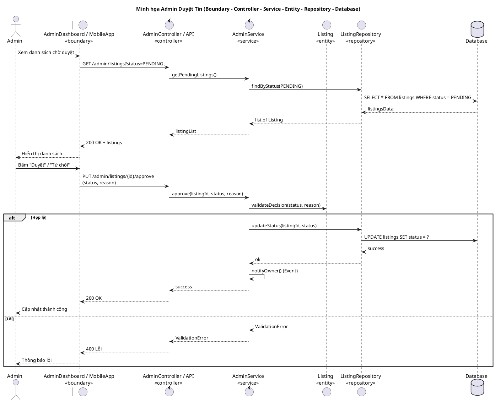

# Sequence Diagram - Admin Duyệt Tin

```plantuml
@startuml
title Minh họa Admin Duyệt Tin (Boundary - Controller - Service - Entity - Repository - Database)

actor "Admin" as Admin
boundary "AdminDashboard / MobileApp\n«boundary»" as FE
control "AdminController / API\n«controller»" as Controller
control "AdminService\n«service»" as Service
entity "Listing\n«entity»" as Entity
entity "ListingRepository\n«repository»" as Repo
database "Database" as DB

Admin -> FE: Xem danh sách chờ duyệt
FE -> Controller: GET /admin/listings?status=PENDING
Controller -> Service: getPendingListings()
Service -> Repo: findByStatus(PENDING)
Repo -> DB: SELECT * FROM listings WHERE status = PENDING
DB --> Repo: listingsData
Repo --> Service: list of Listing
Service --> Controller: listingList
Controller --> FE: 200 OK + listings
FE --> Admin: Hiển thị danh sách
Admin -> FE: Bấm "Duyệt" / "Từ chối"
FE -> Controller: PUT /admin/listings/{id}/approve\n(status, reason)
Controller -> Service: approve(listingId, status, reason)
Service -> Entity: validateDecision(status, reason)
alt Hợp lệ
  Service -> Repo: updateStatus(listingId, status)
  Repo -> DB: UPDATE listings SET status = ?
  DB --> Repo: success
  Repo --> Service: ok
  Service -> Service: notifyOwner() (Event)
  Service --> Controller: success
  Controller --> FE: 200 OK
  FE --> Admin: Cập nhật thành công
else Lỗi
  Entity --> Service: ValidationError
  Service --> Controller: ValidationError
  Controller --> FE: 400 Lỗi
  FE --> Admin: Thông báo lỗi
end
@enduml
```
