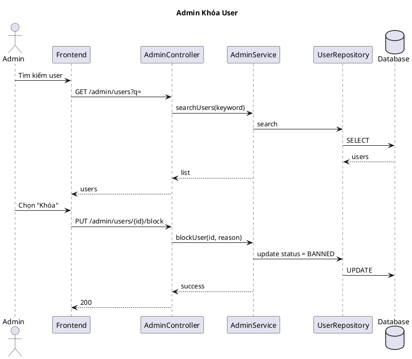

# Sequence Diagram - Admin Khóa User

```plantuml
@startuml
title Admin Khóa User

actor "Admin" as Admin
participant "Frontend" as FE
participant "AdminController" as Controller
participant "AdminService" as Service
participant "UserRepository" as Repo
database "Database" as DB

Admin -> FE: Tìm kiếm user
FE -> Controller: GET /admin/users?q=
Controller -> Service: searchUsers(keyword)
Service -> Repo: search
Repo -> DB: SELECT
DB --> Repo: users
Service --> Controller: list
Controller --> FE: users
Admin -> FE: Chọn "Khóa"
FE -> Controller: PUT /admin/users/{id}/block
Controller -> Service: blockUser(id, reason)
Service -> Repo: update status = BANNED
Repo -> DB: UPDATE
Service --> Controller: success
Controller --> FE: 200
@enduml
```

**3-layer:** Controller -> Service -> Repository -> DB.
