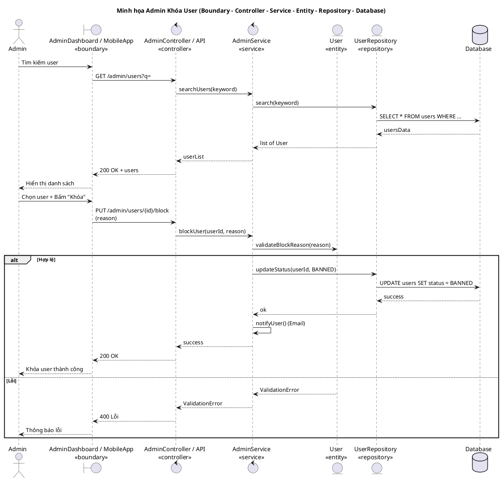

# Sequence Diagram - Admin Khóa User

```plantuml
@startuml
title Minh họa Admin Khóa User (Boundary - Controller - Service - Entity - Repository - Database)

actor "Admin" as Admin
boundary "AdminDashboard / MobileApp\n«boundary»" as FE
control "AdminController / API\n«controller»" as Controller
control "AdminService\n«service»" as Service
entity "User\n«entity»" as Entity
entity "UserRepository\n«repository»" as Repo
database "Database" as DB

Admin -> FE: Tìm kiếm user
FE -> Controller: GET /admin/users?q=
Controller -> Service: searchUsers(keyword)
Service -> Repo: search(keyword)
Repo -> DB: SELECT * FROM users WHERE ...
DB --> Repo: usersData
Repo --> Service: list of User
Service --> Controller: userList
Controller --> FE: 200 OK + users
FE --> Admin: Hiển thị danh sách
Admin -> FE: Chọn user + Bấm "Khóa"
FE -> Controller: PUT /admin/users/{id}/block\n(reason)
Controller -> Service: blockUser(userId, reason)
Service -> Entity: validateBlockReason(reason)
alt Hợp lệ
  Service -> Repo: updateStatus(userId, BANNED)
  Repo -> DB: UPDATE users SET status = BANNED
  DB --> Repo: success
  Repo --> Service: ok
  Service -> Service: notifyUser() (Email)
  Service --> Controller: success
  Controller --> FE: 200 OK
  FE --> Admin: Khóa user thành công
else Lỗi
  Entity --> Service: ValidationError
  Service --> Controller: ValidationError
  Controller --> FE: 400 Lỗi
  FE --> Admin: Thông báo lỗi
end
@enduml
```
