# Sequence Diagram - Admin Khóa/Mở Khóa Tài Khoản

```plantuml
@startuml

title Admin Khóa/Mở Khóa Tài Khoản

actor "Admin" as Admin
participant "UserManagement\n/ Frontend" as FE
participant "AdminUserController\n/ API" as Controller
participant "LockUserRequest\n«validation»" as Validation
participant "UserService" as UserService
participant "User\n«entity»" as User
participant "UserRepository\n«repository»" as UserRepo
participant "ListingRepository\n«repository»" as ListingRepo
participant "NotificationService" as NotificationService
database "Database" as DB

Admin -> FE: Truy cập trang quản lý user

FE -> Controller: GET /api/v1/admin/users?search=...

Controller -> UserService: getAllUsers(filters)

UserService -> UserRepo: paginate(filters)
UserRepo -> DB: SELECT * FROM users\nWHERE role != 'ADMIN'\nORDER BY created_at DESC
DB --> UserRepo: users[]

UserRepo --> UserService: PaginatedResult
UserService --> Controller: PaginatedResult
Controller --> FE: 200 OK + users
FE --> Admin: Hiển thị danh sách user

Admin -> FE: Tìm kiếm user theo email/tên
Admin -> FE: Chọn user cần xử lý

FE -> Controller: GET /api/v1/admin/users/{id}

Controller -> UserRepo: findById(id)
UserRepo -> DB: SELECT u.*,\nCOUNT(l.id) as listing_count\nFROM users u\nLEFT JOIN listings l ON u.id = l.owner_id\nWHERE u.id = ?
DB --> UserRepo: user with stats

UserRepo --> Controller: User
Controller --> FE: 200 OK + UserResource
FE --> Admin: Hiển thị thông tin:
note right
  - Họ tên, email
  - Trạng thái hiện tại
  - Ngày đăng ký
  - Số tin đăng
  - Lịch sử vi phạm
end note

alt Admin khóa tài khoản
    Admin -> FE: Nhấn "Khóa tài khoản"
    
    FE -> FE: Hiển thị form lý do
    
    Admin -> FE: Nhập lý do khóa:
    note right
      - Spam
      - Lừa đảo
      - Vi phạm chính sách
      - Báo cáo nhiều lần
    end note
    
    Admin -> FE: Xác nhận khóa
    
    FE -> Controller: PUT /api/v1/admin/users/{id}/block\n{block_reason: '...'}
    
    Controller -> Validation: validate()
    
    alt Validation failed
        Validation --> Controller: ValidationError
        Controller --> FE: 422 Validation Error
        FE --> Admin: Hiển thị lỗi
    else Validation passed
        
        Controller -> UserService: blockUser(admin, user_id, reason)
        
        UserService -> UserRepo: findById(user_id)
        UserRepo -> DB: SELECT * FROM users\nWHERE id = ? FOR UPDATE
        DB --> UserRepo: user
        
        alt User không tồn tại
            UserRepo --> UserService: NotFoundException
            UserService --> Controller: Exception
            Controller --> FE: 404 Not Found
            FE --> Admin: "User không tồn tại"
        else User tồn tại
            
            alt User đã bị khóa (status = BLOCKED)
                UserService --> Controller: AlreadyBlockedException
                Controller --> FE: 400 Bad Request
                FE --> Admin: "Tài khoản đã bị khóa"
            else User chưa bị khóa
                
                UserService -> UserService: BEGIN TRANSACTION
                
                UserService -> UserRepo: update(user_id, data)
                UserRepo -> DB: UPDATE users SET\nstatus = 'BLOCKED',\nblock_reason = ?,\nblocked_at = NOW(),\nblocked_by = ?
                DB --> UserRepo: affected rows
                
                UserService -> ListingRepo: lockAllListingsByOwner(user_id)
                ListingRepo -> DB: UPDATE listings\nSET status = 'LOCKED',\nlock_reason = 'Chủ tài khoản bị khóa'\nWHERE owner_id = ?\nAND status IN ('ACTIVE', 'PENDING')
                DB --> ListingRepo: affected rows
                note right
                  Vô hiệu hóa tất cả
                  tin đăng của user
                end note
                
                UserService -> DB: DELETE FROM refresh_tokens\nWHERE user_id = ?
                DB --> UserService: deleted count
                note right
                  Force logout khỏi
                  tất cả thiết bị
                end note
                
                UserService -> UserService: COMMIT TRANSACTION
                
                UserService -> NotificationService: notifyUser(user)
                
                NotificationService -> DB: INSERT INTO notifications\n(user_id, type, data)
                DB --> NotificationService: notification_id
                
                NotificationService -> NotificationService: Gửi email:\n"Tài khoản bị khóa"\n+ Lý do\n+ Cách khiếu nại
                
                NotificationService --> UserService: success
                
                UserService --> Controller: User updated
                
                Controller --> FE: 200 OK\n"Đã khóa tài khoản"
                FE --> Admin: Hiển thị thông báo
            end
        end
    end
    
else Admin mở khóa tài khoản
    Admin -> FE: Nhấn "Mở khóa tài khoản"
    
    FE -> FE: Hiển thị form ghi chú
    
    Admin -> FE: Nhập ghi chú (tùy chọn):
    note right
      - Khiếu nại hợp lệ
      - Đã xác minh lại
      - Vi phạm nhẹ
    end note
    
    Admin -> FE: Xác nhận mở khóa
    
    FE -> Controller: PUT /api/v1/admin/users/{id}/unblock\n{unblock_note: '...'}
    
    Controller -> UserService: unblockUser(admin, user_id, note)
    
    UserService -> UserRepo: findById(user_id)
    UserRepo -> DB: SELECT * FROM users\nWHERE id = ? FOR UPDATE
    DB --> UserRepo: user
    
    alt User không tồn tại
        UserRepo --> UserService: NotFoundException
        UserService --> Controller: Exception
        Controller --> FE: 404 Not Found
        FE --> Admin: "User không tồn tại"
    else User tồn tại
        
        alt User không bị khóa (status != BLOCKED)
            UserService --> Controller: NotBlockedException
            Controller --> FE: 400 Bad Request
            FE --> Admin: "Tài khoản không bị khóa"
        else User đang bị khóa
            
            UserService -> UserService: BEGIN TRANSACTION
            
            UserService -> UserRepo: update(user_id, data)
            UserRepo -> DB: UPDATE users SET\nstatus = 'ACTIVE',\nunblocked_at = NOW(),\nunblocked_by = ?,\nunblock_note = ?
            DB --> UserRepo: affected rows
            
            UserService -> ListingRepo: getLockedListingsByOwner(user_id)
            ListingRepo -> DB: SELECT id, previous_status\nFROM listings\nWHERE owner_id = ?\nAND status = 'LOCKED'\nAND lock_reason = 'Chủ tài khoản bị khóa'
            DB --> ListingRepo: locked_listings[]
            
            UserService -> ListingRepo: restoreListings(listings)
            loop For each locked listing
                ListingRepo -> DB: UPDATE listings\nSET status = previous_status,\nlock_reason = NULL\nWHERE id = ?
                DB --> ListingRepo: affected rows
                note right
                  Khôi phục tin đăng về
                  trạng thái trước khi khóa
                  (ACTIVE hoặc PENDING)
                end note
            end
            
            UserService -> UserService: COMMIT TRANSACTION
            
            UserService -> NotificationService: notifyUser(user)
            
            NotificationService -> DB: INSERT INTO notifications
            DB --> NotificationService: notification_id
            
            NotificationService -> NotificationService: Gửi email:\n"Tài khoản đã được mở khóa"
            
            NotificationService --> UserService: success
            
            UserService --> Controller: User updated
            
            Controller --> FE: 200 OK\n"Đã mở khóa tài khoản"
            FE --> Admin: Hiển thị thông báo
        end
    end
end

@enduml
```



## Giải Thích

**Quy trình admin khóa/mở khóa tài khoản:**

### 1. Xem danh sách users
**Endpoint**: GET /api/v1/admin/users

```sql
SELECT u.*, 
       COUNT(l.id) as listing_count,
       COUNT(CASE WHEN l.status = 'ACTIVE' THEN 1 END) as active_listings
FROM users u
LEFT JOIN listings l ON u.id = l.owner_id
WHERE u.role != 'ADMIN'
GROUP BY u.id
ORDER BY u.created_at DESC
```

### 2. Khóa tài khoản
**Endpoint**: PUT /api/v1/admin/users/{id}/block

**Input**: `block_reason` (required, max 500 chars)

**Validation:**
- User phải tồn tại
- User chưa bị khóa (status != BLOCKED)

**Database Transaction:**

**a) Update user status:**
```sql
UPDATE users 
SET status = 'BLOCKED',
    block_reason = ?,
    blocked_at = NOW(),
    blocked_by = ?
WHERE id = ?
```

**b) Vô hiệu hóa tất cả tin đăng:**
```sql
UPDATE listings 
SET status = 'LOCKED',
    lock_reason = 'Chủ tài khoản bị khóa',
    previous_status = status  -- Lưu trạng thái cũ để restore sau
WHERE owner_id = ?
  AND status IN ('ACTIVE', 'PENDING')
```

**c) Force logout:**
```sql
DELETE FROM refresh_tokens 
WHERE user_id = ?
```
- Xóa tất cả refresh tokens
- User bị đăng xuất khỏi mọi thiết bị
- Phải đăng nhập lại (nhưng sẽ bị từ chối vì status = BLOCKED)

**Notifications:**
- Email thông báo tài khoản bị khóa
- Lý do khóa
- Hướng dẫn khiếu nại (appeal)

### 3. Mở khóa tài khoản
**Endpoint**: PUT /api/v1/admin/users/{id}/unblock

**Input**: `unblock_note` (optional, max 500 chars)

**Validation:**
- User phải tồn tại
- User đang bị khóa (status = BLOCKED)

**Database Transaction:**

**a) Update user status:**
```sql
UPDATE users 
SET status = 'ACTIVE',
    unblocked_at = NOW(),
    unblocked_by = ?,
    unblock_note = ?
WHERE id = ?
```

**b) Khôi phục tin đăng:**
```sql
-- Tìm tin đăng bị khóa vì user bị khóa
SELECT id, previous_status 
FROM listings 
WHERE owner_id = ?
  AND status = 'LOCKED'
  AND lock_reason = 'Chủ tài khoản bị khóa'

-- Restore về trạng thái cũ
UPDATE listings 
SET status = previous_status,
    lock_reason = NULL
WHERE id IN (...)
```
- Tin đăng được khôi phục về trạng thái trước khi khóa:
  - Nếu trước đó ACTIVE → ACTIVE
  - Nếu trước đó PENDING → PENDING

**Notifications:**
- Email thông báo tài khoản đã mở khóa
- User có thể đăng nhập lại bình thường

### Status Flow

```
ACTIVE → (Admin block) → BLOCKED
BLOCKED → (Admin unblock) → ACTIVE
```

**Effects of Blocking:**
- ❌ User không thể đăng nhập
- ❌ Tất cả tin đăng bị khóa
- ❌ Tin đăng biến mất khỏi trang công khai
- ❌ Tất cả sessions bị xóa (force logout)
- ✅ User có thể xem email thông báo và khiếu nại

**Effects of Unblocking:**
- ✅ User có thể đăng nhập lại
- ✅ Tin đăng được khôi phục (nếu trước đó ACTIVE)
- ✅ User có thể tiếp tục sử dụng bình thường

**Audit Trail:**
- Lưu `blocked_by`, `blocked_at`, `block_reason`
- Lưu `unblocked_by`, `unblocked_at`, `unblock_note`
- Admin có thể xem lịch sử khóa/mở khóa

---

**Cách xem diagram**: Copy code PlantUML vào https://www.plantuml.com/plantuml/uml/
