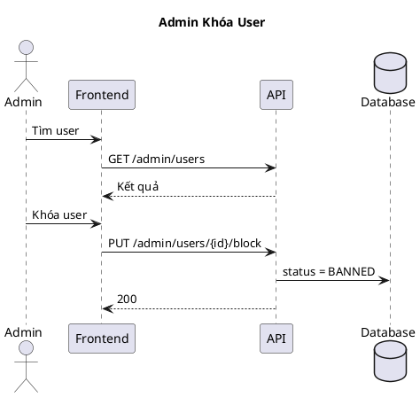

# Sequence Diagram - Admin Khóa User

```plantuml
@startuml
title Admin Khóa User

actor "Admin" as Admin
participant "Frontend" as FE
participant "API" as API
database "Database" as DB

Admin -> FE: Tìm user
FE -> API: GET /admin/users
API --> FE: Kết quả
Admin -> FE: Khóa user
FE -> API: PUT /admin/users/{id}/block
API -> DB: status = BANNED
API --> FE: 200
@enduml
```

**Luồng:** Tìm → Khóa → Cập nhật.
