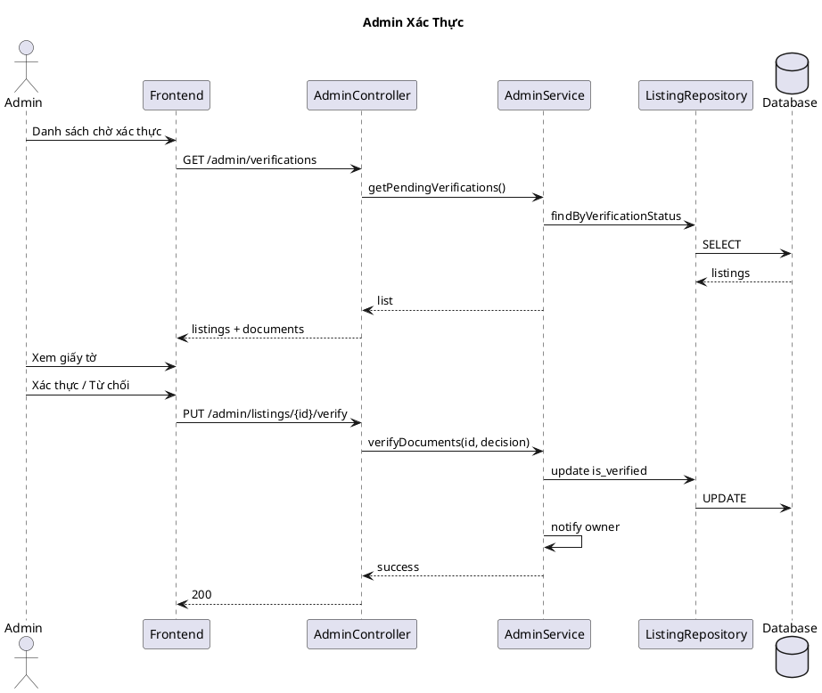

# Sequence Diagram - Admin Xác Thực

```plantuml
@startuml
title Admin Xác Thực

actor "Admin" as Admin
participant "Frontend" as FE
participant "AdminController" as Controller
participant "AdminService" as Service
participant "ListingRepository" as Repo
database "Database" as DB

Admin -> FE: Danh sách chờ xác thực
FE -> Controller: GET /admin/verifications
Controller -> Service: getPendingVerifications()
Service -> Repo: findByVerificationStatus
Repo -> DB: SELECT
DB --> Repo: listings
Service --> Controller: list
Controller --> FE: listings + documents
Admin -> FE: Xem giấy tờ
Admin -> FE: Xác thực / Từ chối
FE -> Controller: PUT /admin/listings/{id}/verify
Controller -> Service: verifyDocuments(id, decision)
Service -> Repo: update is_verified
Repo -> DB: UPDATE
Service -> Service: notify owner
Service --> Controller: success
Controller --> FE: 200
@enduml
```

**3-layer:** Controller -> Service -> Repository -> DB.
