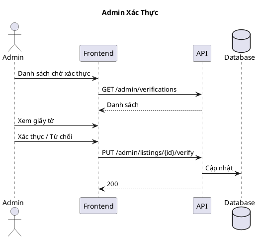

# Sequence Diagram - Admin Xác Thực

```plantuml
@startuml
title Admin Xác Thực

actor "Admin" as Admin
participant "Frontend" as FE
participant "API" as API
database "Database" as DB

Admin -> FE: Danh sách chờ xác thực
FE -> API: GET /admin/verifications
API --> FE: Danh sách
Admin -> FE: Xem giấy tờ
Admin -> FE: Xác thực / Từ chối
FE -> API: PUT /admin/listings/{id}/verify
API -> DB: Cập nhật
API --> FE: 200
@enduml
```

**Luồng:** Xem giấy tờ → Xác thực/Từ chối.
