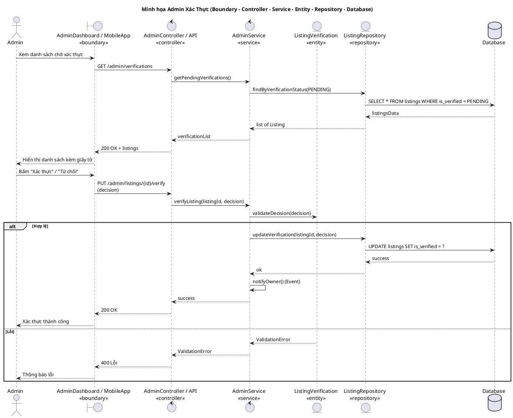

# Sequence Diagram - Admin Xác Thực

```plantuml
@startuml
title Minh họa Admin Xác Thực (Boundary - Controller - Service - Entity - Repository - Database)

actor "Admin" as Admin
boundary "AdminDashboard / MobileApp\n«boundary»" as FE
control "AdminController / API\n«controller»" as Controller
control "AdminService\n«service»" as Service
entity "ListingVerification\n«entity»" as Entity
entity "ListingRepository\n«repository»" as Repo
database "Database" as DB

Admin -> FE: Xem danh sách chờ xác thực
FE -> Controller: GET /admin/verifications
Controller -> Service: getPendingVerifications()
Service -> Repo: findByVerificationStatus(PENDING)
Repo -> DB: SELECT * FROM listings WHERE is_verified = PENDING
DB --> Repo: listingsData
Repo --> Service: list of Listing
Service --> Controller: verificationList
Controller --> FE: 200 OK + listings
FE --> Admin: Hiển thị danh sách kèm giấy tờ
Admin -> FE: Bấm "Xác thực" / "Từ chối"
FE -> Controller: PUT /admin/listings/{id}/verify\n(decision)
Controller -> Service: verifyListing(listingId, decision)
Service -> Entity: validateDecision(decision)
alt Hợp lệ
  Service -> Repo: updateVerification(listingId, decision)
  Repo -> DB: UPDATE listings SET is_verified = ?
  DB --> Repo: success
  Repo --> Service: ok
  Service -> Service: notifyOwner() (Event)
  Service --> Controller: success
  Controller --> FE: 200 OK
  FE --> Admin: Xác thực thành công
else Lỗi
  Entity --> Service: ValidationError
  Service --> Controller: ValidationError
  Controller --> FE: 400 Lỗi
  FE --> Admin: Thông báo lỗi
end
@enduml
```
