# Sequence Diagram - Admin Xác Thực Tin Đăng

```plantuml
@startuml

title Admin Xác Thực Tin Đăng

actor "Admin" as Admin
participant "VerificationPanel\n/ Frontend" as FE
participant "AdminListingController\n/ API" as Controller
participant "VerifyListingRequest\n«validation»" as Validation
participant "ListingVerificationService" as VerificationService
participant "Listing\n«entity»" as Listing
participant "ListingRepository\n«repository»" as ListingRepo
participant "NotificationService" as NotificationService
database "Database" as DB

Admin -> FE: Truy cập trang quản lý tin đăng

FE -> Controller: GET /api/v1/admin/listings\n?is_verified=PENDING_VERIFICATION

Controller -> ListingRepo: getListingsForVerification()
ListingRepo -> DB: SELECT l.*, u.full_name as owner_name\nFROM listings l\nJOIN users u ON l.owner_id = u.id\nWHERE l.is_verified = 'PENDING_VERIFICATION'\nAND l.request_verification = true\nORDER BY l.updated_at DESC
DB --> ListingRepo: listings[]

ListingRepo --> Controller: PaginatedResult
Controller --> FE: 200 OK + listings
FE --> Admin: Hiển thị danh sách\ntin cần xác thực

Admin -> FE: Chọn tin đăng để xem chi tiết

FE -> Controller: GET /api/v1/admin/listings/{id}

Controller -> ListingRepo: findById(id)
ListingRepo -> DB: SELECT l.*, vd.*\nFROM listings l\nLEFT JOIN listing_verification_documents vd\nON l.id = vd.listing_id\nWHERE l.id = ?
DB --> ListingRepo: listing with verification_documents

ListingRepo --> Controller: Listing
Controller --> FE: 200 OK + ListingResource
FE --> Admin: Hiển thị:
note right
  - Thông tin tin đăng
  - CCCD mặt trước
  - CCCD mặt sau
  - Giấy tờ pháp lý (1-5 files)
  - Thông tin liên hệ
end note

Admin -> Admin: Xem xét giấy tờ:
note right
  ✓ CCCD rõ ràng, không giả?
  ✓ Họ tên khớp với contact_name?
  ✓ Giấy tờ pháp lý hợp lệ?
  ✓ Địa chỉ khớp với BĐS?
end note

alt Admin phê duyệt xác thực
    Admin -> FE: Nhấn "Phê duyệt xác thực"
    
    FE -> Controller: PUT /api/v1/admin/listings/{id}/verification\n{is_verified: true}
    
    Controller -> Validation: validate()
    Validation --> Controller: VerifyListingDto
    
    Controller -> VerificationService: updateVerificationForAdmin(listing_id,\ntrue, null, admin_id)
    
    VerificationService -> VerificationService: approveVerification(listing_id, admin_id)
    
    VerificationService -> ListingRepo: findById(listing_id)
    ListingRepo -> DB: SELECT * FROM listings\nWHERE id = ? FOR UPDATE
    DB --> ListingRepo: listing
    
    alt Listing không tồn tại
        ListingRepo --> VerificationService: NotFoundException
        VerificationService --> Controller: Exception
        Controller --> FE: 404 Not Found
        FE --> Admin: "Tin đăng không tồn tại"
    else Listing tồn tại
        
        alt is_verified != PENDING_VERIFICATION
            VerificationService --> Controller: BusinessException
            Controller --> FE: 400 Bad Request
            FE --> Admin: "Yêu cầu đã được xử lý"
        else is_verified = PENDING_VERIFICATION
            
            VerificationService -> VerificationService: BEGIN TRANSACTION
            
            VerificationService -> ListingRepo: update(listing_id, data)
            ListingRepo -> DB: UPDATE listings SET\nis_verified = 'VERIFIED',\nverified_at = NOW(),\nverified_by = ?
            DB --> ListingRepo: affected rows
            
            VerificationService -> VerificationService: Calculate new score\n(+5 bonus for verified)
            
            VerificationService -> ListingRepo: update(listing_id,\n{score: new_score})
            ListingRepo -> DB: UPDATE listings\nSET score = score + 5
            DB --> ListingRepo: affected rows
            note right
              Tin xác thực được
              ưu tiên hiển thị cao hơn
            end note
            
            VerificationService -> VerificationService: COMMIT TRANSACTION
            
            VerificationService -> NotificationService: notifyOwner(listing.owner_id)
            
            NotificationService -> DB: INSERT INTO notifications\n(user_id, type, data)
            DB --> NotificationService: notification_id
            
            NotificationService -> NotificationService: Gửi email:\n"Tin đăng đã được xác thực"
            note right
              Email chứa:
              - Badge "Đã xác thực"
              - Lợi ích của xác thực
              - Link xem tin đăng
            end note
            
            NotificationService -> NotificationService: Push notification
            
            NotificationService --> VerificationService: success
            
            VerificationService -> VerificationService: Clear cache listings
            
            VerificationService --> Controller: Listing updated
            
            Controller --> FE: 200 OK\n"Đã phê duyệt xác thực"
            FE --> Admin: Hiển thị thông báo
            
            note right
              Tin đăng được gắn
              badge "Đã xác thực"
              trên trang công khai
            end note
        end
    end
    
else Admin từ chối xác thực
    Admin -> FE: Nhấn "Từ chối xác thực"
    
    FE -> FE: Hiển thị form lý do
    
    Admin -> FE: Nhập lý do từ chối:
    note right
      - CCCD không rõ/giả mạo
      - Thông tin không khớp
      - Giấy tờ pháp lý không hợp lệ
      - Thiếu giấy tờ bắt buộc
    end note
    
    Admin -> FE: Xác nhận từ chối
    
    FE -> Controller: PUT /api/v1/admin/listings/{id}/verification\n{is_verified: false,\nrejection_reason: '...'}
    
    Controller -> Validation: validate()
    Validation --> Controller: VerifyListingDto
    
    Controller -> VerificationService: updateVerificationForAdmin(listing_id,\nfalse, rejection_reason, admin_id)
    
    VerificationService -> VerificationService: rejectVerification(listing_id,\nadmin_id, reason)
    
    VerificationService -> ListingRepo: findById(listing_id)
    ListingRepo -> DB: SELECT * FROM listings\nWHERE id = ? FOR UPDATE
    DB --> ListingRepo: listing
    
    alt is_verified = PENDING_VERIFICATION
        
        VerificationService -> VerificationService: BEGIN TRANSACTION
        
        VerificationService -> ListingRepo: update(listing_id, data)
        ListingRepo -> DB: UPDATE listings SET\nis_verified = 'REJECTED',\nverification_rejection_reason = ?,\nverification_rejected_at = NOW(),\nverification_rejected_by = ?
        DB --> ListingRepo: affected rows
        
        VerificationService -> VerificationService: COMMIT TRANSACTION
        
        VerificationService -> NotificationService: notifyOwner(listing.owner_id)
        
        NotificationService -> DB: INSERT INTO notifications
        DB --> NotificationService: notification_id
        
        NotificationService -> NotificationService: Gửi email:\n"Xác thực bị từ chối"
        note right
          Email chứa:
          - Lý do từ chối chi tiết
          - Hướng dẫn upload lại
          - Yêu cầu cụ thể cần sửa
        end note
        
        NotificationService -> NotificationService: Push notification
        
        NotificationService --> VerificationService: success
        
        VerificationService --> Controller: Listing updated
        
        Controller --> FE: 200 OK\n"Đã từ chối xác thực"
        FE --> Admin: Hiển thị thông báo
        
        note right
          User có thể:
          - Upload lại giấy tờ đúng
          - Gửi yêu cầu xác thực mới
        end note
    end
end

@enduml
```



## Giải Thích

**Quy trình admin xác thực tin đăng:**

### 1. Xem danh sách tin cần xác thực
**Endpoint**: GET /api/v1/admin/listings?is_verified=PENDING_VERIFICATION

```sql
SELECT l.*, 
       u.full_name as owner_name,
       u.email as owner_email,
       COUNT(vd.id) as document_count
FROM listings l
JOIN users u ON l.owner_id = u.id
LEFT JOIN listing_verification_documents vd ON l.id = vd.listing_id
WHERE l.is_verified = 'PENDING_VERIFICATION'
  AND l.request_verification = true
  AND l.demand_type IN ('SELL', 'BUY')  -- Chỉ tin BÁN/MUA
GROUP BY l.id
ORDER BY l.updated_at DESC
```

### 2. Xem chi tiết giấy tờ
**Endpoint**: GET /api/v1/admin/listings/{id}

**Load documents:**
```sql
SELECT * FROM listing_verification_documents
WHERE listing_id = ?
ORDER BY sort_order
```

**Document types:**
- `ID_FRONT`: CCCD mặt trước
- `ID_BACK`: CCCD mặt sau
- `LEGAL_DOCUMENT`: Giấy tờ pháp lý (sổ đỏ, hợp đồng, giấy phép, ...)

### 3. Admin kiểm tra

**Checklist:**
- ✅ **CCCD rõ ràng**: Không mờ, không bị che, không giả mạo
- ✅ **Họ tên khớp**: Tên trên CCCD = property.contact_name
- ✅ **Giấy tờ pháp lý hợp lệ**: 
  - Sổ đỏ/sổ hồng (nhà/đất)
  - Hợp đồng mua bán (chung cư)
  - Giấy phép xây dựng
- ✅ **Địa chỉ khớp**: Địa chỉ trên giấy tờ ≈ property.address_detail

### 4. Phê duyệt xác thực
**Endpoint**: PUT /api/v1/admin/listings/{id}/verification

**Update Database:**
```sql
UPDATE listings 
SET is_verified = 'VERIFIED',
    verified_at = NOW(),
    verified_by = ?,
    score = score + 5  -- Bonus score cho tin xác thực
WHERE id = ?
```

**Benefits of VERIFIED:**
- 🏅 **Badge "Đã xác thực"** trên tin đăng
- 📈 **Tăng score +5**: Ưu tiên hiển thị cao hơn trong search
- 💎 **Trust badge**: Người mua/thuê tin tưởng hơn
- 🎯 **Conversion rate cao hơn**: Khách liên hệ nhiều hơn

### 5. Từ chối xác thực
**Input**: `rejection_reason` (required, max 1000 chars)

**Update Database:**
```sql
UPDATE listings 
SET is_verified = 'REJECTED',
    verification_rejection_reason = ?,
    verification_rejected_at = NOW(),
    verification_rejected_by = ?
WHERE id = ?
```

**Email notification:**
- Lý do từ chối chi tiết
- Hướng dẫn cụ thể cần sửa:
  - "CCCD không rõ → Chụp lại với ánh sáng tốt"
  - "Họ tên không khớp → Đảm bảo contact_name = tên trên CCCD"
  - "Thiếu sổ đỏ → Upload thêm sổ đỏ/sổ hồng"
- Link để user upload lại

### Verification Status Flow

```
NOT_VERIFIED → (User submit documents) → PENDING_VERIFICATION

PENDING_VERIFICATION → (Admin approve) → VERIFIED
                    → (Admin reject)  → REJECTED

REJECTED → (User re-submit) → PENDING_VERIFICATION
```

### Validation Criteria

**CCCD:**
- Photo quality: Rõ ràng, không mờ
- Authenticity: Không giả mạo, không photoshop
- Information: Họ tên, ngày sinh, địa chỉ đọc được

**Giấy tờ pháp lý:**
- Type: Sổ đỏ/hồng (nhà đất), Hợp đồng (chung cư), Giấy phép xây dựng
- Owner match: Tên trên giấy tờ = tên trên CCCD
- Address match: Địa chỉ trên giấy tờ ≈ địa chỉ BĐS đang đăng

**Common rejection reasons:**
- CCCD mờ/không rõ (30%)
- Thông tin không khớp (25%)
- Giấy tờ pháp lý không đủ (20%)
- Giả mạo/photoshop (15%)
- Địa chỉ không khớp (10%)

**Statistics:**
- Approval rate: ~70%
- Rejection rate: ~25%
- Re-submission success: ~60%
- Average review time: 24-48 hours

---

**Cách xem diagram**: Copy code PlantUML vào https://www.plantuml.com/plantuml/uml/
