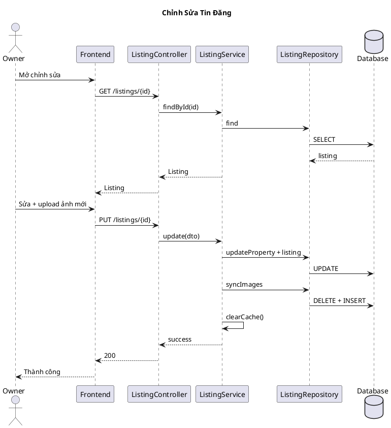

# Sequence Diagram - Chỉnh Sửa Tin Đăng

```plantuml
@startuml
title Chỉnh Sửa Tin Đăng

actor "Owner" as Owner
participant "Frontend" as FE
participant "ListingController" as Controller
participant "ListingService" as Service
participant "ListingRepository" as Repo
database "Database" as DB

Owner -> FE: Mở chỉnh sửa
FE -> Controller: GET /listings/{id}
Controller -> Service: findById(id)
Service -> Repo: find
Repo -> DB: SELECT
DB --> Repo: listing
Service --> Controller: Listing
Controller --> FE: Listing
Owner -> FE: Sửa + upload ảnh mới
FE -> Controller: PUT /listings/{id}
Controller -> Service: update(dto)
Service -> Repo: updateProperty + listing
Repo -> DB: UPDATE
Service -> Repo: syncImages
Repo -> DB: DELETE + INSERT
Service -> Service: clearCache()
Service --> Controller: success
Controller --> FE: 200
FE --> Owner: Thành công
@enduml
```

**3-layer:** Controller -> Service -> Repository -> DB.
